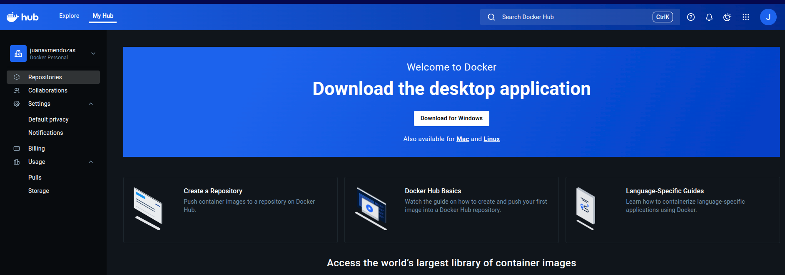
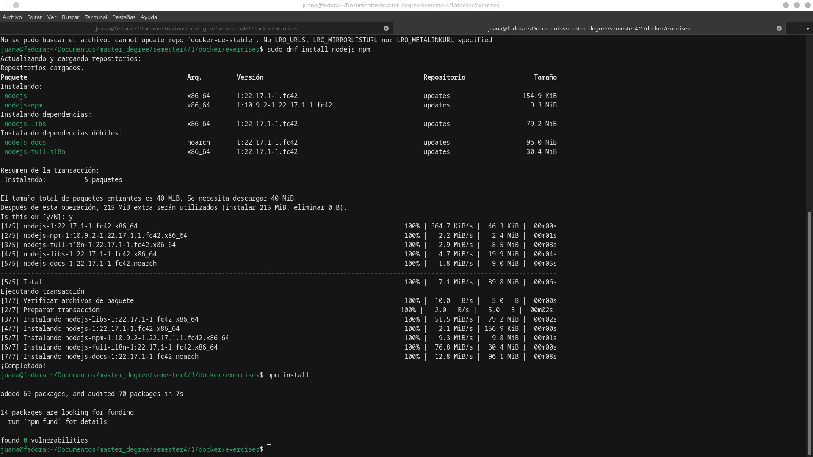
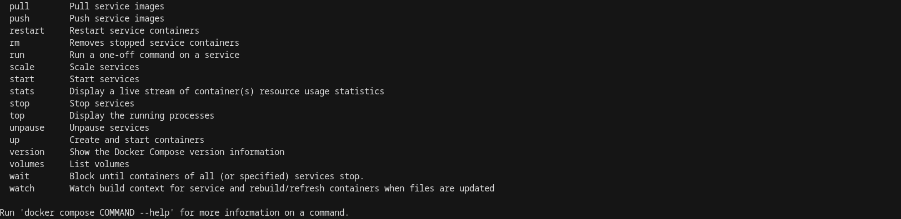
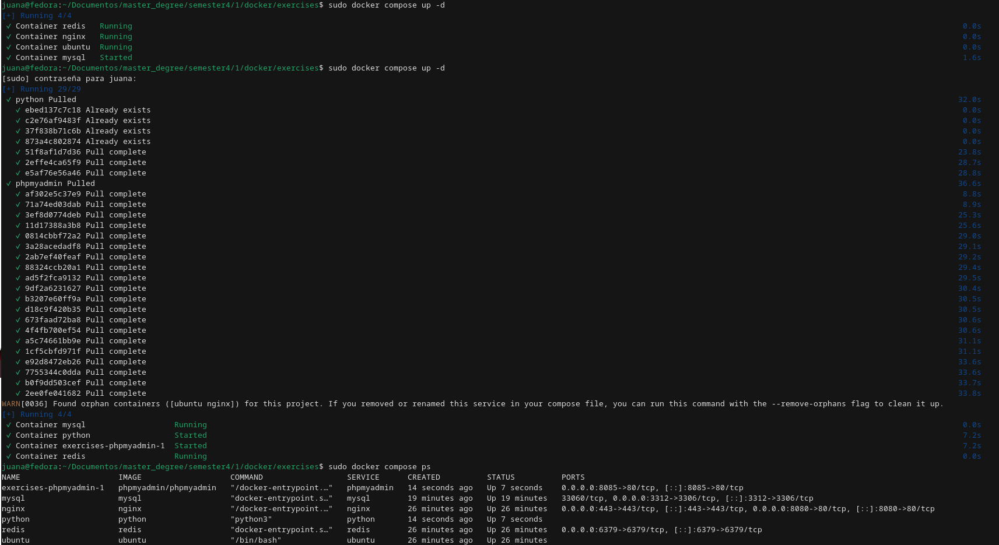

# Introducción a Docker

Los temas a ver son:

- Introducción a Docker
- Instalación de Docker
- Contenedores
- Redes y Volúmenes
- Imágenes
- Docker Compose
- Introducción a Kubernets
- Extras

## 1. Introducción a Docker 🙋🏻‍♀️

- Conceptos
- Arquitectura de Docker

### **Sección 1: Conceptos**

### 1. Contenedores (Containers)

Un contenedor es una unidad ligera, portable y autosuficiente que empaqueta una aplicación con todas sus dependencias (bibliotecas, configuraciones, código, etc.).

🔹 Características principales:

Aislamiento: Cada contenedor se ejecuta de forma independiente, sin afectar a otros.

Portabilidad: Funciona igual en cualquier entorno (desarrollo, pruebas, producción).

Eficiencia: Consume menos recursos que una máquina virtual (VM).

Velocidad: Se inicia en segundos.

📌 Diferencia entre contenedores y máquinas virtuales (VMs):

| Contenedores                         | Máquinas Virtuales (VMs)              |
|-------------------------------------|---------------------------------------|
| Comparten el kernel del host        | Cada VM tiene su propio sistema operativo |
| Más ligeros y rápidos               | Más pesados y lentos                  |
| Menor consumo de recursos           | Mayor consumo de CPU/RAM              |
| Ideal para microservicios           | Útil para sistemas completos          |

### 2. Imágenes (Images)

Una imagen es un paquete inmutable (solo lectura) que contiene todo lo necesario para ejecutar una aplicación (sistema de archivos, código, dependencias, configuraciones).

🔹 Características:

Se crean a partir de un Dockerfile (archivo de configuración).

Se almacenan en repositorios como Docker Hub.

Son la "plantilla" para crear contenedores.

📌 Ejemplo:

docker pull nginx → Descarga la imagen oficial de Nginx.


### 3. Dockerfile

Es un archivo de texto que define los pasos para construir una imagen Docker.

🔹 Estructura básica:

Usa una imagen base (ej: Ubuntu)

```
FROM ubuntu:latest
```

Actualiza e instala dependencias

```
RUN apt-get update && apt-get install -y python3
```

Copia archivos al contenedor

```
COPY app.py /app/
```

Define el comando al iniciar

```
CMD ["python3", "/app/app.py"]
```

Comandos clave en Dockerfile:

* FROM → Imagen base.

* RUN → Ejecuta comandos durante la construcción.

* COPY → Copia archivos al contenedor.

* CMD → Comando por defecto al iniciar el contenedor.


### 4. Docker Hub (Registro de imágenes)

Es un repositorio público donde se almacenan imágenes Docker (como GitHub para código).

🔹 Funciones:

    Descargar imágenes oficiales (nginx, mysql, python).

    Subir tus propias imágenes.

    Compartir contenedores con otros desarrolladores.

📌 Ejemplo:

```
docker pull mysql → Descarga la imagen de MySQL desde Docker Hub.
```

### 5. Volúmenes (Volumes)

Los volúmenes permiten persistir datos fuera del contenedor (útil para bases de datos, configuraciones, etc.).

🔹 Tipos de volúmenes:

5.1 Volúmenes nombrados:

```
docker volume create mi_volumen
```

```
docker run -v mi_volumen:/ruta/en/contenedor mysql
```

5.2 Bind mounts (montajes directos):

```
docker run -v /ruta/local:/ruta/en/contenedor nginx
```

📌 ¿Por qué usarlos?

Evita perder datos al eliminar un contenedor.

Permite compartir datos entre contenedores.

### 6. Redes (Networks)

Docker permite crear redes virtuales para que los contenedores se comuniquen entre sí.

🔹 Tipos de redes:

Bridge (predeterminada): Aislamiento interno.

Host: Comparte red con el sistema host.

Overlay: Para contenedores en diferentes hosts (Docker Swarm/Kubernetes).

📌 Ejemplo:

```
docker network create mi_red
docker run --network=mi_red --name=app1 nginx
docker run --network=mi_red --name=app2 mysql
```

app1 y app2 pueden comunicarse usando sus nombres (app1, app2).


### 7. Docker Compose

Herramienta para definir y gestionar aplicaciones multi-contenedor usando un archivo YAML.

🔹 Ejemplo (docker-compose.yml):

```
version: '3'
services:
  web:
    image: nginx
    ports:
      - "80:80"
  db:
    image: mysql
    environment:
      MYSQL_ROOT_PASSWORD: contraseña
```      

Comandos útiles:

```
docker-compose up -d   # Inicia los servicios
docker-compose down    # Detiene y elimina todo
```

Resumen de Comandos Básicos

| Comando                          | Descripción                                 |
|----------------------------------|---------------------------------------------|
| `docker run -d nginx`           | Ejecuta Nginx en segundo plano              |
| `docker ps`                     | Lista contenedores en ejecución             |
| `docker stop <ID>`             | Detiene un contenedor                       |
| `docker rm <ID>`               | Elimina un contenedor                       |
| `docker images`                | Lista imágenes disponibles                  |
| `docker rmi <IMAGEN>`          | Elimina una imagen                          |
| `docker exec -it <ID> bash`    | Entra a un contenedor en ejecución          |
| `docker build -t mi-app .`     | Construye una imagen desde un Dockerfile    |


### **Sección 2: Arquitectura de Docker**

### ¿Qué es Docker Engine?

Docker Engine es el componente central de Docker que permite crear, ejecutar y gestionar contenedores. Es un software cliente-servidor que incluye:

* Docker Daemon (dockerd): Servidor en segundo plano que gestiona contenedores, imágenes, redes y volúmenes.

* Docker API: Interfaz REST para comunicarse con el daemon (usada por CLI y herramientas externas).

* Docker CLI (docker): Interfaz de línea de comandos para interactuar con el daemon.

📌 Resumen:
docker run (CLI) → API REST → dockerd (Daemon) → Crea/Ejecuta contenedores.


La arquitectura de Docker sigue un modelo cliente-servidor y se compone de los siguientes elementos:

### A. Docker Client (CLI)

Herramienta principal para que los usuarios interactúen con Docker (docker run, docker build, etc.).

Envía comandos al Docker Daemon mediante la API REST.

### B. Docker Daemon (dockerd)

Escucha peticiones a través de la API (por defecto en /var/run/docker.sock).

Gestiona:

* Contenedores (creación, ejecución, monitoreo).

* Imágenes (descarga desde registros como Docker Hub).

* Redes (configuración de redes virtuales).

* Volúmenes (almacenamiento persistente).

### C. Containerd

Componente de bajo nivel que ejecuta los contenedores (separado del Daemon desde Docker 1.11+).

Responsable de:

* Ciclo de vida del contenedor (start/stop/pause).

* Gestión de imágenes (pull/commit).

* Supervisión de procesos.

### D. runC

Herramienta ligera que implementa el estándar OCI (Open Container Initiative).

Crea y ejecuta contenedores según las especificaciones de OCI.

📌 Flujo de ejecución de un contenedor:

docker run → Docker Daemon → containerd → runC → Contenedor en ejecución.

---

## 2. Instalación de Docker 🙋🏻‍♀️

A continuación se realiza la instalación de Docker en Linux con distribución de Fedora 42. 

### 1. Configurar el repositorio de paquetes de Docker

[Link](https://docs.docker.com/engine/install/fedora/#uninstall-old-versions)

**1.1 Configurar el repositorio de paquetes de Docker:**

```
sudo dnf install -y dnf-plugins-core
```


**1.2: Agregar el repositorio oficial de Docker:**

```
sudo dnf config-manager --add-repo https://download.docker.com/linux/fedora/docker-ce.repo
```


<blockquote>
<strong>⚠️ WARNING: </strong> Si se presenta error se descarga manualmente el archivo .repo de docker:
</blockquote>

- Ejecutar este comando para crear el archivo de configuración del repositorio:

```
sudo tee /etc/yum.repos.d/docker-ce.repo << 'EOF'
[docker-ce-stable]
name=Docker CE Stable - \$basearch
baseurl=https://download.docker.com/linux/fedora/\$releasever/\$basearch/stable
enabled=1
gpgcheck=1
gpgkey=https://download.docker.com/linux/fedora/gpg
EOF
```

¿Qué hace este comando?

Crea el archivo /etc/yum.repos.d/docker-ce.repo con la configuración oficial de Docker.

Habilita el repositorio (enabled=1).

Verifica firmas GPG (gpgcheck=1).

- Actualizar la caché de paquetes

```
sudo dnf makecache
```

- Verificar que el archivo existe

Ejecuta este comando para comprobar si el archivo del repositorio (docker-ce.repo) está en la ubicación correcta:

```
ls -l /etc/yum.repos.d/docker-ce.repo
```

Si existe, verás algo como: -rw-r--r--. 1 root root 320 [fecha] /etc/yum.repos.d/docker-ce.repo

- Revisar el contenido del archivo

Para asegurarte de que el contenido del archivo es correcto:

```
cat /etc/yum.repos.d/docker-ce.repo
```

Debe mostrar algo similar a esto:

```
[docker-ce-stable]
name=Docker CE Stable - $basearch
baseurl=https://download.docker.com/linux/fedora/$releasever/$basearch/stable
enabled=1
gpgcheck=1
gpgkey=https://download.docker.com/linux/fedora/gpg
```

- Verificar que el repositorio está activo en DNF

Comprueba si Docker aparece en la lista de repositorios disponibles:

```
sudo dnf repolist | grep -i docker
```

Si está correctamente agregado, verás:

```
docker-ce-stable      Docker CE Stable - x86_64
```


**1.3 Instalar Docker Engine:**

Instala Docker Engine, containerd y Docker Compose:

```
sudo dnf install docker-ce docker-ce-cli containerd.io docker-buildx-plugin docker-compose-plugin
```


Si se le solicita que acepte la clave GPG, verifique que la huella digital coincida con 060A 61C5 1B55 8A7F 742B 77AA C52F EB6B 621E 9F35 y, de ser así, acéptela.


Este comando instala Docker, pero no lo inicia. También crea un grupo de Docker; sin embargo, no agrega ningún usuario al grupo por defecto.


**1.4 Habilitar e iniciar el servicio Docker:**


Habilita Docker para que se inicie automáticamente al arrancar el sistema y luego inicia el servicio:

```
sudo systemctl enable --now docker
```

Salida:

```
Created symlink /etc/systemd/system/multi-user.target.wants/docker.service → /usr/lib/systemd/system/docker.service.
```


<blockquote>
<strong>⚠️ WARNING: </strong> Verificación adicional
</blockquote>

```
systemctl status docker
```

● docker.service - Docker Application Container Engine
     Loaded: loaded (/usr/lib/systemd/system/docker.service; enabled; vendor preset: disabled)
     Active: active (running) since [fecha y hora]
       Docs: https://docs.docker.com
   Main PID: 1234 (dockerd)
      Tasks: 8
     Memory: 10.5M
        CPU: 500ms
     CGroup: /system.slice/docker.service
             └─1234 /usr/bin/dockerd -H fd:// --containerd=/run/containerd/containerd.sock
             
             
Claves para verificar:

Loaded: enabled → Servicio habilitado en el arranque.

Active: active (running) → Docker está funcionando.           
             
             
**1.5 Verificar la instalación:**


Comprueba que Docker se ha instalado correctamente ejecutando el contenedor de prueba "hello-world":

```
sudo docker run hello-world
```


### 2. Instalar Docker Desktop

[Link de la guía de Docker](https://docs.docker.com/desktop/setup/install/linux/fedora/)

**2.1 Descargar el Paquete RPM de Docker Desktop:**

[Link de la última versión](https://desktop.docker.com/linux/main/amd64/docker-desktop-x86_64.rpm?utm_source=docker&utm_medium=webreferral&utm_campaign=docs-driven-download-linux-amd64)

```
cd Descargas/

sudo dnf install ./docker-desktop-x86_64.rpm
```


DNF instalará automáticamente las dependencias requeridas (ej. containerd, docker-ce-cli).

**2.2 Iniciar Docker Desktop:**

Buscar "Docker Desktop" en el menú de aplicaciones (GUI) o Iniciar desde terminal:

```
systemctl --user start docker-desktop
```


Aceptar los permisos:

La primera vez, pedirá permisos para:

* Configurar redes virtuales.

* Integración con WSL2 (si la usas).


**2.3 Verificar versiones:**

```
juana@fedora:~$ docker --version
Docker version 28.3.3, build 980b856

juana@fedora:~$ docker compose version
Docker Compose version v2.38.2-desktop.1

juana@fedora:~$ docker version
Client: Docker Engine - Community
 Version:           28.3.3
 API version:       1.51
 Go version:        go1.24.5
 Git commit:        980b856
 Built:             Fri Jul 25 11:36:40 2025
 OS/Arch:           linux/amd64
 Context:           desktop-linux

Server: Docker Desktop 4.43.2 (199162)
 Engine:
  Version:          28.3.2
  API version:      1.51 (minimum version 1.24)
  Go version:       go1.24.5
  Git commit:       e77ff99
  Built:            Wed Jul  9 16:13:55 2025
  OS/Arch:          linux/amd64
  Experimental:     false
 containerd:
  Version:          1.7.27
  GitCommit:        05044ec0a9a75232cad458027ca83437aae3f4da
 runc:
  Version:          1.2.5
  GitCommit:        v1.2.5-0-g59923ef
 docker-init:
  Version:          0.19.0
  GitCommit:        de40ad0
```


---


## 3. Contenedores 🙋🏻‍♀️

### Temario: 

- Comandos básicos
- Modo iteractivo
- Puertos
- Logs
- Variables de entorno
- Contenedores sin servicio


### Sección 1: Comandos básicos

La siguiente tabla contiene un listado de los comandos básicos necesarios para trabajar con Docker. 

| Comando                                      | Descripción |
|---------------------------------------------|-------------|
| `docker --version`                          | Valida si Docker está instalado y muestra la versión. |
| `docker container list`                     | Muestra la lista de contenedores en ejecución. |
| `docker ps`                                 | Muestra la lista de todos los contenedores estén detenidos o en ejecución. |
| `docker image list`                         | Muestra la lista de imágenes locales. |
| `docker build -t <tag> --file <docker-file> .` | Construye una imagen tomando como base la ruta donde se esté ubicado y las instrucciones en el Dockerfile. El argumento `-t` etiqueta la imagen con un nombre específico. |
| `docker run -d -p <host-port>:<container-port> <tag>` | Crea una instancia (contenedor) de una imagen almacenada localmente. Si la imagen no está localmente, se descarga desde un registro de contenedores (por defecto, Docker Hub).<br><br>El argumento `-d` ejecuta el contenedor en segundo plano (modo *detached*). Omitir este argumento mostrará el output en la terminal, pero bloqueará la sesión hasta que se detenga con `Ctrl+C`.<br><br>El argumento `-p` permite enlazar un puerto de la máquina anfitriona a uno del contenedor. |
| `docker stop <container-id>`                | Detiene el contenedor identificado con el ID especificado. |


## Hola mundo con Docker

1. Ir a [link](https://hub.docker.com/_/httpd) y copiar el comando para descargar la imagen:

```
sudo docker pull httpd
```


2. Verificar qué imágenes existen actualmente.

```
sudo docker image ls
```


3. Ejecutar el contenedor. Para ello se le da la instrucción al Docker Daemon de ejecutar la imagen y crear el contenedor.

El comando run crea un contenedor a partir de una imagen. El servidor de apache se ejecuta en el puerto 80 como indica la documentación:

```
sudo docker run -p 8080:80 httpd
```


No obstante, al terminar el proceso en terminal, el contenedor se detiene. Esto se debe a que se está ejecutando en primer plano.  

* Si cierras la terminal o presionas Ctrl+C, el contenedor se detiene.

* Si no interactúas con la terminal, Docker puede interpretar que el proceso terminó y cerrar el contenedor.


El siguiente comando permite un servicio persistente:

```
sudo docker run -d -p 8080:80 --name mi-apache httpd
```


Qué hace:

-d: Ejecuta el contenedor en segundo plano ("detached").

--name: Asigna un nombre fijo (útil para gestionarlo después).


Para detener el contenedor, se puede usar el comando mediante el nombre del contenedor:

```
sudo docker stop mi-apache
```

4. Realizar el ejercicio con [nginx](https://hub.docker.com/_/nginx).

Si no está descargada la imagen con el comando pull, el comando run realiza la descarga de la imagen y la ejecución del contenedor.

```
sudo docker run -p 8080:80 nginx
```


5. Para verificar qué contenedores existen y están activos:

```
sudo docker container ls

sudo docker container ls -a
```

Diferencias:

* El primer comando solo lista los contenedores que están actualmente activos (status "Up").
* El segundo comando lista todos los contenedores, incluyendo los detenidos (status "Exited").


6. Para volver a iniciar el contenedor:

```
sudo docker start mi-apache
```


7. Para inspeccionar un contenedor se puede usar el ID o el nombre:

```
sudo docker container inspect 3019d4813cb9
```


8. Para eliminar los contenedores hay que tener presente que deben de estar detenidos.

```
sudo docker stop 3019d4813cb9
sudo docker container rm 3019d4813cb9
```


9. Para remover todos los contenedores detenidos:

```
sudo docker container prune
```


### Sección 2: Modo iteractivo

El modo interactivo permite acceder a la terminal del contenedor.

```
sudo docker exec 84f35778bfa4 ls
sudo docker exec -it 84f35778bfa4 bash
```


### Sección 3: Puertos

Como se vió anteriormente -p permite establecer el puerto.

```
sudo docker run -d -p 8080:80 --name mi-apache httpd
```

También, se puede usar -P para asignar un puerto aleatoriamente.

```
sudo docker run -d -P httpd
sudo docker container port 0a836423c35a
```


### Sección 4: Logs

Los logs permite hacer una trasavilidad de los errores o warnings del contenedor.


```
sudo docker logs 3b13bc012c47
```


Para que se actualice la terminal con los logs en tiempo real:

```
sudo docker logs -f 3b13bc012c47
```


### Sección 5: Variables de entorno


```
sudo docker run -d -p 3309:3306 -e MYSQL_ROOT_PASSWORD=mypass -e MYSQL_DATABASE=my_database mysql:oraclelinux9
```


### Sección 6: Contenedores sin servicio

Por ejemplo, Ubuntu no tiene un puerto o servicio asignado. No obstante, al descargar la imagen y ejecutarla el contenedor no aparece con ps. 


Tampoco aparece un error con logs.

Por lo tanto, para permitir que se ejecute se utiliza -d -i -t o se puede unificar -dit:

```
sudo docker run -d -i -t ubuntu:rolling

sudo docker run -dit ubuntu:rolling
```


---


## 4. Redes y Volúmenes 🙋🏻‍♀️

- Qué son los Volúmenes
- Vólumenes de Docker
- Compartir Archivos entre Contenedores
- Volúmenes Manuales
- Redes
- Conectando Contenedor a Red


### Sección 1: Qué son los Volúmenes

Los vólumenes en Docker son espacios en el disco duro que permiten guardar y compartir archivos en el contenedor.

Hay dos tipos de volúmenes:

1. Administrados por el usuario: hay que pasar el path completo.
2. Administrados por Docker.


### Sección 2: Vólumenes de Docker

```
sudo docker
```


```
sudo docker volume

sudo docker volume ls
```


```
sudo docker volume create docker-my-volume

sudo docker volume inspect docker-my-volume
```


Para poder ejecutar el volumen y teniendo en cuenta la guía de Docker para MySQL:

```
$ docker run --name some-mysql -v /my/own/datadir:/var/lib/mysql -e MYSQL_ROOT_PASSWORD=my-secret-pw -d mysql:tag
```

A continuación, se adapata el comando:

```
sudo docker run -d --name mysql-volume -v docker-my-volume:/var/lib/mysql -p 3311:3306 -e MYSQL_ROOT_PASSWORD=mypass mysql:oraclelinux9
```


Pero si se borrara el contenedor y no se estuviera utilizando los volúmenes se perdería toda la información. Por ejemplo, si anteriormente se hubiera creado una base de datos, se habría perdido. Sin embargo, al ultilizar volúmenes, la base de datos queda almacenada en el vólumen docker-my-volume en la ruta /var/lib/mysql.


A continuación, se realiza un ejemplo con un archivo txt, para verificar que los volúmenes conservan la información:


### Sección 3: Compartir Archivos entre Contenedores

Los volúmenes permiten compartir archivos entre contenedores. Para ello se va a utilizar la imagen de Ubuntu y se guarda en docker-my-volume:

```
sudo docker run -dit -v docker-my-volume:/docker-my-volume --name ubuntu-volume ubuntu:rolling
```


Se crea un archivo para el volumen docker-my-volume desde el contenedor de ubuntu:rolling, para poder observar si en el volumen de mysql también se crea. 

```
touch iminubuntu.txt
```


### Sección 4: Volúmenes Manuales

La ruta local:

```
/home/juana/Documentos/master_degree/semester4/1/docker
```


```
sudo docker run -dit -v /home/juana/Documentos/master_degree/semester4/1/docker:/docker-my-volume ubuntu:rolling 
```


### Sección 5: Redes

- Permiten Conexión a internet.
- Los contenedores se pueden encontrar por las IPs.


### Sección 6: Conectando Contenedor a Red

Cuando instalas Docker, este crea automáticamente tres redes predefinidas que puedes usar para conectar contenedores entre sí o con el exterior.

* Null:

Si se agrega esta red por defecto indica que el contenedor no va a tener conexión a internet.

* Host:

El contenedor comparte la pila de red del host. 
No tiene su propia IP; usa la del host directamente.
Útil para casos donde necesitas máxima velocidad o acceso a puertos sin NAT.
Servicios que requieren rendimiento alto, servidores DNS, o apps que usan multicast.

* Bridge:

Por defecto para contenedores independientes. 
Es una red NAT virtual creada automáticamente.
Si no especificas una red al ejecutar un contenedor, Docker lo conecta a esta red bridge (docker0).
Ejecutas contenedores individuales o pequeños grupos que necesitan comunicarse entre sí.
Necesitas aislamiento de red pero también acceso a internet.
Desarrollo local, microservicios, apps web sencillas.


Ejemplo de Bridge:


Para crear una red por defecto bridge:

```
sudo docker network create docker-network
```


Para contectar el contendor a la red:

```
docker run --help
```


```
sudo docker run -dit --network docker-network ubuntu:rolling
```


```
sudo docker run -dit --name ubuntu-network --network docker-network ubuntu:rolling
```


Recordándo:

El primer contenedor conectado con la red docker-network tiene la "IPAddress": "172.18.0.2" terminada en 2.

```
sudo docker inspect fec09cc9a553


"Networks": {
                "docker-network": {
                    "IPAMConfig": null,
                    "Links": null,
                    "Aliases": null,
                    "MacAddress": "de:31:50:45:14:9b",
                    "DriverOpts": null,
                    "GwPriority": 0,
                    "NetworkID": "8e6dc43cc6361eb2c1ef7e30b4e5a985159896765324931038f07133c842642a",
                    "EndpointID": "66847e6e7b51657f80b97384c2cac4a296d940b8457873c0df5104696c5328aa",
                    "Gateway": "172.18.0.1",
                    "IPAddress": "172.18.0.2",
                    "IPPrefixLen": 16,
                    "IPv6Gateway": "",
                    "GlobalIPv6Address": "",
                    "GlobalIPv6PrefixLen": 0,
                    "DNSNames": [
                        "elated_ptolemy",
                        "fec09cc9a553"
                    ]
                }
```

El contenedor ubuntu-network que se acaba de conectar a la red, termina en 3.

```
sudo docker inspect 8f5fd78737c8


"Networks": {
                "docker-network": {
                    "IPAMConfig": null,
                    "Links": null,
                    "Aliases": null,
                    "MacAddress": "52:8d:fe:95:2d:e0",
                    "DriverOpts": null,
                    "GwPriority": 0,
                    "NetworkID": "8e6dc43cc6361eb2c1ef7e30b4e5a985159896765324931038f07133c842642a",
                    "EndpointID": "8b640d49f24e1a5620c969c480515f8398bfd3510dda165c4a4cd8ad7a8599cc",
                    "Gateway": "172.18.0.1",
                    "IPAddress": "172.18.0.3",
                    "IPPrefixLen": 16,
                    "IPv6Gateway": "",
                    "GlobalIPv6Address": "",
                    "GlobalIPv6PrefixLen": 0,
                    "DNSNames": [
                        "ubuntu-network",
                        "8f5fd78737c8"
                    ]
                }
            }
```

Se realiza un ping para cada una:

```
sudo docker exec -it 8f5fd78737c8 bash
apt-get update
apt-get install iputils-ping -y
apt-get install net-tools -y
root@8f5fd78737c8:/# ifconfig
eth0: flags=4163<UP,BROADCAST,RUNNING,MULTICAST>  mtu 1500
        inet 172.18.0.3  netmask 255.255.0.0  broadcast 172.18.255.255
        ether 52:8d:fe:95:2d:e0  txqueuelen 0  (Ethernet)
        RX packets 8898  bytes 26074273 (26.0 MB)
        RX errors 0  dropped 0  overruns 0  frame 0
        TX packets 6015  bytes 402710 (402.7 KB)
        TX errors 0  dropped 0 overruns 0  carrier 0  collisions 0

lo: flags=73<UP,LOOPBACK,RUNNING>  mtu 65536
        inet 127.0.0.1  netmask 255.0.0.0
        inet6 ::1  prefixlen 128  scopeid 0x10<host>
        loop  txqueuelen 1000  (Local Loopback)
        RX packets 8  bytes 986 (986.0 B)
        RX errors 0  dropped 0  overruns 0  frame 0
        TX packets 8  bytes 986 (986.0 B)
        TX errors 0  dropped 0 overruns 0  carrier 0  collisions 0

root@8f5fd78737c8:/# ping 172.18.0.2
PING 172.18.0.2 (172.18.0.2) 56(84) bytes of data.
64 bytes from 172.18.0.2: icmp_seq=1 ttl=64 time=0.175 ms
64 bytes from 172.18.0.2: icmp_seq=2 ttl=64 time=0.089 ms
64 bytes from 172.18.0.2: icmp_seq=3 ttl=64 time=0.094 ms
64 bytes from 172.18.0.2: icmp_seq=4 ttl=64 time=0.103 ms
64 bytes from 172.18.0.2: icmp_seq=5 ttl=64 time=0.112 ms
64 bytes from 172.18.0.2: icmp_seq=6 ttl=64 time=0.103 ms
64 bytes from 172.18.0.2: icmp_seq=7 ttl=64 time=0.126 ms
^C
--- 172.18.0.2 ping statistics ---
7 packets transmitted, 7 received, 0% packet loss, time 6150ms
rtt min/avg/max/mdev = 0.089/0.114/0.175/0.027 ms
```

También se puede hacer ping por el nombre del contenedor:

```
root@fec09cc9a553:/# ping ubuntu-network
PING ubuntu-network (172.18.0.3) 56(84) bytes of data.
64 bytes from ubuntu-network.docker-network (172.18.0.3): icmp_seq=1 ttl=64 time=0.107 ms
64 bytes from ubuntu-network.docker-network (172.18.0.3): icmp_seq=2 ttl=64 time=0.082 ms
64 bytes from ubuntu-network.docker-network (172.18.0.3): icmp_seq=3 ttl=64 time=0.126 ms
^C
--- ubuntu-network ping statistics ---
3 packets transmitted, 3 received, 0% packet loss, time 2055ms
rtt min/avg/max/mdev = 0.082/0.105/0.126/0.018 ms
```

Otra:

```
sudo docker exec -it fec09cc9a553 bash
apt-get update
apt-get install iputils-ping -y
apt-get install net-tools -y
root@fec09cc9a553:/# ifconfig
eth0: flags=4163<UP,BROADCAST,RUNNING,MULTICAST>  mtu 1500
        inet 172.18.0.2  netmask 255.255.0.0  broadcast 172.18.255.255
        ether de:31:50:45:14:9b  txqueuelen 0  (Ethernet)
        RX packets 5251  bytes 25908105 (25.9 MB)
        RX errors 0  dropped 0  overruns 0  frame 0
        TX packets 2417  bytes 164374 (164.3 KB)
        TX errors 0  dropped 0 overruns 0  carrier 0  collisions 0

lo: flags=73<UP,LOOPBACK,RUNNING>  mtu 65536
        inet 127.0.0.1  netmask 255.0.0.0
        inet6 ::1  prefixlen 128  scopeid 0x10<host>
        loop  txqueuelen 1000  (Local Loopback)
        RX packets 8  bytes 986 (986.0 B)
        RX errors 0  dropped 0  overruns 0  frame 0
        TX packets 8  bytes 986 (986.0 B)
        TX errors 0  dropped 0 overruns 0  carrier 0  collisions 0

root@fec09cc9a553:/# ping 172.18.0.3
PING 172.18.0.3 (172.18.0.3) 56(84) bytes of data.
64 bytes from 172.18.0.3: icmp_seq=1 ttl=64 time=0.144 ms
64 bytes from 172.18.0.3: icmp_seq=2 ttl=64 time=0.110 ms
64 bytes from 172.18.0.3: icmp_seq=3 ttl=64 time=0.117 ms
^C
--- 172.18.0.3 ping statistics ---
3 packets transmitted, 3 received, 0% packet loss, time 2062ms
rtt min/avg/max/mdev = 0.110/0.123/0.144/0.014 ms
```

---


## 5. Imágenes 🙋🏻‍♀️

- Qué son las imágenes
- Primera Imagen
- Copiando Archivos
- Variables de Entorno
- Ejecutar Servicios
- Entry Point VS CMD
- Dokenizar Script Python
- Docker Hub
- Dokenizar Script Node

### Sección 1: Qué son las imágenes

Una imagen es un paquete inmutable (solo lectura) que contiene todo lo necesario para ejecutar una aplicación (sistema de archivos, código, dependencias, configuraciones).

🔹 Características:

Se crean a partir de un Dockerfile (archivo de configuración).

Se almacenan en repositorios como Docker Hub.

Son la "plantilla" para crear contenedores.


Se necesita archivo Docker File para poder crear el contendor. 

### Sección 2: Primera Imagen

Para crear un archivo de Docker no se necesita extensión solo escribir **Dockerfile**:

Directivas: 

* FROM → Imagen base sobre la que construirás tu contenedor.

* RUN → Ejecuta comandos durante la construcción de la imagen.

* COPY → Copia archivos al contenedor.

* CMD → Comando por defecto al iniciar el contenedor.

A continuación, se construye el archivo:


Ahora se compila el archivo, al final hay que poner la ruta dónde se encuentra el docker file.

```
sudo docker build --help

sudo docker build -t ubuntu-with-python ./
```


```
sudo docker image ls

sudo docker run -it ubuntu-with-python
```


### Sección 3: Copiando Archivos

* COPY → Copia archivos del host al contenedor.

Rutas son relativas al contexto de build (directorio donde ejecutas docker build).

Si el destino no existe, se crea automáticamente.


* WORKDIR → Definir la ruta (directorio) de trabajo dentro del contenedor para los comandos posteriores. Si el directorio no existe, Docker lo crea automáticamente.

Dockerfile:

```
FROM ubuntu:rolling

RUN apt-get update && apt-get install -y \
    python3 \
    curl \
    nano 

COPY . /app

WORKDIR /app
```

```
sudo docker build -t ubuntu-with-python:v2 ./
sudo docker run -it ubuntu-with-python:v2
```

### Sección 4: Variables de Entorno

Los valores de las varianles de entorno que se asignan desde el docker file son constantes.

* ENV: Define variables de entorno persistentes dentro del contenedor.

```
FROM ubuntu:rolling

ENV DEBIAN_FRONTEND=noninteractive
ENV version=1.0

RUN apt-get update && apt-get install -y \
    python3 \
    curl \
    nano 

COPY . /app

WORKDIR /app
```


Los argumentos de construcción permiten modificar el comportamiento de la imagen.

* ARG: Variables temporales solo durante el build (no persisten en el contenedor final).

```
FROM ubuntu:rolling

ENV DEBIAN_FRONTEND=noninteractive
ENV version=1.0

ARG TEXT_EDITOR=nano

RUN apt-get update && apt-get install -y \
    python3 \
    curl \
    nano  \
    $TEXT_EDITOR

COPY . /app

WORKDIR /app
```


```
sudo docker build -t ubuntu-with-python:v4 --build-arg="TEXT_EDITOR=vim" ./
```


| Característica    | `ENV`                                | `ARG`                                 |
|-------------------|---------------------------------------|----------------------------------------|
| **Disponibilidad** | En build y runtime                   | Solo en build                          |
| **Sobrescribir**   | `docker run -e VAR=valor`            | `docker build --build-arg VAR=valor`   |
| **Persistencia**   | Sí                                   | No                                     |


### Sección 5: Ejecutar Servicios

El comando run no sirve para ejecutar servicios, ya que solo se ejecuta al momento de copilar la imagen. Para esto existe el comando:

* CMD → Comando por defecto al iniciar el contenedor.

Define el comando por defecto que se ejecutará cuando el contenedor inicie.

Especifica el proceso principal del contenedor (si este proceso termina, el contenedor se detendrá).

Puede ser sobrescrito al ejecutar el contenedor con docker run <imagen> <nuevo-comando>.


```
sudo docker build -t ubuntu-with-python:v5 ./

sudo docker run -it ubuntu-with-python:v5
```


```
sudo docker ps

sudo docker run -d -p 8082:80 ubuntu-with-python:v5

curl localhost:8082

sudo docker inspect 89f39976e9e8
```


### Sección 6: Entry Point VS CMD

El comando cmd puede ser sobrescrito al ejecutar el contenedor con docker run <imagen> <nuevo-comando>.


```
sudo docker stop 37fa188d349e

sudo docker run -d -p 8082:80 ubuntu-with-python:v5 ls -al

sudo docker logs a720a992f735

sudo docker ps -a

sudo docker logs 6542876e94bc
```
Para evitar que el comando pueda ser reemplazado se utiliza:

* ENTRYPOINT → Define el ejecutable principal que se ejecutará cuando el contenedor inicie. 

```
FROM ubuntu:rolling

ENV DEBIAN_FRONTEND=noninteractive
ENV version=1.0

ARG TEXT_EDITOR=nano

RUN apt-get update && apt-get install -y \
    python3 \
    curl \
    nano  \
    nginx

COPY . /app

WORKDIR /app

#CMD ["nginx", "-g", "daemon off;"]

ENTRYPOINT ["nginx", "-g", "daemon off;"]
```

```
sudo docker ps
sudo docker build -t ubuntu-with-python:v6 ./
sudo docker run -d -p 8082:80 ubuntu-with-python:v6
sudo docker run -d -p 8082:80 ubuntu-with-python:v6 ls -la
```


| Característica                                      | `CMD`                                       | `ENTRYPOINT`                              |
|----------------------------------------------------|---------------------------------------------|-------------------------------------------|
| Se puede sobrescribir con `docker run <imagen> <nuevo-comando>` | ✅ Sí                                  | ❌ No (a menos que se use `--entrypoint`) |
| Ideal para pasar argumentos por defecto.                        | Pasar argumentos por defecto                | Definir ejecutables base                  |

El comando ENTRYPOINT en un Dockerfile es una instrucción clave que define el ejecutable principal que se ejecutará cuando el contenedor inicie. A diferencia de CMD (que establece argumentos por defecto), ENTRYPOINT especifica el comando base que siempre se ejecutará, incluso si se pasan argumentos adicionales con docker run.

### Sección 7: Dokenizar Script Python

Se utilizan los archivos de:

- entrypoint.sh
- main.py


```
sudo docker build -t ubuntu-with-python:v7 ./

sudo docker run -d -p 8082:80 ubuntu-with-python:v7

sudo docker ps -a

sudo docker logs df6f2ffcb9e9

sudo docker run -p 8082:80 ubuntu-with-python:v7
```


### Sección 8: Docker Hub

Crear una cuenta en Docker Hub para poder compartir una imagen.



Crea un repositorio:


Posteriormente, ingresar desde la terminal.

```
sudo docker login
```


```
sudo docker image tag ubuntu-with-python juanavmendozas/ubuntu-example:v7

sudo docker push

sudo docker push juanavmendozas/ubuntu-example:v7
```

Posteriormente, se hace tag al contendor que se desea subir.


Para descargar el contenedor:


### Sección 8: Dokenizar Script Node

Archivo index.js:


Archivo Dockerfile:


Archivo entrypoint.sh:


Para evitar que más adelante se presente un error cuando instala node desde el dockerfile, se debe de incluir el archivo package.json e instalar node:

```
sudo dnf install nodejs npm

npm install
```




Finalmente, se generan los archivos .json


Si se llega a tener un archivo que se desea ignorar, como podría ser ya tener el node_modules, se crea un archivo .dockerignore:


```
sudo docker build -t ubuntu-with-node:v1 ./

sudo docker run -d -p 3000:3000 ubuntu-with-node:v1
```


---


## 6. Docker Compose 🙋🏻‍♀️

- Qué es Docker Compose
- Servicios
- Redes
- Volúmenes
- Variables de Entorno
- Stack Local
- Docker Compose 

### Sección 1: Qué es Docker Compose

Docker recomienda que se debe de manejar un servicio por contenedor, pero en la realidad se necesitan muchos servicios. Por eso se utiliza Docker Composer que es un Orquestador local que permite trabajar con aplicaciones múltiples contenedores, mediante un archivo de configuración.

Docker Compose es una herramienta para definir y ejecutar aplicaciones multi-contenedor usando un archivo YAML. Permite:

* ✅ Orquestrar múltiples servicios (bases de datos, backends, frontends) en un solo comando.

* ✅ Gestionar redes, volúmenes y variables de entorno centralizadamente.

* ✅ Simplificar el desarrollo y despliegue de aplicaciones complejas.

### Sección 2: Servicios

Verificar que esté instalado Docker Compose:

```
docker compose version

docker compose --help
```




Para crear e iniciar los contenedores usar:

```
sudo docker compose up
```


Fedora incluye Docker Compose v2 como parte de Docker Engine (por eso docker compose funciona).

```
sudo docker compose up -d
sudo docker compose ps
sudo docker compose ls
```


El docker-compose crea una red y agrega todos los contenedores a esa red.

```
sudo docker network ls

sudo docker inspect ubuntu
```


Para eliminar el contendor y la red creada:

```
sudo docker compose down
```


Si se cambian los parámetros docker compose recrea el contenedor, pero la red permanece igual:

```
sudo docker compose down
```


Si se agregan más propiedades, se puede observar la recreación de redis y de ubuntu2 a ubuntu.


### Sección 3: Redes

Se pueden adicionar puertos a los servicios, que en sintaxis de yml son representados como arreglos:

```
services:
  ubuntu:
    image: ubuntu
    tty: true
    container_name: ubuntu

  nginx:
    image: nginx
    container_name: nginx
    ports:
      - "80:80"
      - "443:443"

  redis:
    image: redis
    container_name: redis
```


```
services:
  ubuntu:
    image: ubuntu
    tty: true
    container_name: ubuntu

  nginx:
    image: nginx
    container_name: nginx
    ports:
      - "80:80"
      - "443:443"

  redis:
    image: redis
    container_name: redis
```


```
services:
  ubuntu:
    image: ubuntu
    tty: true
    container_name: ubuntu

  nginx:
    image: nginx
    container_name: nginx
    ports:
      - "80:80"
      - "443:443"

  redis:
    image: redis
    container_name: redis
    ports:
      - "6379:6379"
```

* Debido a un problema con Fedora se modifica el puerto 80:80.


Aunque, el contenedor tiene su propia red, también se pueden adicionar redes externas:

Previamente estaba creada la red:

8e6dc43cc636   docker-network

```
services:
  ubuntu:
    image: ubuntu
    tty: true
    container_name: ubuntu

  nginx:
    image: nginx
    container_name: nginx
    ports:
      - "8080:80"
      - "443:443"
    networks:
      - docker-network

  redis:
    image: redis
    container_name: redis
    ports:
      - "6379:6379"

networks:
  docker-network:
    external: true
```


Se puede observar que tiene agregada nginx:


### Sección 4: Volúmenes

Previamente vimos que los volúmenes permiten persisir la información:

```
sudo docker volume ls

sudo docker volume create ubuntu-volume-example
```


Se crea el volúmen con la ruta de: db-data:/var/lib/mysql


Si accidentalmente se elimina el contenedor, los volúmenes nos permiten conservar la información.


### Sección 5: Variables de Entorno

Se vuelven a inicializar los contenedores, pero como se pueden observar solo hay 3. ¿Pero qué pasa con el de MySQL?


El contenedor de MySQL como se vió previamente necesita de una variable de entorno obligatoria, la de la contraseña.


```
services:
  ubuntu:
    image: ubuntu
    tty: true
    container_name: ubuntu
    volumes:
      - ./main.py:/main.py

  nginx:
    image: nginx
    container_name: nginx
    ports:
      - "8080:80"
      - "443:443"
    networks:
      - docker-network

  redis:
    image: redis
    container_name: redis
    ports:
      - "6379:6379"

  mysql:
    image: mysql
    container_name: mysql
    ports:
      - "3312:3306"
    volumes:
      - db-data:/var/lib/mysql
    
    environment:
      - MYSQL_ROOT_PASSWORD=12345

volumes:
  db-data:

networks:
  docker-network:
    external: true
```


Ahora, aparece el contendor de mysql.


No obstante, por temas de seguridad y probablemente se comparta el archivo docker-compose.yml, no está bien tener la contraseña ahí:


```
MYSQL_ROOT_PASSWORD=12345
```


```
services:
  ubuntu:
    image: ubuntu
    tty: true
    container_name: ubuntu
    volumes:
      - ./main.py:/main.py

  nginx:
    image: nginx
    container_name: nginx
    ports:
      - "8080:80"
      - "443:443"
    networks:
      - docker-network

  redis:
    image: redis
    container_name: redis
    ports:
      - "6379:6379"

  mysql:
    image: mysql
    container_name: mysql
    ports:
      - "3312:3306"
    volumes:
      - db-data:/var/lib/mysql
    
    environment:
      - MYSQL_ROOT_PASSWORD=${MYSQL_ROOT_PASSWORD}

volumes:
  db-data:

networks:
  docker-network:
    external: true
```

### Sección 6: Stack Local

Ahora se va a utilizar phpmyadmin que es una interfaz gráfica que permite trabajar con MySQL:


El PMA_HOST es mysql y el puerto 8085:80.


```
services:
  python:
    image: python
    tty: true
    container_name: python
    volumes:
      - .:/scripts

  redis:
    image: redis
    container_name: redis
    ports:
      - "6379:6379"

  mysql:
    image: mysql
    container_name: mysql
    ports:
      - "3312:3306"
    volumes:
      - db-data:/var/lib/mysql
    
    environment:
      - MYSQL_ROOT_PASSWORD=${MYSQL_ROOT_PASSWORD}

  phpmyadmin:
    image: phpmyadmin/phpmyadmin
    ports:
      - "8085:80"
    environment:
      - PMA_HOST=mysql

volumes:
  db-data:
```




En el contenedor de Python dentro de la carpeta scripts se encuentran todos los archivos:

```
sudo docker compose ps

sudo docker compose exec -it python bash
```


### Sección 7: Docker Compose Build

Para trabajar imágenes en docker compose existen dos alternativas:

1. Trabajar con el nombre de la imagen con su respectivo tag y reemplazarlo en la variable image en el docker-compose.yml:


Pero no es la mejor forma de hacerlo por las diferentes versiones de la imagen.

2. La segunda forma es reemplazar el tag image por build.

Por ejemplo, se utilizará node momentaneamente:

El context hace referencia al path donde se encuentra el Dockerfile.


Comienza hacer el proceso de generar la imagen (build) y finalmente el contenedor (pull).


---


## 7. Introducción a Kubernets 🙋🏻‍♀️

- Qué son los Orquestadores
- Conceptos Básicos
- Instalación
- Primer Pod
- Port Foward
- Terminal Interactiva
- Eliminar Pods
- Logs en Pods

### Sección 1: Qué son los Orquestadores

Orquestadores de Contenedores (Kubernetes, Docker Swarm, Mesos)

**Qué son:**

Herramientas para gestionar clústeres de contenedores en múltiples servidores, ideal para entornos de producción complejos.

Características:

* ✅ Escalabilidad horizontal: Distribuye contenedores en varios nodos.

* ✅ Alta disponibilidad: Recuperación automática de fallos.

* ✅ Balanceo de carga: Distribuye tráfico entre instancias.

* ✅ Gestión de redes avanzada: Comunicación entre contenedores en distintos hosts.

Los contenedores Docker son como cajas mágicas que guardan tus aplicaciones. Los orquestadores son como directores de orquesta que coordinan miles de estas cajas para que trabajen juntas sin problemas. 

Es un sistema inteligente que gestiona múltiples contenedores Docker en varios servidores (como un ejército de robots organizando cajas mágicas). Su trabajo es:

- Decidir dónde colocar cada contenedor.

- Reemplazar los que fallen.

- Escalar automáticamente si hay mucha demanda.


**Orquestadores Famosos**

1. Kubernetes (K8s)

El más popular para contenedores, es desarrollado por Google.

- Pods: Grupos de contenedores que trabajan juntos (como un food truck con cocinero y cajero).

- Nodos: Servidores físicos donde corren los pods (como estacionamientos para food trucks).

```

kubectl create deployment pizza --image=chef-especial  # ¡Despliega tu app!

```

2. Docker Swarm

El más simple. Como un "equipo de repartidores" de Docker:

- Servicios: Define cuántas copias de un contenedor necesitas.

- Redes: Conexiones privadas entre contenedores.

```
docker swarm init  # Convierte tu PC en el jefe
docker service create --replicas 3 --name panaderos bakery-image  # 3 contenedores idénticos
```

3. Apache Mesos

Para supercomputadoras. Como un "arquitecto de ciudades":

Gestiona contenedores + otros recursos (CPU, RAM, disco).

**Orquestadores Vs Docker Compose**

¿Cuándo usar cada uno?

Docker Compose:

- Prototipado rápido.

- Entornos locales con dependencias (DB, cache, etc.).

Orquestadores:

- Apps en producción con alta demanda.

- Sistemas distribuidos con microservicios.

| Característica  | Orquestadores (K8s/Swarm)        | Docker Compose               |
|------------------|----------------------------------|------------------------------|
| Alcance          | Multi-nodo (producción)          | Single-nodo (desarrollo)     |
| Escalabilidad    | Automática (pods/replicas)       | Manual                       |
| Archivos         | Manifiestos YAML/JSON complejos  | docker-compose.yml           |
| Redes            | Entre nodos                      | Solo en local                |
| Uso típico       | Producción, microservicios       | Desarrollo, pruebas          |


### Sección 2: Conceptos Básicos

Kubernetes (abreviado K8s) es el orquestador de contenedores más popular del mundo. Imagínalo como el "sistema operativo" para gestionar aplicaciones en contenedores (como Docker) a gran escala.

El conjunto de servidores de máquinas virtuales para que una aplicación funcione son los clústers. Un clúster se conforma de 1 o varios servidores (máquinas virtuales).


**📌 ¿Qué es Kubernetes?**

Es una plataforma open-source que:

* ✅ Automatiza el despliegue, escalado y gestión de aplicaciones en contenedores.

* ✅ Garantiza alta disponibilidad (que tu app no se caiga).

* ✅ Distribuye cargas de trabajo en múltiples servidores (nodos).

Ejemplo:

Si tienes una app como Netflix, Kubernetes se encarga de:

- Lanzar más contenedores cuando hay muchos usuarios.

- Reemplazar los que fallen.

- Balancear el tráfico entre ellos.

**🏗️ Arquitectura de Kubernetes**

Kubernetes funciona como un equipo bien organizado:

1. Nodo Maestro (Control Plane)

Es el "cerebro" que toma decisiones. Incluye:

* API Server: La "puerta de entrada" para gestionar Kubernetes. Terminal con los comandos.

* Scheduler: Decide en qué nodo se ejecuta cada contenedor.

* Controller Manager: Supervisa y corrige estados (ej: si un contenedor se cae).

* etcd: Base de datos que guarda toda la configuración. Orientada a sistemas distribuidos.

2. Nodos Worker (Nodos de Trabajo)

Son los "trabajadores" donde corren las aplicaciones. Cada nodo tiene:

* Kubelet: Agente (Proxy) que comunica el nodo con el maestro.

* Kube-proxy: Gestiona las redes (como un router).

* Contenedores: Las apps que ejecutas (Docker, containerd, etc.).

3. Componentes Clave

* Pods: La unidad más pequeña en K8s (1+ contenedores que comparten recursos).

* Deployments: Define cuántas copias de un Pod deben estar activas.

* Services: Expone tus Pods al mundo (como un balanceador de carga).


🚀 Características Principales:

1. Autoescalado

Horizontal: Crea más Pods si la app recibe mucho tráfico.

Vertical: Aumenta recursos (CPU/RAM) a un Pod existente.

2. Auto-reparación

Si un contenedor falla, Kubernetes:

Lo mata.

Crea uno nuevo.

3. Balanceo de Carga

Distribuye el tráfico entre múltiples Pods para evitar sobrecargas.

4. Gestión de Configuraciones y Secretos

ConfigMaps: Guarda configuraciones (ej: variables de entorno).

Secrets: Almacena datos sensibles (contraseñas, API keys).

5. Rollouts y Rollbacks

Actualiza tu app sin tiempo de inactividad y revierte cambios si algo sale mal.


### Sección 3: Instalación


Para utilizar Kubernets de forma local se puede hacer mediante: [Minikube](https://minikube.sigs.k8s.io/docs/start/?arch=%2Flinux%2Fx86-64%2Fstable%2Frpm+package) y Kind.

**Minikube**

Minikube es una herramienta que permite ejecutar un clúster de Kubernetes de un solo nodo en tu computadora local. Es ideal para:

* ✅ Aprender Kubernetes sin necesidad de infraestructura compleja.

* ✅ Desarrollar y probar aplicaciones antes de llevarlas a producción.

* ✅ Experimentar con despliegues, pods y servicios en un entorno controlado.

| Término   | ¿Qué es?                                                                 | ¿Para qué sirve?                                                        |
|-----------|-------------------------------------------------------------------------|---------------------------------------------------------------------------|
| Minikube  | Herramienta que crea un clúster de Kubernetes local en tu máquina.     | Permite practicar Kubernetes sin necesidad de servidores en la nube.     |
| kubectl   | CLI (Interfaz de Línea de Comandos) para gestionar Kubernetes.         | Te permite interactuar con tu clúster (ej: crear pods, servicios, etc.). |
| Driver    | Software que Minikube usa para crear contenedores (Docker, Podman, etc.) | Define cómo se ejecutarán los contenedores de Kubernetes.                |

Primero se deben de instalar las dependencias 

Necesitas Docker (o Podman) y kubectl antes de Minikube:

```
# Descargar kubectl
curl -LO "https://dl.k8s.io/release/$(curl -L -s https://dl.k8s.io/release/stable.txt)/bin/linux/amd64/kubectl"

# Verificar integridad (opcional pero recomendado)
curl -LO "https://dl.k8s.io/release/$(curl -L -s https://dl.k8s.io/release/stable.txt)/bin/linux/amd64/kubectl.sha256"
echo "$(cat kubectl.sha256)  kubectl" | sha256sum --check  # Debe mostrar "kubectl: OK"

# Instalar en /usr/local/bin (para evitar conflictos con paquetes del sistema)
chmod +x kubectl
sudo mv kubectl /usr/local/bin/
```

Posteriormente se instala minikube:

```
cd

cd Descargas/

curl -LO https://storage.googleapis.com/minikube/releases/latest/minikube-latest.x86_64.rpm

sudo rpm -Uvh minikube-latest.x86_64.rpm

minikube start --driver=docker
```

<blockquote>
<strong>⚠️ WARNING: </strong> Si se instala primero minikube
</blockquote>

Al momento de instalar las dependencias es recomendable hacerlo manulmente, ya que si se usa dnf va a quedar instalado kubernetes-client con una versión que no es la actual. 

Inicialmente se hizo la instalación primero de minikube y luego de kubernetes-client. Se eliminó esta instalación de kubernetes-client. A continuación en las imágenes se puede ver el proceso:


Al realizar el proceso de reinstalación el sistema busca kubectl en /usr/bin/ en lugar de /usr/local/bin/. Minikube a veces crea un enlace en /usr/bin/ que puede quedar roto al reinstalar. Fedora por defecto prioriza /usr/bin/ sobre /usr/local/bin/ en el PATH.


Continua aquí si no hay problemas con la instalación:

```
kubectl

kubectl get nodes
```


El comando get permite obtener objetos, un objeto es cada uno de los componentes, por ejemplo, pod, kube-scheduler, etc. El comando kubectl get nodes obtiene todos los nodos dentro del cluster. Al utilizar minikube solo se puede trabajar con un nodo, que en este caso es control-plane, que actual como el nodo master y el nodo worker.


### Sección 4: Primer Pod

Ahora se va a trabajar con el componente más básico que es el pod. La unidad más básica de kubernets, que es un wrapper que contiene múltiples contenedores. Cuando se trabaja con Kubernets no se interactua los contenedores.

```
kubectl get pods

sudo docker image ls

kubectl run nginx-pods --image nginx:latest

kubectl get pods

kubectl get pods -o wide
```


En Visual Studio se pueden defir los objetos mediante el archivo nginx-pods.yml

* apiVersion: Versión de la API de Kubernetes que estás usando.
* kind: Tipo de recurso (objeto) que estás creando (en este caso, un Pod).
* metadata: Metadatos que identifican el recurso. name: Nombre único que le das a este Pod.
* spec: Especificación del estado deseado del Pod. 


```
apiVersion: v1       # Versión de la API de Kubernetes que estás usando
kind: Pod            # Tipo de recurso que estás creando (en este caso, un Pod)
metadata:            # Metadatos que identifican el recurso
  name: nginx-pod-1  # Nombre único que le das a este Pod
spec:                # Especificación del estado deseado del Pod
  containers:        # Lista de contenedores que irán dentro del Pod
    - name: nginx-pods  # Nombre del contenedor dentro del Pod
      image: nginx:latest  # Imagen de Docker que se usará para el contenedor
```


### Sección 5: Port Foward

```
kubectl get pods -o wide

kubectl port-forward nginx-pods 8181

kubectl port-forward nginx-pods 8181:80
```


No obstante, es momentaneo al momento de cancelar el proceso en terminal se pierde la conexión, para solucionar esto se usan servicios.


### Sección 6: Terminal Interactiva

Para ingresar a la terminal desde los pods:

```
kubectl exec -it nginx-pods -- bash
```


### Sección 7: Eliminar Pods

Se pueden eliminar pods mediante el comando de delete o mediante el archivo nginx-pods.yml:


### Sección 8: Logs en Pods

El comando describe para ver las características de un pod:

```
kubectl describe pods nginx-pods
```


---


## 8. Extras 🙋🏻‍♀️

- Consumir API Docker
- Docker Portainer
- Docker Aplicaciones Gráficas
- Entorno VSCode

### Sección 1: Consumir API Docker

Para poder consumir la API de Docker es necesario utilizar el socket.

El archivo /var/run/docker.sock es un socket de Unix que actúa como la interfaz principal para comunicarse con el Docker Daemon (el servicio que gestiona contenedores, imágenes, redes, etc.).

Cuando ejecutas comandos como docker ps o docker run, en realidad estás enviando peticiones a este socket.

Es un mecanismo de IPC (Inter-Process Communication) que permite a procesos externos (como un contenedor) controlar Docker.

¿Por qué montarlo en un contenedor con -v /var/run/docker.sock:/var/run/docker.sock?

Al montar el socket dentro de un contenedor, le das a ese contenedor acceso total al Docker Daemon del host. Esto permite que el contenedor:

* Cree, elimine o gestione otros contenedores (como si fuera el propio Docker CLI).

* Interactúe con imágenes, redes y volúmenes del sistema host.

* Sea útil para herramientas como Portainer, Jenkins o CI/CD pipelines que necesitan administrar contenedores.

```
sudo docker run -dit -v .:/app -v /var/run/docker.sock:/var/run/docker.sock ubuntu-with-python:v5
sudo docker run -dit -v .:/app -v /var/run/docker.sock:/var/run/docker.sock python
sudo docker exec -it 3339cf091683 bash
```


[Docker SDK for Python](https://docker-py.readthedocs.io/en/stable/)

```
import docker

client = docker.DockerClient(base_url = 'unix://var/run/docker.sock')

client.containers.run("ubuntu", "echo hello world")
```


Ahora una imagen:


```
import docker

client = docker.DockerClient(base_url = 'unix://var/run/docker.sock')

client.containers.run("ubuntu", "echo hello world")
```


### Sección 2: Docker Portainer

[Docker Portainer](https://docs.portainer.io/start/install/server/docker/linux)

Portainer es una herramienta de gestión visual (GUI) para Docker y Kubernetes que permite administrar contenedores, imágenes, redes, volúmenes y otros recursos de manera sencilla a través de una interfaz web.

Es especialmente útil para:

Usuarios nuevos en Docker (para evitar comandos complejos).

Equipos de desarrollo/operaciones que necesitan una forma gráfica de gestionar entornos Docker.

Administradores de sistemas que quieren supervisar múltiples servidores Docker desde un solo lugar.

```
docker volume create portainer_data

docker run -d -p 8000:8000 -p 9443:9443 --name portainer --restart=always -v /var/run/docker.sock:/var/run/docker.sock -v portainer_data:/data portainer/portainer-ee:lts
```


https://localhost:9443

User: admin

Password: 12345678987654321


<blockquote>
<strong>⚠️ WARNING: </strong> Portainer te solicita una licencia que puede ser solicitada gratuitamente.
</blockquote>


Una vez ingresas:

Dar clic sobre local


### Sección 3: Docker Aplicaciones Gráficas

Ejecutar aplicaciones gráficas dentro del contenedor y poder visualizarlas dentro del host (fuera del contenedor).

X Window System es un sistema de ventanas en Linux que actua como cliente servidor.

Definir una variable de entorno para pasarla al contendor, que permita ejecutar aplicaciones gráficas.

### Sección 4: Entorno VSCode


