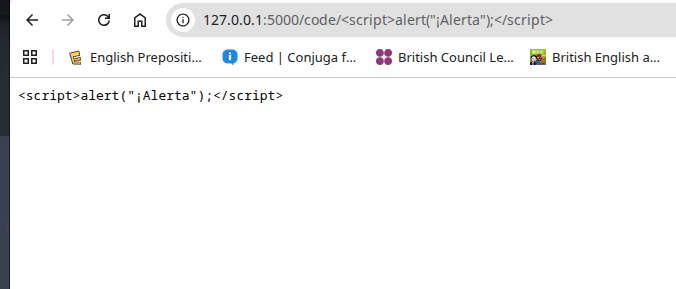
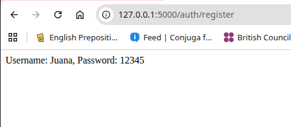

# Primer Ejercicio: Aprender lo básico

Los temas a ver son:

- Hola Mundo
- Activar Modo Depurador
- Rutas y Vistas
- Variables en rutas
- Escape de HTML
- Plantillas con Jinja y HTML
- Creación de plantillas
- Uso de variables y bucles 
- Herencia de plantillas
- Uso de filtros y funciones 
- Enviar datos a las plantillas
- Enlaces y rutas 
- Archivos estáticos 
- Manejo de formulario 
- Crear formulario 
- Validación de datos 
- Formulario con WTForm
- Validación de datos con WTForm
- Final

## Hola Mundo

1. Abrir Visual Studio Code

```
code .
```

2. Crear el archivo .py por fuera del ambiente virtual:

```
from flask import Flask

app = Flask(__name__)

@app.route('/')
def hello():
    return 'Hello World'
```

__name__ indica que el archivo (modulo) es la aplicación de Flask.

Cada Route representa una vista y está relacionado a una función.


3. Ejecutar la aplicación

```
cd exercises/
flask --app app1 run

Url: http://127.0.0.1:5000
```


## Activar Modo Depurador

Para activar modo depurador modificar el comando:

```
flask --app app1 --debug run
```


## Rutas y Vistas

1. Cada ruta debe ser única. Dos funciones no pueden tener la misma ruta o por defecto tomará la asociación de la primera función que encuentre.


2. También se pueden retornar diferentes elementos:


3. Una función puede tener más de una ruta:


## Variables en rutas

Se puede añadir variables de esta forma:


Se puede especificar el dato que se desea recibir por la ruta: string, int, float, path, uuid, etc.


También, se pueden recibir varios valores:


Ejemplo para manejar varias rutas:


## Escape de HTML

Flask recomienda escapar las entradas.

Código:

```
from flask import Flask

app = Flask(__name__)

@app.route('/')
@app.route('/index')
def index():
    return '<h1>Index Page</h1>'


# Obtener valores: string, int, float, path, uuid.
@app.route('/hello')
@app.route('/hello/<string:name>')
@app.route('/hello/<string:name>/<int:age>')
def hello(name = None, age = None):
    if name is None and age is None:
        return f'<h1>Hello World</h1>' 
    elif age is None:
        return f'<h1>Hello, {name}</h1>'
    else:
        return f'<h1>Hello, {name}. Your age is: {age}</h1>'

@app.route('/code/<path:code>')
def code(code):
    return f'<code>{code}</code>' 
```


```
http://127.0.0.1:5000/code/<script>alert("¡Alerta");</script>
```

```
from markupsafe import escape

@app.route('/code/<path:code>')
def code(code):
    return f'<code>{escape(code)}</code>' 
```




El escape es util para prevenir ataque de inyecciones al código. El escape convierte el código por ejemplo, de javascript a un texto plano. Por defecto la vista de Flask devuelve una vista en HTML.

## Plantillas con Jinja y HTML

En el contexto de Flask (y en desarrollo web en general), los templates son una herramienta clave para generar contenido HTML dinámico.

Un template (plantilla) es un archivo HTML que no tiene contenido fijo, sino que incluye marcadores de posición (variables, estructuras de control) que serán reemplazados por datos reales desde tu aplicación Python al momento de generar la página.

Los templates permiten que tu aplicación Flask:

- Genere páginas HTML personalizadas según el usuario.

- Reutilice partes comunes (como encabezados, menús).

- Separe el diseño visual (HTML) del código de lógica (Python).

En Flask: motor de plantillas Jinja2

Flask usa por defecto el motor de plantillas Jinja2, que permite incluir variables, estructuras condicionales, y bucles dentro del HTML.

Jinja2 es un motor de plantillas para Python que permite crear plantillas dinámicas y generar contenido HTML, XML, etc con datos en tiempo de ejecución.

Con Jinga se puede renderizar plantillas de HTML (Templates). 

¿Qué cosas puedes hacer en un template?

| Sintaxis de Jinja2                       | Significado                      |
| ---------------------------------------- | -------------------------------- |
| `{{ variable }}`                         | Muestra el valor de una variable |
| `...`            | Condicional                      |
| `...` | Bucle                            |
| `{# comentario #}`                       | Comentario que no se renderiza   |
| ``           | Incluir otro template            |
| ``              | Heredar de un template base      |

¿Dónde se guardan?

Todos los templates deben ir en la carpeta llamada templates/, al mismo nivel que tu app.py.

```
mi_proyecto/
├── app.py
├── templates/
│   └── index.html
```

En resumen:

| Concepto           | Descripción breve                                      |
| ------------------ | ------------------------------------------------------ |
| Template           | HTML con variables y lógica que se llena dinámicamente |
| render\_template() | Función de Flask para cargar y llenar un template      |
| Jinja2             | Lenguaje usado dentro de los templates                 |
| templates/         | Carpeta donde deben guardarse tus archivos HTML        |

## Creación de plantillas

En el proyecto se crea una carpeta templates:


Biblioteca:

```
from flask import Flask, render_template

@app.route('/')
@app.route('/index')
def index():
    return render_template('index.html')
```


Enviar una variable a la plantilla:


Uso de condicional:


## Uso de variables y bucles 


```
<!DOCTYPE html>
<html>
    <head>
        <title>Hello World</title>
    </head>
    <body>
        
        <h1>Welcome {{ name }}!</h1>
        
        <h1>Welcome friend!</h1>
        
        <ul>
            
            <li>{{ friend }}</li>
            
        </ul>
    </body>
</html>
```

## Herencia de plantillas

Es un sistema que permite definir una plantilla base (como un diseño general) que otras plantillas pueden extender y rellenar solo con el contenido específico que cambia.

Piensa en esto como una estructura madre que tiene la cabecera, el menú y el pie de página, y cada página hija solo pone lo que cambia en el "cuerpo".

También se pueden usar elementos dinámicos con bloques de contenido:


```
<!DOCTYPE html>
<html>
    <head>
        <title>My Web Site - </title>
    </head>
    <body>
        
        
        
    </body>
</html>
```

```

 Index Site 


    
    <h1>Welcome {{ name }}!</h1>
    
    <h1>Welcome friend!</h1>
    
    <ul>
        
        <li>{{ friend }}</li>
        
    </ul>

```

```
@app.route('/')
@app.route('/index')
def index():
    name = 'Juana'
    friends = ['friend1', 'friend2', 'friend3']
    return render_template('index.html', name = name, friends = friends)
```

## Uso de filtros y funciones 

En Flask, cuando hablamos de filtros, normalmente nos referimos a los filtros de Jinja2, que es el motor de plantillas que Flask usa por defecto.

Estos filtros te permiten modificar o dar formato a datos directamente en el HTML de tus templates, de manera sencilla y expresiva.

Ejemplo:

```
{{ variable | filtro }}
```

| Filtro    | Función                              |
| --------- | ------------------------------------ |
| `upper`   | Convierte a mayúsculas               |
| `lower`   | Convierte a minúsculas               |
| `length`  | Devuelve la cantidad de elementos    |
| `trim`    | Elimina espacios en blanco           |
| `default` | Usa un valor por defecto si es vacío |
| `date()`  | Da formato a fechas                  |


Agregar un filtro personalizado para la fecha:


Las dos formas de registrar un filtro personalizado, por un decorador o mediante el objeto, enviándo los valores por parámetro.


Ejemplo de repeat:


Asimismo, se puede añadir un decorador global.


o de esta forma:


```

 Index Site 


    
    <h1>Welcome {{ name | upper }}!</h1>
    
    <h1>Welcome friend!</h1>
    
    <ul>
        
        <li>{{ friend }}</li>
        
    </ul>

    <p>Today's date is {{ date | today }}</p>
    <p>The repeated sentence is {{ repeat('Ji', 3) }}</p>

```

```
from flask import Flask, render_template
from markupsafe import escape
from datetime import datetime

app = Flask(__name__)

# Filtro personalizado.
@app.add_template_filter
def today(date):
    return date.strftime('%d-%m-%Y')

#app.add_template_filter(today, 'today')

# Función personalizada multiplicar un string por un número.
@app.add_template_global
def repeat(val, num):
    return val * num

#app.add_template_global(repeat, 'repeat')

@app.route('/')
@app.route('/index')
def index():
    name = 'Juana'
    friends = ['friend1', 'friend2', 'friend3']
    date = datetime.now()
    return render_template(
        'index.html', 
        name = name, 
        friends = friends, 
        date = date
    )
```

## Enviar datos a las plantillas


```
# Obtener valores: string, int, float, path, uuid.
@app.route('/hello')
@app.route('/hello/<string:name>')
@app.route('/hello/<string:name>/<int:age>/<email>')
def hello(name = None, age = None, email = None):
    my_data = {
        'name': name,
        'age': age,
        'email': email
    }
    return render_template("hello.html", data = my_data)
```

```

 Hello Site 

    
        <h1>Welcome friend!</h1>
    
        <h1>Welcome {{ data.name | upper }}!</h1>
    
        <h1>Welcome. Your data is:</h1>
        <ul>
        
        <li>{{ val }}</li>
        
    </ul>
    

```

## Enlaces y rutas 

Una ruta (o endpoint) es la dirección URL que el navegador usa para pedir una página o recurso desde tu aplicación Flask.

Un enlace en HTML es simplemente una etiqueta <a> que lleva al usuario a otra ruta:

¿Qué es url_for?

url_for es una función de Flask (y Jinja2) que genera automáticamente la URL de una ruta, basándose en el nombre de la función que la maneja.

* Si cambias la ruta en el backend, los enlaces siguen funcionando.

* Puedes pasar parámetros.

* Evitas errores por rutas mal escritas.

Para fabricar rutas se utiliza url_for:


Se puede agregar un nav para las rutas:


## Archivos estáticos 


## Manejo de formulario 


## Crear formulario 


El método post evita que salgan los valores enviados por formulario en la url.

Importa la librería:

request es un objeto que Flask te permite acceder a los datos que llegan desde el navegador o cliente, como:

* Formularios (POST)

* Parámetros en la URL (GET)

* Cookies

* Headers




## Validación de datos 


## Formulario con WTForm


## Validación de datos con WTForm


