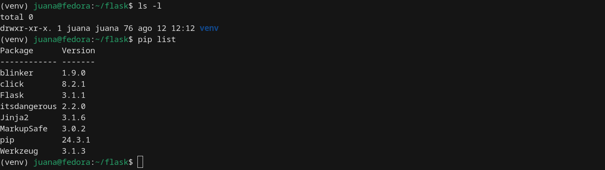
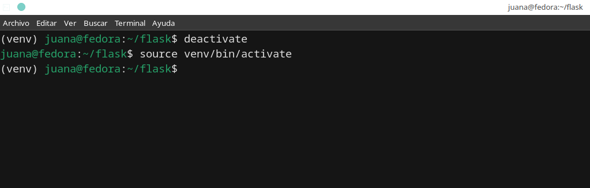

# Introducción a Flask API

Los temas a ver son:

- Introducción a Flask API
- Instalación de Flask API
- Primer Ejercicio: Aprender lo básico


## 1. Introducción a Flask API 🙋🏻‍♀️

- Introducción a Flask
- Conceptos básicos en Flask

#### ¿Qué es Flask?

Flask es un microframework web para Python que permite crear aplicaciones web de forma sencilla, rápida y flexible.

Fue creado por Armin Ronacher y es parte del proyecto Pallets.

#### ¿Por qué se llama “microframework”?

* No significa que Flask sea pequeño o limitado.

* Significa que no viene con todo incluido (como autenticación, ORM, formularios, etc.).

* Te da libertad: puedes agregar solo lo que necesitas, sin forzar estructuras.

#### Características principales de Flask

| Característica                                                 | Descripción                                                                            |
| -------------------------------------------------------------- | -------------------------------------------------------------------------------------- |
| ✅ **Ligero y simple**                                          | No impone una arquitectura compleja. Ideal para empezar.                               |
| 🔧 **Extensible**                                              | Puedes agregar extensiones (como Flask-SQLAlchemy, Flask-Login, etc.) si lo necesitas. |
| 🧩 **Flexible**                                                | Tú decides cómo organizar tu aplicación.                                               |
| 🚀 **Compatible con WSGI**                                     | Usa el estándar WSGI para correr en servidores como Gunicorn o uWSGI.                  |
| 🧪 **Modo debug integrado**                                    | Permite ver errores detallados en el navegador.                                        |
| 🌐 **Soporte para rutas, peticiones, templates HTML (Jinja2)** | Puedes crear URLs, manejar formularios, renderizar páginas dinámicas, etc.             |

#### ¿Qué incluye Flask por defecto?

Flask ya viene con:

* Servidor web de desarrollo

* Soporte de rutas

* Soporte para peticiones HTTP (GET, POST, etc.)

* Sistema de templates Jinja2 (para HTML dinámico)

* Manejo de sesiones

* Manejo de errores y logging

### Conceptos básicos en Flask

| Concepto                               | Explicación                                                                                          |
| -------------------------------------- | ---------------------------------------------------------------------------------------------------- |
| `Flask(__name__)`                      | Crea la aplicación web. Usa el nombre del módulo para ayudar a encontrar recursos (templates, etc.). |
| `__name__`                             | Indica si el script es principal o importado.                                                        |
| `@app.route()`                         | Decorador que define una **ruta** (una URL que responde algo).                                       |
| `app.run()`                            | Inicia el servidor de desarrollo de Flask.                                                           |
| `render_template()`                    | Usa templates HTML dinámicos con Jinja2.                                                             |
| `request`, `session`, `redirect`, etc. | Utilidades para manejar formularios, sesiones, redirecciones, etc.                                   |

1. **from flask import Flask**

```
from flask import Flask
```

Esto importa la clase Flask del paquete flask.

2. **app = Flask(__name__)**

```
app = Flask(__name__)
```

* Aquí estás creando una instancia de la clase Flask.

* __name__ es una variable especial de Python que representa el nombre del módulo actual.

* Flask lo usa para encontrar rutas relativas a tu archivo (por ejemplo, para buscar plantillas o recursos).

3. **Decoradores @app.route("/")**

```
@app.route("/")
def home():
    return "Hola mundo"
```

¿Qué es eso @?

* Esto es un decorador en Python, una función que modifica otra función.

* En Flask, el decorador @app.route() le dice a Flask qué URL debe ejecutar qué función.

* En este ejemplo: cuando alguien entra a / (la raíz del sitio), Flask ejecuta la función home().

4. **return de las funciones de ruta**

```
return "Hola mundo"
```

Flask espera que cada función de ruta (como home()) devuelva un contenido que se mostrará en el navegador.

Puede ser:

* Texto plano

* HTML

* Una redirección

* Un archivo JSON (para APIs)

5. **app.run(debug=True)**

```
if __name__ == "__main__":
    app.run(debug=True)
```

Esto ejecuta el servidor web de desarrollo.

debug=True activa el modo desarrollador:

* Flask recarga la app automáticamente si detecta cambios.

* Muestra errores detallados en el navegador.

⚠️ No uses debug=True en producción.

6. render_template()

```
from flask import render_template

@app.route("/inicio")
def inicio():
    return render_template("inicio.html")
```

* Esta función busca archivos HTML dentro de la carpeta templates/.

* Usa el motor de plantillas Jinja2, que permite insertar variables y estructuras de control en HTML.

#### Ejemplo completo explicado:

```
from flask import Flask, render_template, request, redirect, url_for

app = Flask(__name__)

@app.route('/')
def home():
    return "Página principal"

@app.route('/saludo/<nombre>')
def saludar(nombre):
    return f"Hola, {nombre}!"

if __name__ == '__main__':
    app.run(debug=True)
```

¿Qué hace esto?

* @app.route('/'): Muestra texto cuando visitas la raíz.

* @app.route('/saludo/<nombre>'): Ruta dinámica que captura un parámetro (nombre) desde la URL.

Si visitas /saludo/Juana, verás “Hola, Juana!”


### Estructura básica de un proyecto Flask simple

```
flask_app/
│
├── venv/               → Entorno virtual
├── app.py              → Código principal de tu aplicación
├── templates/          → Archivos HTML (Jinja2)
│   └── index.html
├── static/             → Archivos estáticos (CSS, JS, imágenes)
└── requirements.txt    → Lista de paquetes instalados
```

#### **1. venv/ — Entorno virtual**

¿Qué es?

* Carpeta que contiene una copia aislada de Python y pip.

* Todos los paquetes que instales con pip dentro del entorno van aquí.

¿Para qué sirve?

* Aíslas dependencias del sistema.

* Puedes tener diferentes versiones de Flask o librerías en diferentes proyectos.

📌 Nunca subas esta carpeta a Git o la compartas. Siempre se recrea con requirements.txt.

#### **2. app.py — Código principal de la aplicación**

¿Qué es?

* Archivo donde defines tu aplicación Flask.

Contiene:

* La instancia de Flask

* Las rutas

* La configuración

* La ejecución del servidor

Ejemplo básico:

```
from flask import Flask, render_template

app = Flask(__name__)

@app.route("/")
def index():
    return render_template("index.html")

if __name__ == "__main__":
    app.run(debug=True)
```

#### **3. templates/ — Plantillas HTML con Jinja2**

¿Qué es?

* Carpeta especial donde Flask busca tus archivos HTML.

* Usa el motor de plantillas Jinja2, que permite usar código como:

```
<!DOCTYPE html>
<html>
<head>
    <title>Mi app Flask</title>
</head>
<body>
    <h1>Bienvenida, Juana</h1>
</body>
</html>
```

#### **4. static/ — Archivos estáticos**

¿Qué es?

Carpeta donde colocas archivos como:

* CSS

* JavaScript

* Imágenes

Ejemplo de estructura:

```
static/
├── css/
│   └── estilo.css
├── js/
│   └── script.js
└── img/
    └── logo.png

<link rel="stylesheet" href="{{ url_for('static', filename='css/estilo.css') }}">

```

#### **5. requirements.txt — Dependencias del proyecto**

¿Qué es?

* Archivo de texto que guarda la lista de paquetes instalados con pip.

* Se genera así:

```
pip freeze > requirements.txt
```

```
Flask==3.0.3
Jinja2==3.1.3
Werkzeug==3.0.3
```

¿Para qué sirve?

Para que tú o cualquier persona pueda instalar todas las dependencias de tu proyecto fácilmente:

```
pip install -r requirements.txt
```

¿Puedo estructurar mi proyecto de otra forma?

Sí. A medida que tu proyecto crece, puedes separar el código en módulos y carpetas, por ejemplo:

Es un esquema más avanzado y profesional, ideal para proyectos Flask (u otras apps) que se desarrollan en equipos y se despliegan en producción, especialmente si se usa CI/CD, contenedores, y buenas prácticas de documentación.

```
.
├── .github/
│   └── workflows/          # Pipelines del repositorio (CI/CD)
├── k8s/                    # Archivos para despliegue en Kubernetes
├── docs/                   # Documentación técnica
├── <aplicación>/           # Código fuente de la app (una carpeta por app)
├── vale.ini                # Configuración para Vale (linter de estilo de escritura)
├── config.yaml             # Configuración general del repositorio
├── Makefile                # Tareas automatizadas (compilar, testear, etc.)
└── README.md               # Descripción del proyecto
```

**1. .github/workflows/**

Contiene archivos .yml para GitHub Actions.

Define pipelines automatizados como:

* Ejecutar pruebas

* Validar código

* Construir imágenes Docker

* Hacer despliegues automáticos

📌 Esto es parte del proceso de integración continua (CI/CD).

**2. k8s/**

Archivos de configuración para Kubernetes:

* deployment.yaml

* service.yaml

* ingress.yaml

Permiten desplegar la app automáticamente en clusters Kubernetes.

📌 Esto te indica que el proyecto está pensado para escalar y usarse en contenedores.

**3. docs/**

Contiene documentación técnica:

* Guías de instalación

* Arquitectura del sistema

* Manuales de uso

Suele usarse con herramientas como MkDocs o Sphinx.

**4. <aplicación>/**

Carpeta que contiene el código fuente de tu aplicación Flask.

Si hay varias apps, se crea una carpeta por cada una.

Ejemplo de lo que puede haber adentro:

```
<aplicación>/
├── __init__.py
├── routes.py
├── models.py
├── templates/
└── static/
```

📌 Esta separación permite mantener múltiples microservicios o apps dentro del mismo repositorio.

Archivos importantes

1. vale.ini

Configura Vale, un linter de estilo de escritura técnica.

Se usa para asegurar que la redacción de la documentación sea clara, consistente y profesional.

⚠️ NO modificarlo si no sabes qué hace, porque lo usan los pipelines para revisar documentación.

2. config.yaml

Archivo de configuración del repositorio.

Puede incluir:

* Nombre del proyecto

* Versión mínima de Python

* Variables comunes

* Información de despliegue

📌 Este SÍ deberías modificarlo si estás configurando el proyecto.

3. Makefile

Define tareas automatizadas usando el comando make.

Ejemplos de comandos posibles:

* make run → ejecuta la app

* make test → corre pruebas

* make lint → valida código o documentación

⚠️ NO modificar las reglas actuales si dice eso en el comentario.

README.md

Archivo Markdown con la descripción del proyecto:

* Qué hace

* Cómo instalarlo

* Cómo ejecutarlo

* Quién lo mantiene

📌 Es lo primero que ve alguien que entra al repo. Muy importante.

En resumen

Esta estructura es propia de un proyecto industrial o empresarial que sigue buenas prácticas de desarrollo moderno:

* CI/CD (automatización)

* Contenerización (Docker/Kubernetes)

* Documentación estructurada

* Revisión automatizada de escritura (Vale)

* Separación de responsabilidades


## 2. Instalación de Flask API 🙋🏻‍♀️

- Instalación

### Instalación

1. Actualizar el sistema:

```
sudo dnf update -y
```

2. Verificar versión de Python

```
python --version
```

3. Crear una carpeta para tu proyecto Flask:

```
mkdir ~/flask
cd ~/flask
```

4. Crear un entorno virtual (con la versión actual de Python)

```
python3 -m venv venv
```

5. Activa el entorno virtual

```
source venv/bin/activate
```

6. Instala Flask dentro del entorno virtual

```
pip install Flask
```

7. Verifica que Flask se instaló correctamente

```
pip install Flask
```


8. Verificar las herramientas

```
pip list
```



9. Desactivar entorno virtual

```
deactivate
```




---


## 3. Primer Ejercicio: Aprender lo básico 🙋🏻‍♀️

- Hola Mundo
- Activar Modo Depurador
- Rutas y Vistas
- Variables en rutas
- Escape de HTML
- Plantillas con Jinja y HTML
- Creación de plantillas
- Uso de variables y bucles 
- Herencia de plantillas
- Uso de filtros y funciones 
- Enviar datos a las plantillas
- Enlaces y rutas 
- Archivos estáticos 
- Manejo de formulario 
- Crear formulario 
- Validación de datos 
- Formulario con WTForm
- Validación de datos con WTForm
- Final

### Hola Mundo

1. Abrir Visual Studio Code

```
code .
```

2. Crear el archivo .py por fuera del ambiente virtual:

```
from flask import Flask

app = Flask(__name__)

@app.route('/')
def hello():
    return 'Hello World'
```

__name__ indica que el archivo (modulo) es la aplicación de Flask.

Cada Route representa una vista y está relacionado a una función.


3. Ejecutar la aplicación

```
cd exercises/
flask --app app1 run

Url: http://127.0.0.1:5000
```


### Activar Modo Depurador

Para activar modo depurador modificar el comando:

```
flask --app app1 --debug run
```


### Rutas y Vistas

1. Cada ruta debe ser única. Dos funciones no pueden tener la misma ruta o por defecto tomará la asociación de la primera función que encuentre.


2. También se pueden retornar diferentes elementos:


3. Una función puede tener más de una ruta:


### Variables en rutas

Se puede añadir variables de esta forma:


Se puede especificar el dato que se desea recibir por la ruta: string, int, float, path, uuid, etc.


También, se pueden recibir varios valores:


Ejemplo para manejar varias rutas:


### Escape de HTML

Flask recomienda escapar las entradas.

Código:

```
from flask import Flask

app = Flask(__name__)

@app.route('/')
@app.route('/index')
def index():
    return '<h1>Index Page</h1>'


# Obtener valores: string, int, float, path, uuid.
@app.route('/hello')
@app.route('/hello/<string:name>')
@app.route('/hello/<string:name>/<int:age>')
def hello(name = None, age = None):
    if name is None and age is None:
        return f'<h1>Hello World</h1>' 
    elif age is None:
        return f'<h1>Hello, {name}</h1>'
    else:
        return f'<h1>Hello, {name}. Your age is: {age}</h1>'

@app.route('/code/<path:code>')
def code(code):
    return f'<code>{code}</code>' 
```


```
http://127.0.0.1:5000/code/<script>alert("¡Alerta");</script>
```

```
from markupsafe import escape

@app.route('/code/<path:code>')
def code(code):
    return f'<code>{escape(code)}</code>' 
```


El escape es util para prevenir ataque de inyecciones al código. El escape convierte el código por ejemplo, de javascript a un texto plano. Por defecto la vista de Flask devuelve una vista en HTML.

### Plantillas con Jinja y HTML

En el contexto de Flask (y en desarrollo web en general), los templates son una herramienta clave para generar contenido HTML dinámico.

Un template (plantilla) es un archivo HTML que no tiene contenido fijo, sino que incluye marcadores de posición (variables, estructuras de control) que serán reemplazados por datos reales desde tu aplicación Python al momento de generar la página.

Los templates permiten que tu aplicación Flask:

- Genere páginas HTML personalizadas según el usuario.

- Reutilice partes comunes (como encabezados, menús).

- Separe el diseño visual (HTML) del código de lógica (Python).

En Flask: motor de plantillas Jinja2

Flask usa por defecto el motor de plantillas Jinja2, que permite incluir variables, estructuras condicionales, y bucles dentro del HTML.

Jinja2 es un motor de plantillas para Python que permite crear plantillas dinámicas y generar contenido HTML, XML, etc con datos en tiempo de ejecución.

Con Jinga se puede renderizar plantillas de HTML (Templates). 

¿Qué cosas puedes hacer en un template?

| Sintaxis de Jinja2                       | Significado                      |
| ---------------------------------------- | -------------------------------- |
| `{{ variable }}`                         | Muestra el valor de una variable |
| `...`            | Condicional                      |
| `...` | Bucle                            |
| `{# comentario #}`                       | Comentario que no se renderiza   |
| ``           | Incluir otro template            |
| ``              | Heredar de un template base      |

¿Dónde se guardan?

Todos los templates deben ir en la carpeta llamada templates/, al mismo nivel que tu app.py.

```
mi_proyecto/
├── app.py
├── templates/
│   └── index.html
```

En resumen:

| Concepto           | Descripción breve                                      |
| ------------------ | ------------------------------------------------------ |
| Template           | HTML con variables y lógica que se llena dinámicamente |
| render\_template() | Función de Flask para cargar y llenar un template      |
| Jinja2             | Lenguaje usado dentro de los templates                 |
| templates/         | Carpeta donde deben guardarse tus archivos HTML        |

### Creación de plantillas

En el proyecto se crea una carpeta templates:


Biblioteca:

```
from flask import Flask, render_template

@app.route('/')
@app.route('/index')
def index():
    return render_template('index.html')
```


Enviar una variable a la plantilla:


Uso de condicional:


### Uso de variables y bucles 


```
<!DOCTYPE html>
<html>
    <head>
        <title>Hello World</title>
    </head>
    <body>
        
        <h1>Welcome {{ name }}!</h1>
        
        <h1>Welcome friend!</h1>
        
        <ul>
            
            <li>{{ friend }}</li>
            
        </ul>
    </body>
</html>
```

### Herencia de plantillas

Es un sistema que permite definir una plantilla base (como un diseño general) que otras plantillas pueden extender y rellenar solo con el contenido específico que cambia.

Piensa en esto como una estructura madre que tiene la cabecera, el menú y el pie de página, y cada página hija solo pone lo que cambia en el "cuerpo".

También se pueden usar elementos dinámicos con bloques de contenido:


```
<!DOCTYPE html>
<html>
    <head>
        <title>My Web Site - </title>
    </head>
    <body>
        
        
        
    </body>
</html>
```

```

 Index Site 


    
    <h1>Welcome {{ name }}!</h1>
    
    <h1>Welcome friend!</h1>
    
    <ul>
        
        <li>{{ friend }}</li>
        
    </ul>

```

```
@app.route('/')
@app.route('/index')
def index():
    name = 'Juana'
    friends = ['friend1', 'friend2', 'friend3']
    return render_template('index.html', name = name, friends = friends)
```

### Uso de filtros y funciones 

En Flask, cuando hablamos de filtros, normalmente nos referimos a los filtros de Jinja2, que es el motor de plantillas que Flask usa por defecto.

Estos filtros te permiten modificar o dar formato a datos directamente en el HTML de tus templates, de manera sencilla y expresiva.

Ejemplo:

```
{{ variable | filtro }}
```

| Filtro    | Función                              |
| --------- | ------------------------------------ |
| `upper`   | Convierte a mayúsculas               |
| `lower`   | Convierte a minúsculas               |
| `length`  | Devuelve la cantidad de elementos    |
| `trim`    | Elimina espacios en blanco           |
| `default` | Usa un valor por defecto si es vacío |
| `date()`  | Da formato a fechas                  |


Agregar un filtro personalizado para la fecha:


Las dos formas de registrar un filtro personalizado, por un decorador o mediante el objeto, enviándo los valores por parámetro.


Ejemplo de repeat:


Asimismo, se puede añadir un decorador global.


o de esta forma:


```

 Index Site 


    
    <h1>Welcome {{ name | upper }}!</h1>
    
    <h1>Welcome friend!</h1>
    
    <ul>
        
        <li>{{ friend }}</li>
        
    </ul>

    <p>Today's date is {{ date | today }}</p>
    <p>The repeated sentence is {{ repeat('Ji', 3) }}</p>

```

```
from flask import Flask, render_template
from markupsafe import escape
from datetime import datetime

app = Flask(__name__)

# Filtro personalizado.
@app.add_template_filter
def today(date):
    return date.strftime('%d-%m-%Y')

#app.add_template_filter(today, 'today')

# Función personalizada multiplicar un string por un número.
@app.add_template_global
def repeat(val, num):
    return val * num

#app.add_template_global(repeat, 'repeat')

@app.route('/')
@app.route('/index')
def index():
    name = 'Juana'
    friends = ['friend1', 'friend2', 'friend3']
    date = datetime.now()
    return render_template(
        'index.html', 
        name = name, 
        friends = friends, 
        date = date
    )
```

### Enviar datos a las plantillas


```
# Obtener valores: string, int, float, path, uuid.
@app.route('/hello')
@app.route('/hello/<string:name>')
@app.route('/hello/<string:name>/<int:age>/<email>')
def hello(name = None, age = None, email = None):
    my_data = {
        'name': name,
        'age': age,
        'email': email
    }
    return render_template("hello.html", data = my_data)
```

```

 Hello Site 

    
        <h1>Welcome friend!</h1>
    
        <h1>Welcome {{ data.name | upper }}!</h1>
    
        <h1>Welcome. Your data is:</h1>
        <ul>
        
        <li>{{ val }}</li>
        
    </ul>
    

```

### Enlaces y rutas 

Una ruta (o endpoint) es la dirección URL que el navegador usa para pedir una página o recurso desde tu aplicación Flask.

Un enlace en HTML es simplemente una etiqueta <a> que lleva al usuario a otra ruta:

¿Qué es url_for?

url_for es una función de Flask (y Jinja2) que genera automáticamente la URL de una ruta, basándose en el nombre de la función que la maneja.

* Si cambias la ruta en el backend, los enlaces siguen funcionando.

* Puedes pasar parámetros.

* Evitas errores por rutas mal escritas.

Para fabricar rutas se utiliza url_for:


Se puede agregar un nav para las rutas:


### Archivos estáticos 


### Manejo de formulario 


### Crear formulario 


El método post evita que salgan los valores enviados por formulario en la url.

Importa la librería:

request es un objeto que Flask te permite acceder a los datos que llegan desde el navegador o cliente, como:

* Formularios (POST)

* Parámetros en la URL (GET)

* Cookies

* Headers


### Validación de datos 


### Formulario con WTForm


### Validación de datos con WTForm


