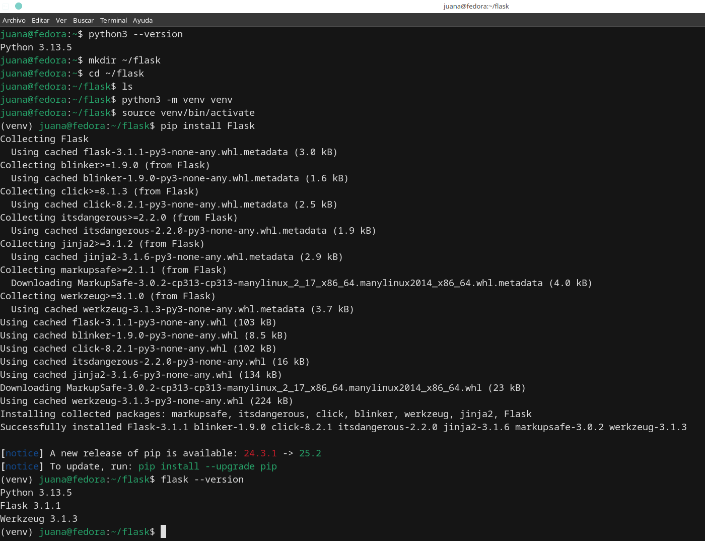

# Introducción a Flask API

Los temas a ver son:

- Introducción a Flask API
- Instalación de Flask API


## 1. Introducción a Flask API 🙋🏻‍♀️

- Introducción a Flask
- Conceptos básicos en Flask

#### ¿Qué es Flask?

Flask es un microframework web para Python que permite crear aplicaciones web de forma sencilla, rápida y flexible.

Fue creado por Armin Ronacher y es parte del proyecto Pallets.

#### ¿Por qué se llama “microframework”?

* No significa que Flask sea pequeño o limitado.

* Significa que no viene con todo incluido (como autenticación, ORM, formularios, etc.).

* Te da libertad: puedes agregar solo lo que necesitas, sin forzar estructuras.

#### Características principales de Flask

| Característica                                                 | Descripción                                                                            |
| -------------------------------------------------------------- | -------------------------------------------------------------------------------------- |
| ✅ **Ligero y simple**                                          | No impone una arquitectura compleja. Ideal para empezar.                               |
| 🔧 **Extensible**                                              | Puedes agregar extensiones (como Flask-SQLAlchemy, Flask-Login, etc.) si lo necesitas. |
| 🧩 **Flexible**                                                | Tú decides cómo organizar tu aplicación.                                               |
| 🚀 **Compatible con WSGI**                                     | Usa el estándar WSGI para correr en servidores como Gunicorn o uWSGI.                  |
| 🧪 **Modo debug integrado**                                    | Permite ver errores detallados en el navegador.                                        |
| 🌐 **Soporte para rutas, peticiones, templates HTML (Jinja2)** | Puedes crear URLs, manejar formularios, renderizar páginas dinámicas, etc.             |

#### ¿Qué incluye Flask por defecto?

Flask ya viene con:

* Servidor web de desarrollo

* Soporte de rutas

* Soporte para peticiones HTTP (GET, POST, etc.)

* Sistema de templates Jinja2 (para HTML dinámico)

* Manejo de sesiones

* Manejo de errores y logging

### Conceptos básicos en Flask

| Concepto                               | Explicación                                                                                          |
| -------------------------------------- | ---------------------------------------------------------------------------------------------------- |
| `Flask(__name__)`                      | Crea la aplicación web. Usa el nombre del módulo para ayudar a encontrar recursos (templates, etc.). |
| `__name__`                             | Indica si el script es principal o importado.                                                        |
| `@app.route()`                         | Decorador que define una **ruta** (una URL que responde algo).                                       |
| `app.run()`                            | Inicia el servidor de desarrollo de Flask.                                                           |
| `render_template()`                    | Usa templates HTML dinámicos con Jinja2.                                                             |
| `request`, `session`, `redirect`, etc. | Utilidades para manejar formularios, sesiones, redirecciones, etc.                                   |

1. **from flask import Flask**

```
from flask import Flask
```

Esto importa la clase Flask del paquete flask.

2. **app = Flask(__name__)**

```
app = Flask(__name__)
```

* Aquí estás creando una instancia de la clase Flask.

* __name__ es una variable especial de Python que representa el nombre del módulo actual.

* Flask lo usa para encontrar rutas relativas a tu archivo (por ejemplo, para buscar plantillas o recursos).

3. **Decoradores @app.route("/")**

```
@app.route("/")
def home():
    return "Hola mundo"
```

¿Qué es eso @?

* Esto es un decorador en Python, una función que modifica otra función.

* En Flask, el decorador @app.route() le dice a Flask qué URL debe ejecutar qué función.

* En este ejemplo: cuando alguien entra a / (la raíz del sitio), Flask ejecuta la función home().

4. **return de las funciones de ruta**

```
return "Hola mundo"
```

Flask espera que cada función de ruta (como home()) devuelva un contenido que se mostrará en el navegador.

Puede ser:

* Texto plano

* HTML

* Una redirección

* Un archivo JSON (para APIs)

5. **app.run(debug=True)**

```
if __name__ == "__main__":
    app.run(debug=True)
```

Esto ejecuta el servidor web de desarrollo.

debug=True activa el modo desarrollador:

* Flask recarga la app automáticamente si detecta cambios.

* Muestra errores detallados en el navegador.

⚠️ No uses debug=True en producción.

6. render_template()

```
from flask import render_template

@app.route("/inicio")
def inicio():
    return render_template("inicio.html")
```

* Esta función busca archivos HTML dentro de la carpeta templates/.

* Usa el motor de plantillas Jinja2, que permite insertar variables y estructuras de control en HTML.

#### Ejemplo completo explicado:

```
from flask import Flask, render_template, request, redirect, url_for

app = Flask(__name__)

@app.route('/')
def home():
    return "Página principal"

@app.route('/saludo/<nombre>')
def saludar(nombre):
    return f"Hola, {nombre}!"

if __name__ == '__main__':
    app.run(debug=True)
```

¿Qué hace esto?

* @app.route('/'): Muestra texto cuando visitas la raíz.

* @app.route('/saludo/<nombre>'): Ruta dinámica que captura un parámetro (nombre) desde la URL.

Si visitas /saludo/Juana, verás “Hola, Juana!”


### Estructura básica de un proyecto Flask simple

```
flask_app/
│
├── venv/               → Entorno virtual
├── app.py              → Código principal de tu aplicación
├── templates/          → Archivos HTML (Jinja2)
│   └── index.html
├── static/             → Archivos estáticos (CSS, JS, imágenes)
└── requirements.txt    → Lista de paquetes instalados
```

#### **1. venv/ — Entorno virtual**

¿Qué es?

* Carpeta que contiene una copia aislada de Python y pip.

* Todos los paquetes que instales con pip dentro del entorno van aquí.

¿Para qué sirve?

* Aíslas dependencias del sistema.

* Puedes tener diferentes versiones de Flask o librerías en diferentes proyectos.

📌 Nunca subas esta carpeta a Git o la compartas. Siempre se recrea con requirements.txt.

#### **2. app.py — Código principal de la aplicación**

¿Qué es?

* Archivo donde defines tu aplicación Flask.

Contiene:

* La instancia de Flask

* Las rutas

* La configuración

* La ejecución del servidor

Ejemplo básico:

```
from flask import Flask, render_template

app = Flask(__name__)

@app.route("/")
def index():
    return render_template("index.html")

if __name__ == "__main__":
    app.run(debug=True)
```

#### **3. templates/ — Plantillas HTML con Jinja2**

¿Qué es?

* Carpeta especial donde Flask busca tus archivos HTML.

* Usa el motor de plantillas Jinja2, que permite usar código como:

```
<!DOCTYPE html>
<html>
<head>
    <title>Mi app Flask</title>
</head>
<body>
    <h1>Bienvenida, Juana</h1>
</body>
</html>
```

#### **4. static/ — Archivos estáticos**

¿Qué es?

Carpeta donde colocas archivos como:

* CSS

* JavaScript

* Imágenes

Ejemplo de estructura:

```
static/
├── css/
│   └── estilo.css
├── js/
│   └── script.js
└── img/
    └── logo.png

<link rel="stylesheet" href="{{ url_for('static', filename='css/estilo.css') }}">

```

#### **5. requirements.txt — Dependencias del proyecto**

¿Qué es?

* Archivo de texto que guarda la lista de paquetes instalados con pip.

* Se genera así:

```
pip freeze > requirements.txt
```

```
Flask==3.0.3
Jinja2==3.1.3
Werkzeug==3.0.3
```

¿Para qué sirve?

Para que tú o cualquier persona pueda instalar todas las dependencias de tu proyecto fácilmente:

```
pip install -r requirements.txt
```

¿Puedo estructurar mi proyecto de otra forma?

Sí. A medida que tu proyecto crece, puedes separar el código en módulos y carpetas, por ejemplo:

Es un esquema más avanzado y profesional, ideal para proyectos Flask (u otras apps) que se desarrollan en equipos y se despliegan en producción, especialmente si se usa CI/CD, contenedores, y buenas prácticas de documentación.

```
.
├── .github/
│   └── workflows/          # Pipelines del repositorio (CI/CD)
├── k8s/                    # Archivos para despliegue en Kubernetes
├── docs/                   # Documentación técnica
├── <aplicación>/           # Código fuente de la app (una carpeta por app)
├── vale.ini                # Configuración para Vale (linter de estilo de escritura)
├── config.yaml             # Configuración general del repositorio
├── Makefile                # Tareas automatizadas (compilar, testear, etc.)
└── README.md               # Descripción del proyecto
```

**1. .github/workflows/**

Contiene archivos .yml para GitHub Actions.

Define pipelines automatizados como:

* Ejecutar pruebas

* Validar código

* Construir imágenes Docker

* Hacer despliegues automáticos

📌 Esto es parte del proceso de integración continua (CI/CD).

**2. k8s/**

Archivos de configuración para Kubernetes:

* deployment.yaml

* service.yaml

* ingress.yaml

Permiten desplegar la app automáticamente en clusters Kubernetes.

📌 Esto te indica que el proyecto está pensado para escalar y usarse en contenedores.

**3. docs/**

Contiene documentación técnica:

* Guías de instalación

* Arquitectura del sistema

* Manuales de uso

Suele usarse con herramientas como MkDocs o Sphinx.

**4. <aplicación>/**

Carpeta que contiene el código fuente de tu aplicación Flask.

Si hay varias apps, se crea una carpeta por cada una.

Ejemplo de lo que puede haber adentro:

```
<aplicación>/
├── __init__.py
├── routes.py
├── models.py
├── templates/
└── static/
```

📌 Esta separación permite mantener múltiples microservicios o apps dentro del mismo repositorio.

Archivos importantes

1. vale.ini

Configura Vale, un linter de estilo de escritura técnica.

Se usa para asegurar que la redacción de la documentación sea clara, consistente y profesional.

⚠️ NO modificarlo si no sabes qué hace, porque lo usan los pipelines para revisar documentación.

2. config.yaml

Archivo de configuración del repositorio.

Puede incluir:

* Nombre del proyecto

* Versión mínima de Python

* Variables comunes

* Información de despliegue

📌 Este SÍ deberías modificarlo si estás configurando el proyecto.

3. Makefile

Define tareas automatizadas usando el comando make.

Ejemplos de comandos posibles:

* make run → ejecuta la app

* make test → corre pruebas

* make lint → valida código o documentación

⚠️ NO modificar las reglas actuales si dice eso en el comentario.

README.md

Archivo Markdown con la descripción del proyecto:

* Qué hace

* Cómo instalarlo

* Cómo ejecutarlo

* Quién lo mantiene

📌 Es lo primero que ve alguien que entra al repo. Muy importante.

En resumen

Esta estructura es propia de un proyecto industrial o empresarial que sigue buenas prácticas de desarrollo moderno:

* CI/CD (automatización)

* Contenerización (Docker/Kubernetes)

* Documentación estructurada

* Revisión automatizada de escritura (Vale)

* Separación de responsabilidades


## 2. Instalación de Flask API 🙋🏻‍♀️

- Instalación

### Instalación

1. Actualizar el sistema:

```
sudo dnf update -y
```

2. Verificar versión de Python

```
python --version
```

3. Crear una carpeta para tu proyecto Flask:

```
mkdir ~/flask
cd ~/flask
```

4. Crear un entorno virtual (con la versión actual de Python)

```
python3 -m venv venv
```

5. Activa el entorno virtual

```
source venv/bin/activate
```

6. Instala Flask dentro del entorno virtual

```
pip install Flask
```

7. Verifica que Flask se instaló correctamente

```
pip install Flask
```




