# Segundo Ejercicio: Crear una simple API Rest 

Los temas a ver son:

- Tu primera REST API
- Introducción a Docker
- Flask-Smorest para un desarrollo más eficiente
- Almacenar datos en una base de datos SQL con SQLAlchemy
- Relaciones de muchos a muchos con SQLAlchemy
- Autenticación de usuarios con Flask-JWT-Extended
- Migraciones de bases de datos con Alembic y Flask-Migrate
- Curso intensivo de Git
- Implementaciones con Render.com
- Colas de tareas con solicitud y envío de correos electrónicos


## 1. Tu primera REST API 🙋🏻‍♀️

- Introducción a Flask
- Configuración inicial para una aplicación Flask
- Su primer punto final de API REST
- ¿Qué es un JSON?
- Cómo interactuar con su API REST y probarla
- Cómo crear tiendas en nuestra API REST
- Cómo crear artículos en cada tienda
- Cómo conseguir una tienda específica y sus artículos

### Descripción general del proyecto que construiremos

#### Explicación general

Este fragmento describe cómo crear una API REST simple que permite trabajar con tiendas y productos. Se puede:

- Crear tiendas con nombre y lista de productos.

- Agregar productos a una tienda.

- Obtener todas las tiendas y sus productos.

- Obtener una tienda específica y sus productos.

- Obtener solo los productos de una tienda específica.

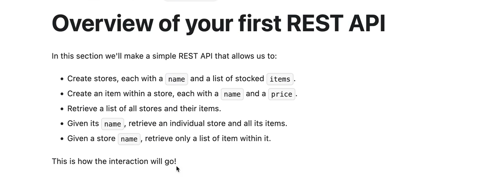

#### Crear tiendas - Create stores

Request:

```
POST /store {"name": "My Store"}
```

Response:

```
{"name": "My Store", "items":[]}
```

Se crea una tienda llamada My Store.

Al principio, la tienda no tiene productos (items: []).

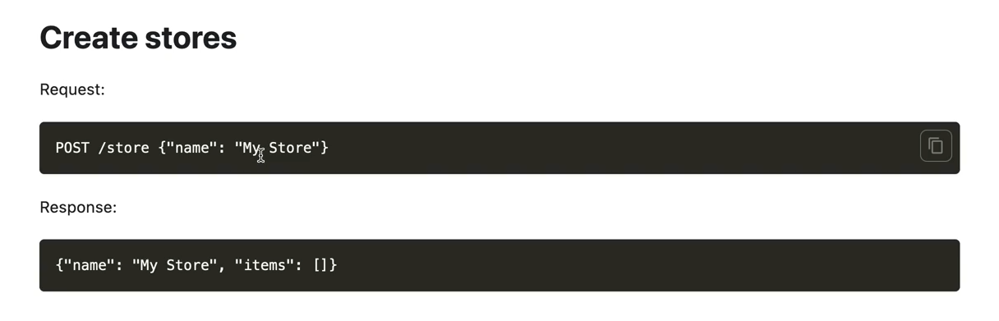

#### Crear productos - Create items

Request:

```
POST /store/item {"name": "Chair", "price": 175.50}
```

Response:

```
{"name": "Chair", "price": 175.50}
```

Se crea un producto llamado Chair (silla) con un precio de 175.50.

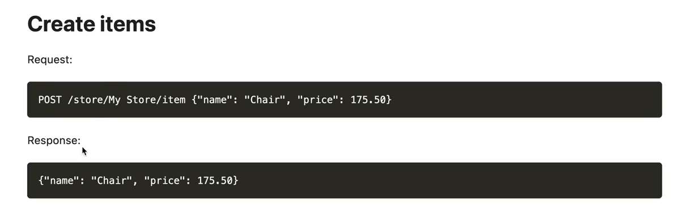

#### Obtener todas las tiendas y sus productos - Retrieve all stories and their items

Request:

```
GET /store
```

Response:

```
{
    "stores": [
        "name": "My Store",
        "items": [
            {
               "name": "Chair",
               "price": 175.50 
            }
        ]
    ]
}
```

Devuelve una lista de tiendas (stores).

En este caso, hay una tienda llamada My Store que contiene un producto llamado Chair con precio 175.50.


#### Obtener una tienda específica - Get a particular store

Request:

```
GET /store/My Store/item
```

Response:

```
[
    {
        "name": "Chair",
        "price": 175.50 
    }
]
```

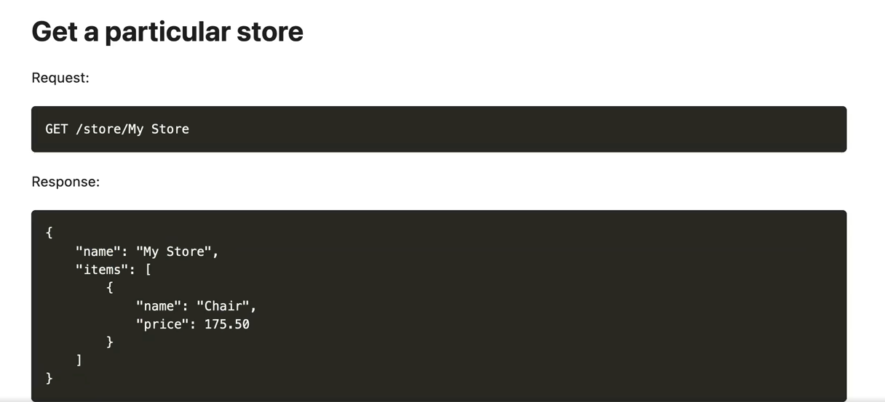

#### Obtener solo los productos de una tienda - Get only items in a store

Request:

```
POST /store {"name": "My Store"}
```

Response:

```
{"name": "My Store", "items":[]}
```

Devuelve solo los productos de la tienda My Store, sin información adicional sobre la tienda.

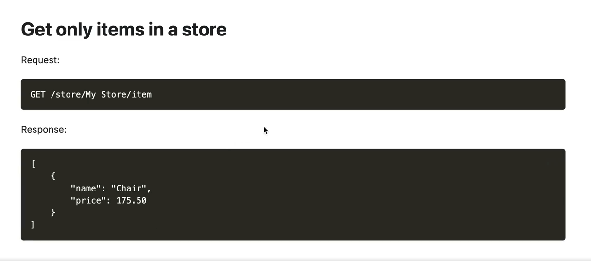


### Configuración inicial para una aplicación Flask

[Ver instalación de Flask](./README.md)

### Su primer punto final de API REST

```
flask --app app --debug run
```

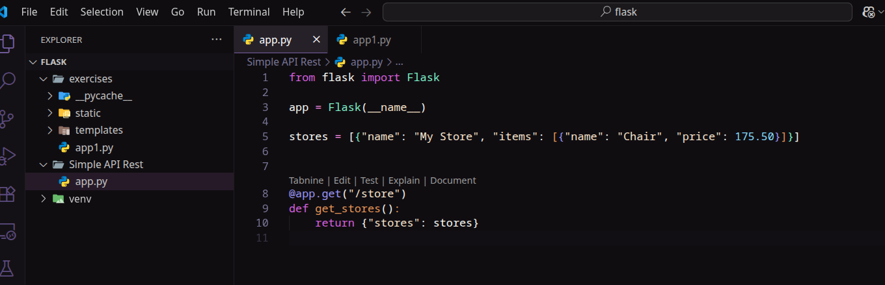

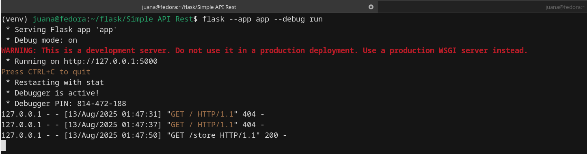

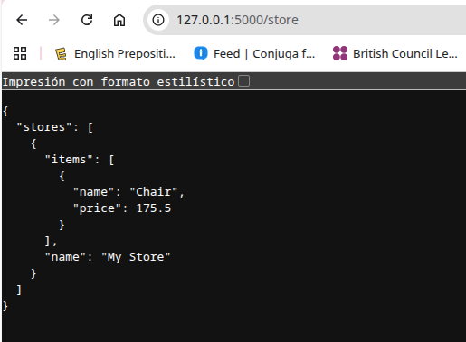

### Cómo interactuar con su API REST y probarla

Insomnia Client o Postman.

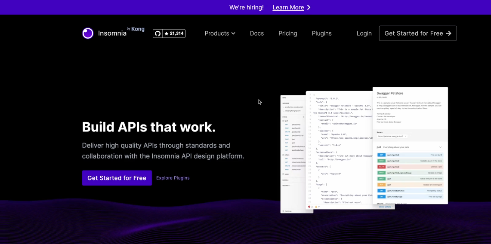

Crear el get all store data:

```
{{base_url}}/store
```

```
from flask import Flask, request

app = Flask(__name__)

stores = [{"name": "My Store", "items": [{"name": "Chair", "price": 175.50}]}]


@app.get("/store")
def get_stores():
    return {"stores": stores}
```

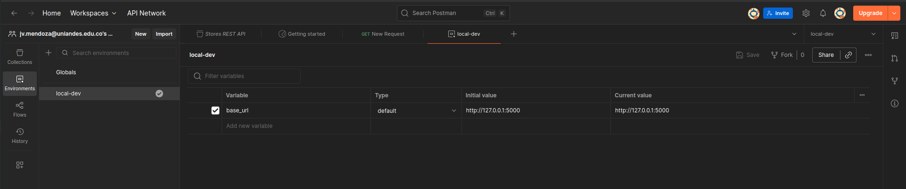

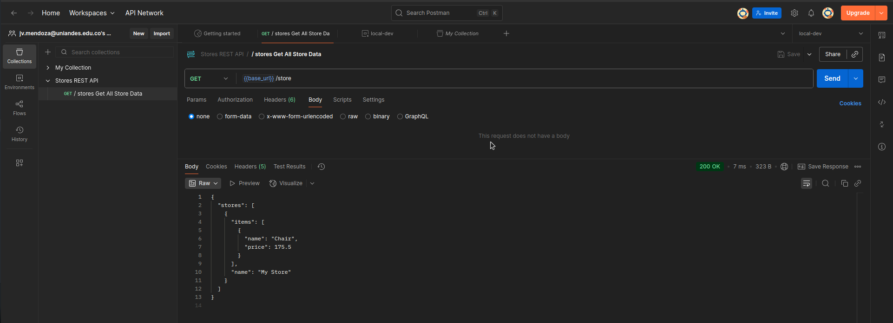

### Cómo crear tiendas en nuestra API REST

```
{{base_url}}/store
```

```
@app.post("/store")
def create_store():
    request_data = request.get_json()
    new_store = {"name": request_data["name"], "items": []}
    stores.append(new_store)
    return new_store, 201
```

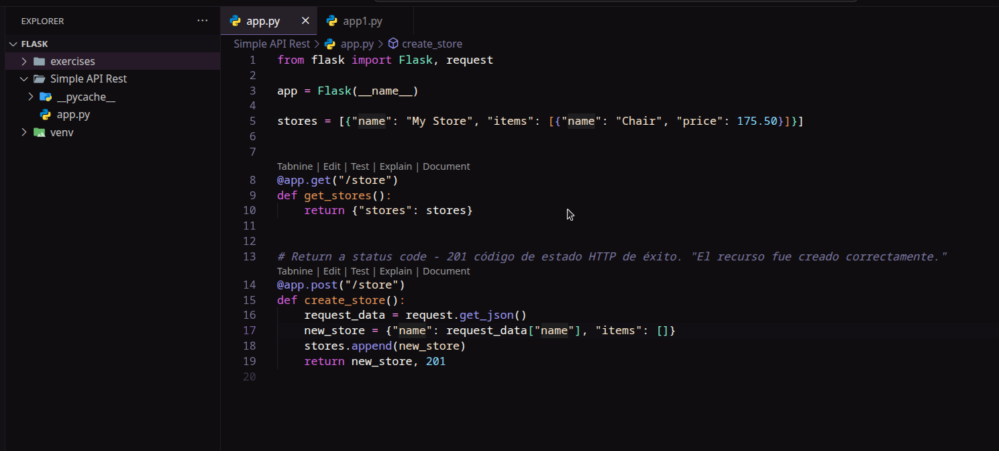

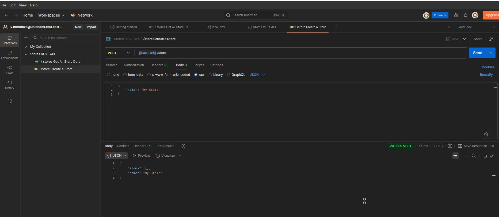


### Cómo crear artículos en cada tienda - Create an item

```
{{base_url}}/store/My Store/item
```

```
@app.post("/store/<string:store_name>/item")
def create_item(store_name):
    request_data = request.get_json()
    for store in stores:
        if store["name"] == store_name:
            new_item = {"name": request_data["name"], "price": request_data["price"]}
            store["items"].append(new_item)
            return new_item, 201
    return {"message": "Store not found"}, 404

```

Función para crear un item:

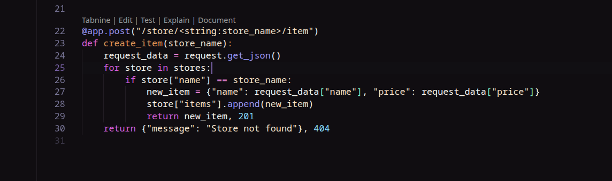

Crear el item table:

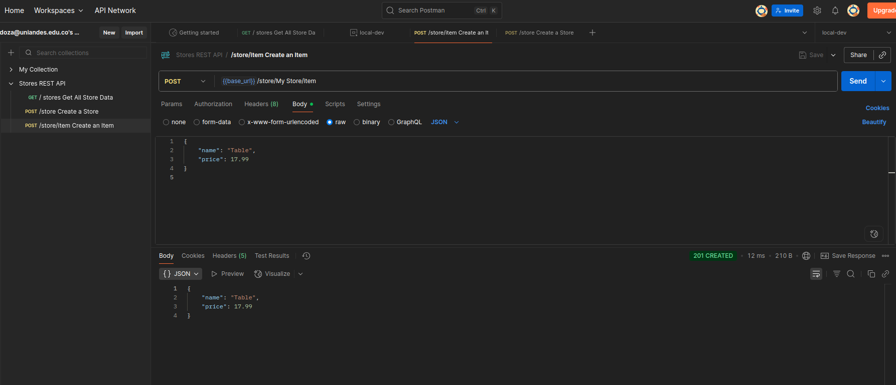

Ver que tiendas hay:


Crear el item laptop:

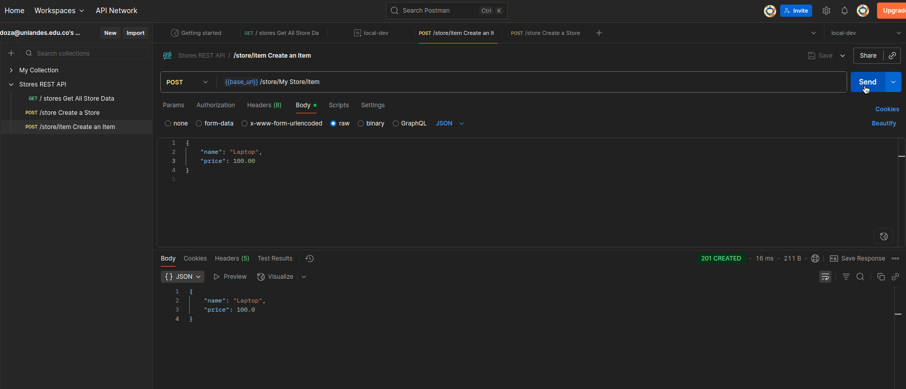

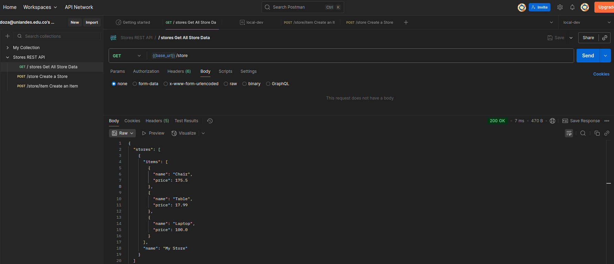

### Cómo conseguir una tienda específica y sus artículos

#### Get a particular store - Obtener los datos de una tienda en específico

```
{{base_url}}/store/My Store
```

```
@app.get("/store/<string:store_name>")
def get_store(store_name):
    for store in stores:
        if store["name"] == store_name:
            return store
    return {"message": "Store not found"}, 404
```

Función:

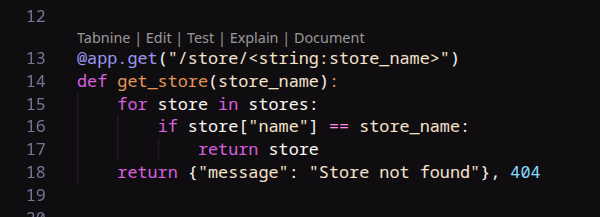

Obtener los datos de la tienda My Store:

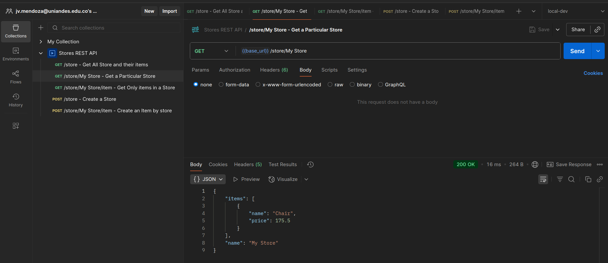

#### Get only items in a store - Obtener solo los items de una tienda

```
{{base_url}}/store/My Store/item
```

```
@app.get("/store/<string:store_name>/item")
def get_only_item_in_store(store_name):
    for store in stores:
        if store["name"] == store_name:
            return {"items": store["items"]}
    return {"message": "Store not found"}, 404
```

Función:

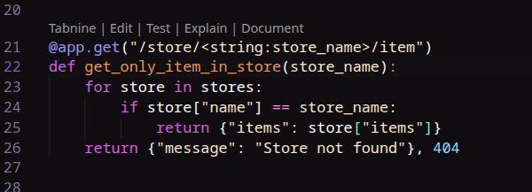

Obtener solo los items de la My Store:

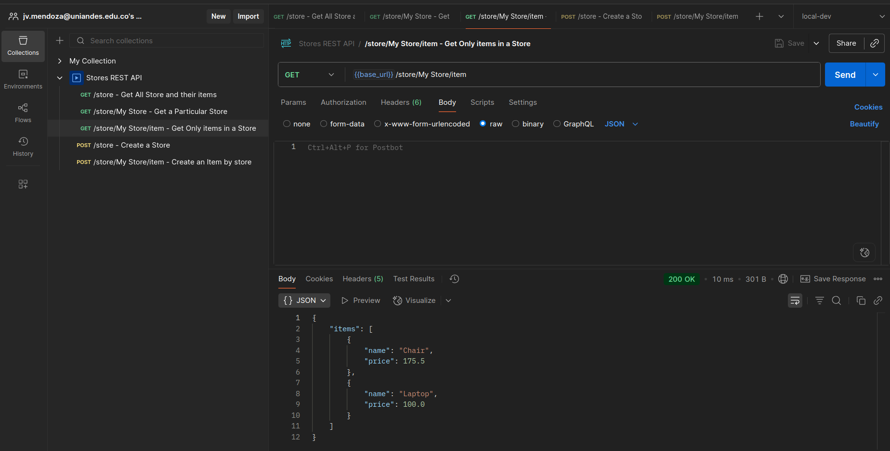


---


## 2. Introducción a Docker 🙋🏻‍♀️

- ¿Qué son los contenedores e imágenes de Docker?
- Cómo ejecutar una aplicación Flask en un contenedor Docker
- Cómo ejecutar la API REST de Flask con Docker Compose

### ¿Qué son los contenedores e imágenes de Docker?

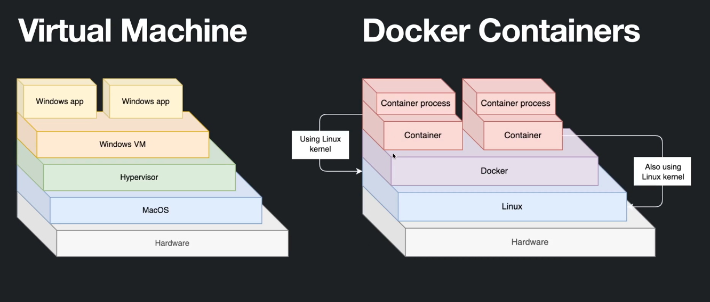

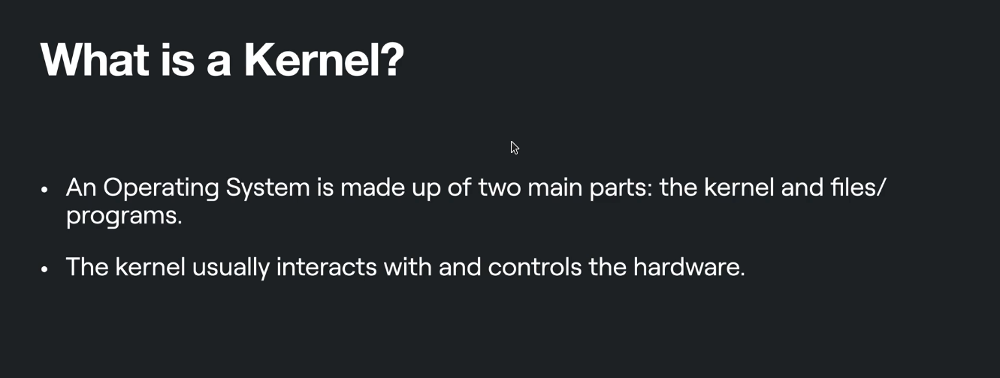

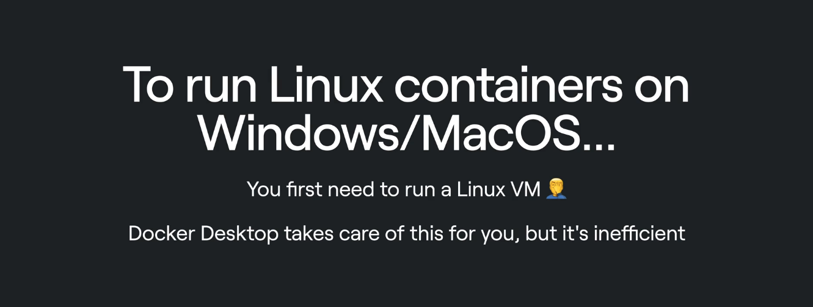

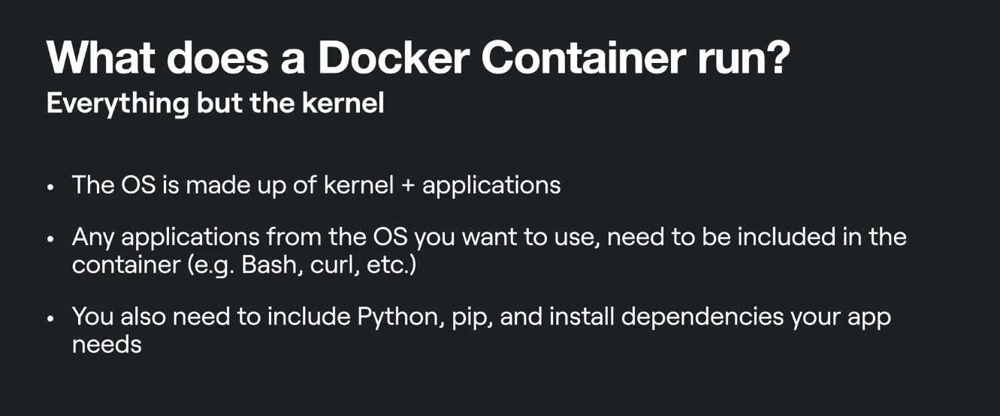

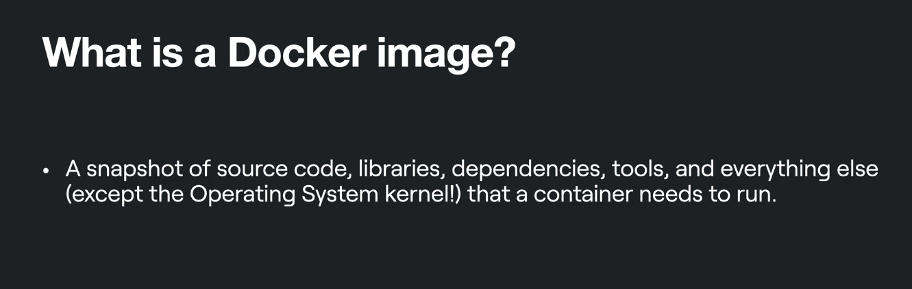

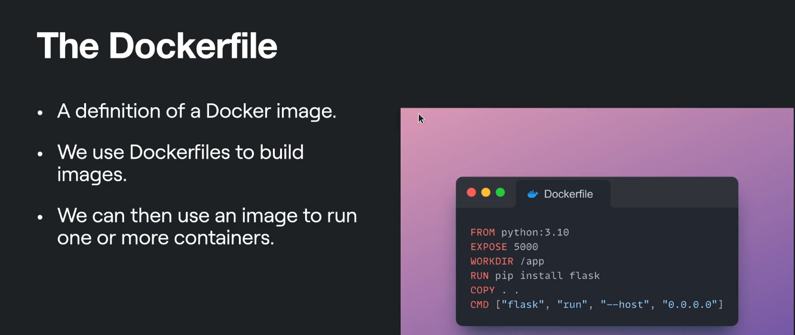

### Cómo ejecutar una aplicación Flask en un contenedor Docker


### Cómo ejecutar la API REST de Flask con Docker Compose

Dockerfile es el archivo que le dice a Docker cómo construir una imagen personalizada que puede ejecutar tu API REST con Flask.

Comandos clave en Dockerfile:

* FROM → Imagen base.

Usa una imagen base de Python (la última versión oficial disponible)..

* EXPOSE → El contenedor escucha en un puerto específico, pero no lo abre al exterior automáticamente.

Indica que el contenedor va a usar el puerto 5000, que es el puerto por defecto donde Flask sirve la aplicación. No abre el puerto por sí solo, solo lo "declara" para quien lo ejecute.

* WORKDIR → Definir la ruta (directorio) de trabajo dentro del contenedor para los comandos posteriores. Si el directorio no existe, Docker lo crea automáticamente.

Establece el directorio de trabajo dentro del contenedor en /app. Todas las instrucciones posteriores se ejecutarán desde ahí. Es como decir: “Entra a esta carpeta dentro del contenedor”.

* RUN → Ejecuta comandos durante la construcción.

Instala el framework Flask dentro del contenedor usando pip. Asegura que Flask esté disponible cuando se ejecute la app.

* COPY → Copia archivos al contenedor.

Copia todo el contenido del directorio actual (donde está el Dockerfile) a la carpeta /app dentro del contenedor. Así el código de tu app se incluye dentro del contenedor.

* CMD → Comando por defecto al iniciar el contenedor.

Define el comando predeterminado que se ejecuta cuando se inicia el contenedor. Aquí le dice a Flask que inicie el servidor y lo haga accesible en cualquier IP (0.0.0.0) dentro del contenedor.

```
FROM python
EXPOSE 5000
WORKDIR /app
RUN pip install flask
COPY . /app
CMD ["flask", "run", "--host", "0.0.0.0"]
```

Construye una imagen tomando como base la ruta donde se esté ubicado y las instrucciones en el Dockerfile. 

- -t rest-apis-flask-python etiqueta la imagen con un nombre específico.
- ./ usa el directorio actual (donde está el Dockerfile) como contexto de construcción.
- build construir la imagen.

```
sudo docker build -t rest-apis-flask-python ./
sudo docker image ls
```

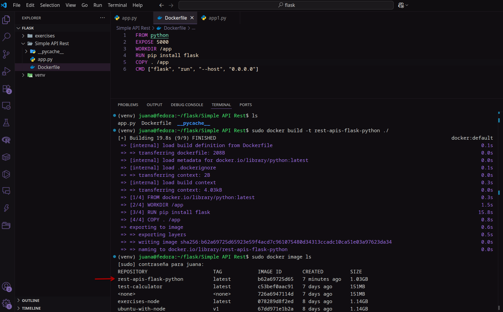

Este comando sirve para ejecutar un contenedor Docker en segundo plano, basado en la imagen rest-apis-flask-python:

```
sudo docker run -d -p 5005:5000 rest-apis-flask-python
    sudo docker container ls
```

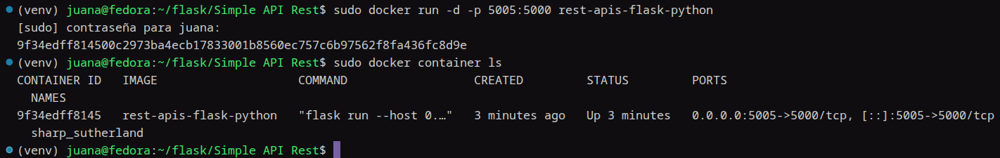

| Parte del comando        | Explicación                                                                                    |
| ------------------------ | ---------------------------------------------------------------------------------------------- |
| `docker run`             | Inicia un nuevo contenedor a partir de una imagen.                                             |
| `-d`                     | Modo "detached": el contenedor se ejecuta en segundo plano (no bloquea la terminal).           |
| `-p 5005:5000`           | Mapea el puerto `5000` del contenedor al puerto `5005` de tu máquina.                          |
| `rest-apis-flask-python` | Nombre de la imagen Docker que quieres ejecutar.                                               |

Puertos:

-p [PUERTO_EXTERNO]:[PUERTO_INTERNO]

| Parte  | Qué es                            | Explicación                                                                                                 |
| ------ | --------------------------------- | ----------------------------------------------------------------------------------------------------------- |
| `5000` | **Puerto interno del contenedor** | Es donde **Flask** está corriendo **dentro del contenedor** (por defecto, Flask escucha en el puerto 5000). |
| `5005` | **Puerto de tu máquina (host)**   | Es el puerto por el que tú accedes desde fuera del contenedor (desde tu navegador, Postman, etc.).          |

Analogía simple

Imagina que tienes un departamento (contenedor) con una puerta interna (5000), pero para que la gente pueda entrar desde la calle (tu PC), necesitas abrir una puerta externa (5005).

Entonces:

* Adentro del contenedor, tu aplicación corre en el puerto 5000.

* Pero tú quieres que desde tu navegador se acceda usando el puerto 5005.

Docker hace ese "puente" gracias al parámetro -p.

Visualmente:

[Tu PC:5005] ───▶ [Docker contenedor:5000 (donde está Flask)]

Tú entras por el puerto 5005, y Docker lo redirige al puerto 5000 interno del contenedor donde está Flask.

```
sudo docker stop 9f34edff8145
sudo docker rm 9f34edff8145
sudo docker container ls -a
```

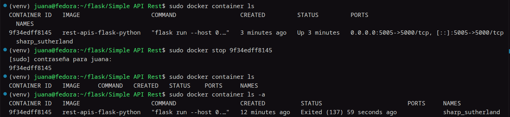

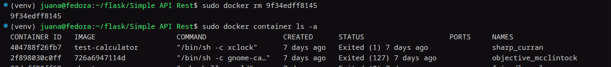


### Cómo ejecutar la API REST de Flask con Docker Compose

Qué es Docker Compose

Docker recomienda que se debe de manejar un servicio por contenedor, pero en la realidad se necesitan muchos servicios. Por eso se utiliza Docker Composer que es un Orquestador local que permite trabajar con aplicaciones múltiples contenedores, mediante un archivo de configuración.

Docker Compose es una herramienta para definir y ejecutar aplicaciones multi-contenedor usando un archivo YAML. Permite:

✅ Orquestrar múltiples servicios (bases de datos, backends, frontends) en un solo comando.

✅ Gestionar redes, volúmenes y variables de entorno centralizadamente.

✅ Simplificar el desarrollo y despliegue de aplicaciones complejas.

Para crear e iniciar los contenedores usar:

```
sudo docker compose up
```

Nota: detener la ejecución de Visual Studio porque tendría ocupado el puerto e interfiere para esta ejecución con Docker.

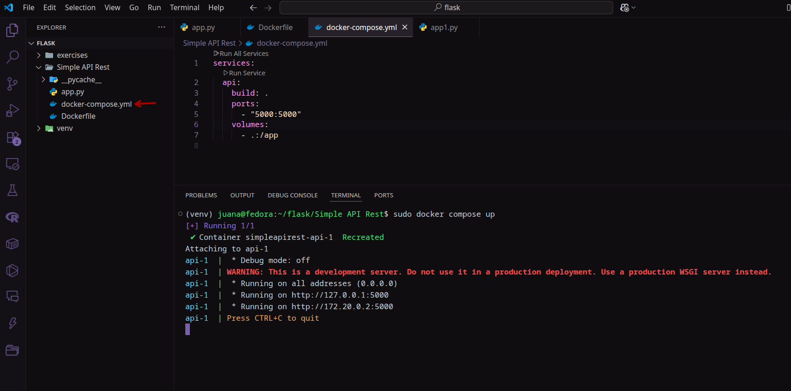

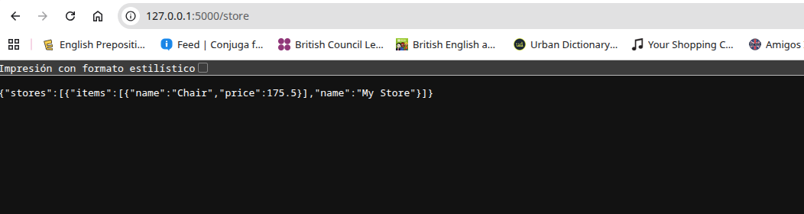

Si se interrumpe el comando en la terminal:

Se detiene el contenedor, pero no se borra. Puedes volver a levantarlo sin reconstruirlo con:

```
sudo docker compose start api
```

o

```
sudo docker compose up api
```

El nombre del servicio es api.

Si se realizó cambios al docker-compose, se puede volver a ejecutar así:

```
sudo docker compose up --build --force-recreate --no-deps
```

| Parte              | Explicación                                                                                                                  |
| ------------------ | ---------------------------------------------------------------------------------------------------------------------------- |
| `docker compose`   | Usa Docker Compose (herramienta para manejar múltiples contenedores como un solo servicio).                                  |
| `up`               | Levanta (inicia) el contenedor especificado.                                                                                 |
| `--build`          | Fuerza la reconstrucción de la imagen del contenedor antes de levantarlo. Útil si cambiaste código o el Dockerfile.          |
| `--force-recreate` | Obliga a eliminar y **recrear el contenedor**, incluso si no ha cambiado.                                                    |
| `--no-deps`        | **No inicia los contenedores dependientes** (solo levanta el contenedor `api`).                                              |
| `api`              | Es el **nombre del servicio** definido en el archivo `docker-compose.yml` (no es el nombre de la imagen, sino del servicio). |

✅ Has modificado el código fuente o el Dockerfile del servicio api.

✅ Quieres probar solo el servicio api sin arrancar toda la aplicación completa (por ejemplo, sin la base de datos u otros servicios definidos en el docker-compose.yml).

✅ Quieres asegurarte de que el contenedor se reconstruya desde cero (por eso --force-recreate y --build).

✅ Estás depurando problemas y necesitas reiniciar ese contenedor específico.

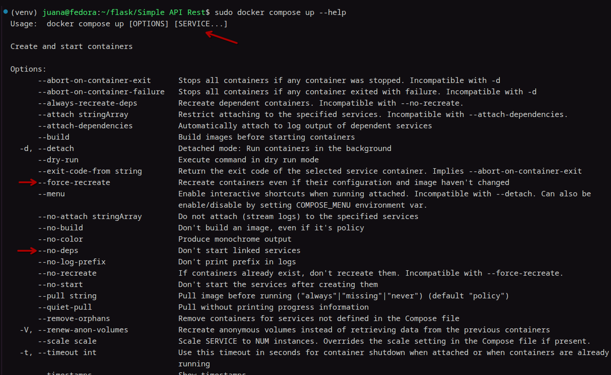


---


## 3. Flask-Smorest para un desarrollo más eficiente 🙋🏻‍♀️

- Mejoras en el modelo de datos para nuestra API
- Mejoras generales en nuestra primera API REST
- Nuevos puntos finales para nuestra primera API REST
- Cómo ejecutar la API en Docker con recarga automática y modo de depuración
- Cómo usar Blueprints y MethodViews en Flask
- Cómo escribir esquemas de malvavisco (Marshmallow) para nuestra API
- Cómo realizar la validación de datos con Marshmallow
- Decorando respuestas con Flask-Smorest

### Mejoras en el modelo de datos para nuestra API

Por ejemplo, para crear un item usamos el nombre de la tienda, la cuál es una práctica poco común. Para ello se suele utilizar un identificador único. Pueden ser:

- Números incrementales.

- Los UUIDs (Universally Unique Identifiers) son identificadores únicos universales. Se usan para asignar identificadores que sean únicos en todo el mundo y en cualquier momento, sin necesidad de una base de datos central o coordinación entre sistemas.

Pueden verse así:

```
123e4567-e89b-12d3-a456-426614174000

8-4-4-4-12 caracteres
```

#### Archivo requirements.txt

El archivo requirements.txt es un archivo de texto que se usa en proyectos de Python para listar todas las dependencias (paquetes o librerías) que tu aplicación necesita para funcionar correctamente.

Sirve para que cualquier persona (o servidor) que quiera correr tu proyecto pueda instalar exactamente los mismos paquetes que tú usaste, con un solo comando:

```
pip install -r requirements.txt
```

```
flask
flask-smorest
python-dotenv
```

| Paquete         | ¿Qué hace?                                                                         |
| --------------- | ---------------------------------------------------------------------------------- |
| `Flask`         | Framework web para construir APIs y apps web en Python.                            |
| `flask-smorest` | Extensión de Flask para crear APIs REST con validación y documentación automática. |
| `python-dotenv` | Permite usar un archivo `.env` para cargar variables de entorno en tu aplicación.  |

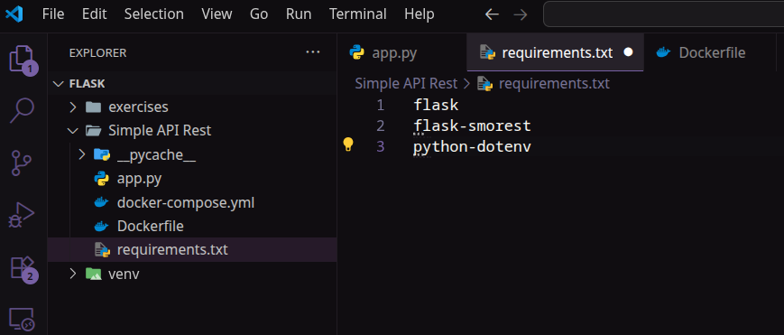

1. flask-smorest: 

Es una extensión de Flask que facilita la creación de APIs RESTful usando:

- OpenAPI / Swagger (documentación automática de la API)

- Marshmallow (para validar y serializar datos)

- Blueprints (para organizar el código modularmente)

¿Por qué usarlo?

- Te ayuda a escribir menos código repetitivo.

- Agrega validación automática de entradas y salidas.

- Genera documentación interactiva de tu API (Swagger UI).

2. python-dotenv

python-dotenv es una librería para cargar variables de entorno desde un archivo .env.

Esto es útil para guardar configuraciones como:

- Claves secretas

- Credenciales

- URLs de bases de datos

- Configuración sensible

#### Archivo .flaskenv

El archivo .flaskenv es un archivo especial que se usa en proyectos con Flask para definir variables de entorno específicas que Flask utilizará automáticamente al iniciar la aplicación en modo desarrollo.

Es un archivo de texto plano que contiene pares clave=valor, como:

```
FLASK_APP=app.py
FLASK_ENV=development
FLASK_DEBUG=1
```

1. FLASK_APP = app

Le dice a Flask qué archivo o módulo debe ejecutar cuando corres:

```
flask run
```

En este caso, app se refiere a un archivo llamado app.py, o un módulo llamado app.

2. FLASK_ENV = 'development'

Esta línea activa el modo desarrollo de Flask.

Habilita cosas como:

- Recarga automática cuando cambias el código (hot reload).

- Errores más detallados en pantalla.

- Modo depuración (debug) activado.

Esto solo debe usarse en desarrollo, nunca en producción, porque expone información sensible.

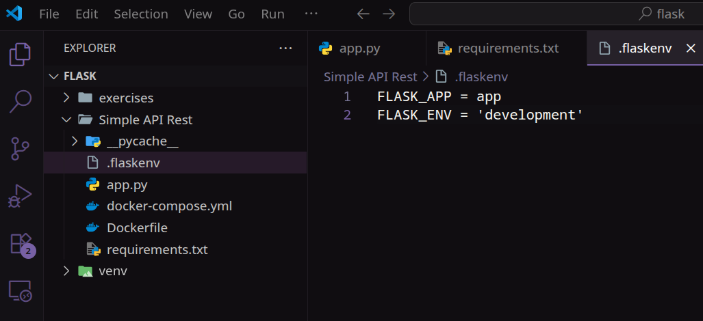

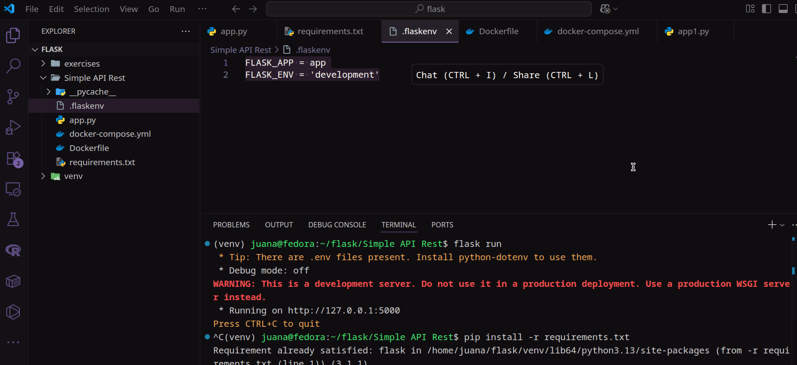

```
pip install -r requirements.txt
```

Nota: ahora se usa FLASK_DEBUG

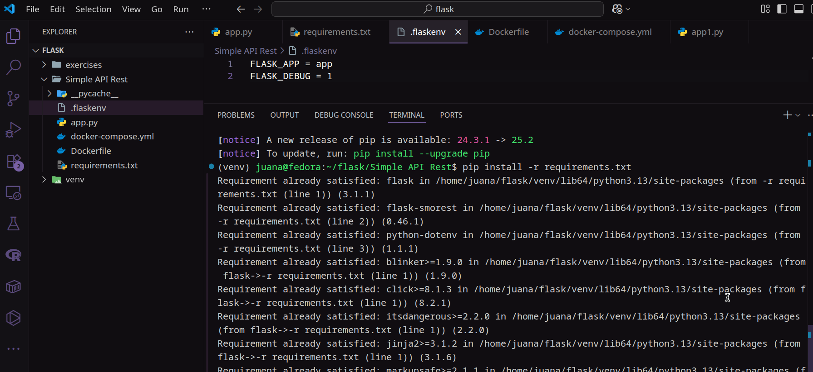

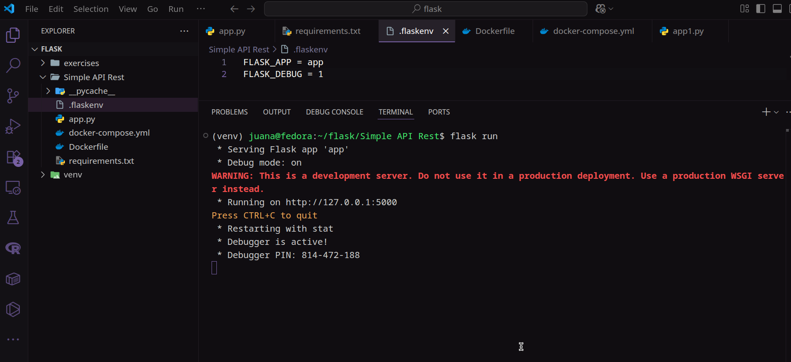

Ahora se reestructura el código, se reemplaza las listas por diccionarios y se crea el archivo db.py:

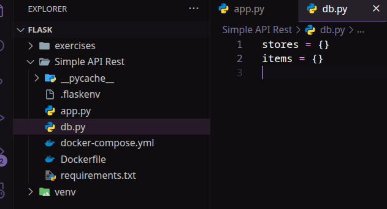

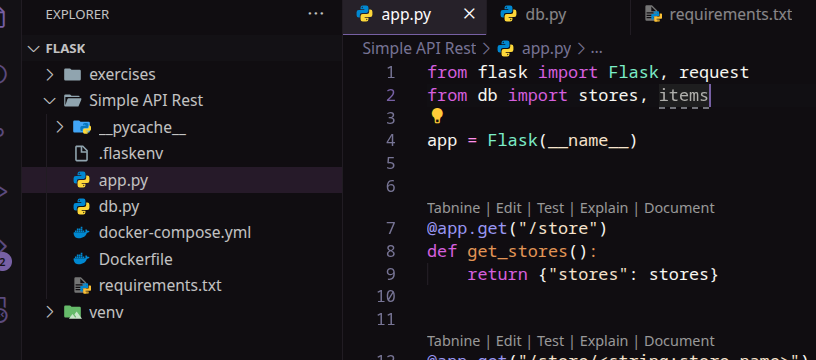

Los GET de stores:

1. Obtener la información de todas las tiendas:

```
@app.get("/store")
def get_stores():
    return {"stores": list(stores.values())}
```

2. Obtener la información de una tienda en particular.

```
@app.get("/store/<string:store_id>")
def get_store(store_id):
    try:
        return stores[store_id]
    except KeyError:
        return {"message": "Store not found"}, 404
```

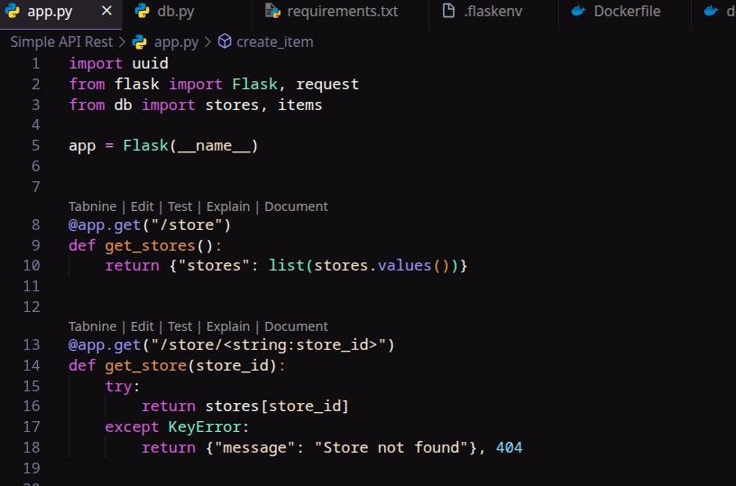

Los GET de items:

1. Obtener la información de todos los productos:

```
@app.get("/item")
def get_all_items():
    return {"items": list(items.values())}
```

2. Obtener la información de un producto en particular.

```
@app.get("/item/<string:item_id>")
def get_item(item_id):
    try:
        return items[item_id]
    except KeyError:
        return {"message": "Item not found"}, 404
```

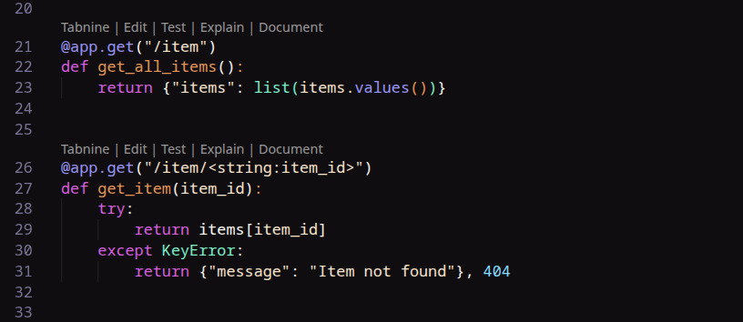

Crear una tienda:

```
@app.post("/store")
def create_store():
    store_data = request.get_json()
    store_id = uuid.uuid4().hex
    store = {**store_data, "id": store_id}
    stores[store_id] = store
    return store, 201
```

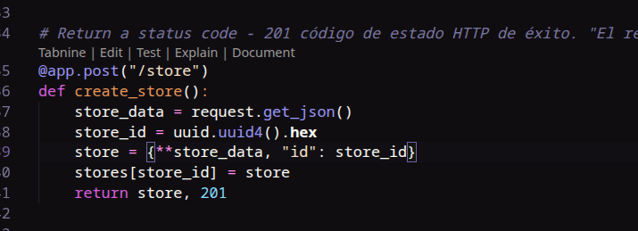

Crear un producto:

```
@app.post("/item")
def create_item():
    item_data = request.get_json()

    if item_data["store_id"] not in stores:
        return {"message": "Store not found"}, 404

    item_id = uuid.uuid4().hex
    item = {**item_data, "id": item_id}
    items[item_id] = item
    return item, 201
```

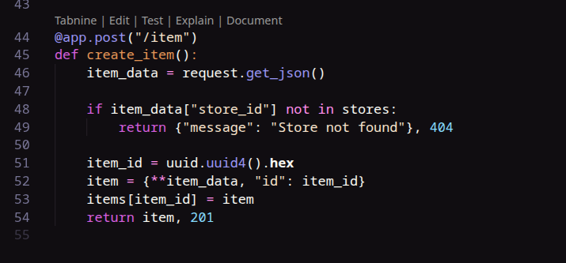


### Mejoras generales en nuestra primera API REST

¿Qué hace abort?

abort corta inmediatamente la ejecución de la ruta (endpoint) y devuelve un error HTTP con un código de estado, mensaje y opcionalmente un detalle.

Es muy útil para:

- Manejar errores personalizados

- Validar datos o condiciones

- Controlar accesos

| Método                    | ¿Lo recomiendo?                     | Cuándo usarlo                                                              |
| ------------------------- | ----------------------------------- | -------------------------------------------------------------------------- |
| `return {...}, 404`       | ✅ Sí                                | Cuando quieras controlar la estructura exacta tú mismo                     |
| `abort(404, message=...)` | ✅✅ Sí (más aún con `flask-smorest`) | Para respuestas de error estructuradas y bien documentadas automáticamente |

```
from flask_smorest import abort
```

Ejemplo:

```
abort(404, message="Store not found")
```

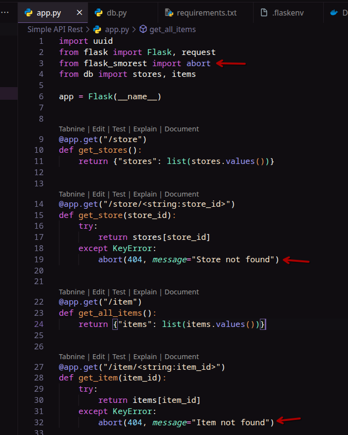

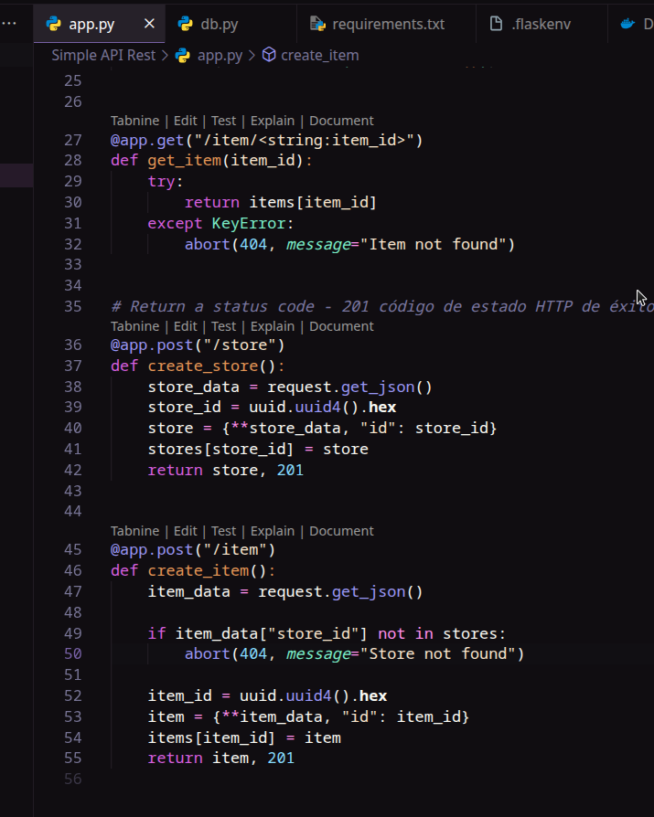

Se actualiza las urls en el Postman:

1. Crear una tienda:

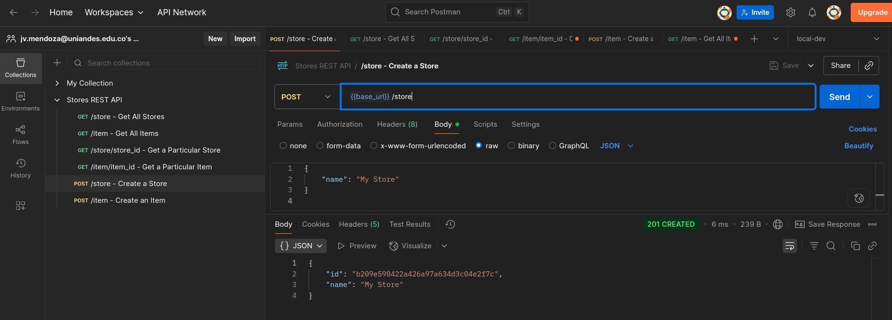

2. Obtener todas las tiendas:

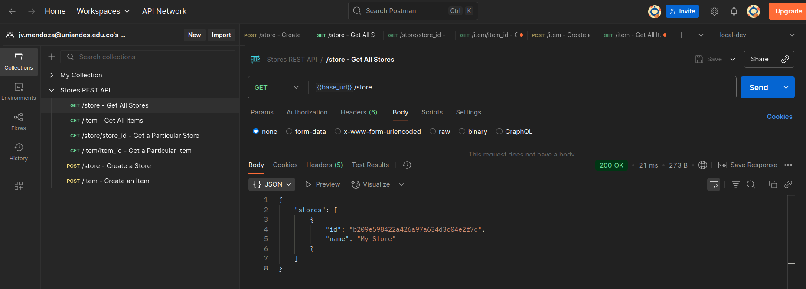

3. Obtener una tienda:

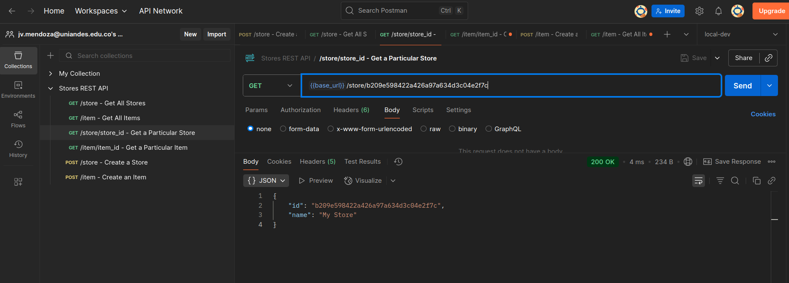

4. Crear un producto:


5. Obtener todos los productos:


6. Obtener un producto:


Ahora se implementan otras validaciones para las funciones de crear. No obstante, Flask tiene librerías para apoyar el proceso de las pruebas:


Se prueba en postman:


### Nuevos puntos finales para nuestra primera API REST

Se adicionan en postman delete y put para store y para items.


Delete:


Se prueba en postman:


Update:


Se prueba en postman:

- Store:


- Item:


### Cómo ejecutar la API en Docker con recarga automática y modo de depuración

En vez de ejecutar la aplicación en Flask se ejecuta en docker, para ello se modifica el Dockerfile:

```
FROM python
EXPOSE 5000
WORKDIR /app
COPY requirements.txt .
RUN pip install -r requirements.txt
COPY . /app
CMD ["flask", "run", "--host", "0.0.0.0"]
```


```
sudo docker build -t simple-flask-api ./
sudo docker run -dp 5005:5000 simple-flask-api
sudo docker container ls
```

Cada vez que se actualiza el código, hay que reconstruir, para evitar eso se utiliza los volúmenes. Los volúmenes permiten persistir datos fuera del contenedor (útil para bases de datos, configuraciones, etc.).

El volúmen monta tu directorio actual del host (tu máquina) en el contenedor, en la ruta /app. Todo el código que tienes en tu carpeta local se refleja en tiempo real dentro del contenedor en /app.  Esto es útil para desarrollo: si editas archivos en tu máquina, no necesitas reconstruir la imagen Docker para ver los cambios.

Este es el "working directory" (directorio de trabajo) dentro del contenedor. "Cuando entres al contenedor o ejecutes comandos, empieza desde /app."

```
sudo docker run -dp 5005:5000 -w /app -v "$(pwd):/app" simple-flask-api
```


| Parte              | Significado                                                                                                                                                           |
| ------------------ | --------------------------------------------------------------------------------------------------------------------------------------------------------------------- |
| `docker run`       | Crea y ejecuta un **nuevo contenedor** a partir de una imagen.                                                                                                        |
| `-d`               | **Detached mode**: ejecuta el contenedor en segundo plano (no bloquea la terminal).                                                                                   |
| `-p 5005:5000`     | Mapea el puerto **5000 del contenedor** (donde corre Flask) al puerto **5005 de tu máquina** (puedes acceder desde `localhost:5005`).                                 |
| `-w /app`          | Define el **directorio de trabajo dentro del contenedor** como `/app`. Es como hacer `cd /app` dentro del contenedor.                                                 |
| `-v "$(pwd):/app"` | Monta un **volumen**: el directorio actual (`$(pwd)`) de tu máquina se monta como `/app` dentro del contenedor. Esto permite que Flask vea tus archivos del proyecto. |
| `simple-flask-api` | Es el **nombre de la imagen Docker** desde la que se creará el contenedor.                                                                                            |

¿Qué está pasando exactamente?

* Docker crea un contenedor desde la imagen simple-flask-api.

* Asigna como directorio de trabajo /app.

* Mapea tu carpeta actual (con el código) al directorio /app dentro del contenedor.

* Ejecuta Flask en el puerto 5000 (como definido en la imagen).

* Expone Flask al puerto 5005 de tu computadora.

* El contenedor corre en segundo plano (-d).

Hay que modificar el puerto en la variable de ambiente en Postman:


Prueba modificando el código para ver si se actualiza dentro del contenedor:


En conclusión, hay dos formas de ejecutar Docker Container:


| Comando                                                                   | ¿Cuándo usarlo?                                                                                                                         | ¿Qué está pasando?                                                                                         |
| ------------------------------------------------------------------------- | --------------------------------------------------------------------------------------------------------------------------------------- | ---------------------------------------------------------------------------------------------------------- |
| `sudo docker run -dp 5005:5000 simple-flask-api`                          | **Para producción** o cuando ya tienes todos los archivos dentro de la imagen Docker y no necesitas modificar el código en tiempo real. | El contenedor se ejecuta de manera aislada sin reflejar cambios en el código de tu máquina.                |
| `sudo docker run -dp 5005:5000 -w /app -v "$(pwd):/app" simple-flask-api` | **Para desarrollo**, cuando necesitas que el contenedor y tu máquina compartan los archivos y los cambios se reflejen en tiempo real.   | Tu código local se monta en el contenedor, permitiéndote editar y ver cambios sin reiniciar el contenedor. |


### Cómo usar Blueprints y MethodViews en Flask

**1. Blueprints**

🌟 ¿Qué es un Blueprint?

Un Blueprint en Flask es una forma de organizar y modularizar tu aplicación. Te permite dividir tu aplicación en varios módulos o componentes que pueden tener sus propias rutas, vistas y otros recursos, y luego registrarlos en tu aplicación principal.

🧩 ¿Cómo funciona un Blueprint?

Piensa en un Blueprint como un "esquema" o "plantilla" que define un conjunto de rutas y vistas.

El Blueprint no es ejecutado directamente; se registra en la aplicación principal (normalmente en el archivo app.py).

Permite dividir la lógica de una aplicación en módulos más pequeños y reutilizables.

**2. MethodViews**

🌟 ¿Qué es un MethodView?
MethodViews en Flask son una forma de organizar las vistas (rutas) en base a métodos HTTP como GET, POST, PUT, etc., usando clases en lugar de funciones tradicionales. Es una forma más orientada a objetos de manejar rutas HTTP.

🧩 ¿Cómo funciona un MethodView?

Flask permite definir clases que manejan las rutas y sus métodos HTTP correspondientes.

Cada clase que hereda de flask.views.MethodView tiene métodos como get(), post(), put(), etc., que representan los métodos HTTP que la ruta acepta.

| Característica               | **Blueprints**                                                                              | **MethodViews**                                                                                              |
| ---------------------------- | ------------------------------------------------------------------------------------------- | ------------------------------------------------------------------------------------------------------------ |
| **Modularización**           | ✅ Ideal para dividir la aplicación en componentes (autenticación, perfil de usuario, etc.). | ❌ No tan adecuado para dividir la aplicación en módulos.                                                     |
| **Métodos HTTP específicos** | ❌ Necesitas manejar métodos HTTP manualmente dentro de las funciones.                       | ✅ Ideal para manejar rutas y métodos HTTP con clases.                                                        |
| **Organización del código**  | ✅ Ayuda a organizar grandes aplicaciones Flask.                                             | ✅ Bueno para aplicaciones más pequeñas o cuando se prefieren las clases sobre las funciones.                 |
| **Escalabilidad**            | ✅ Aumenta la escalabilidad al dividir el código en módulos reutilizables.                   | ❓ Usado principalmente para organizar rutas, pero no tan flexible como Blueprints para aplicaciones grandes. |

Resumen

- Blueprints: Son ideales para modularizar y organizar aplicaciones grandes. Te permiten dividir tu aplicación en módulos reutilizables.

- MethodViews: Son útiles cuando prefieres una organización orientada a objetos, donde cada ruta puede manejar diferentes métodos HTTP dentro de una clase.

Por lo tanto, se crea una carpeta resources dónde se añaden los archivos para store e items.


Ahora el api se restructura de esta forma:

```
from flask import Flask

from flask_smorest import Api

from resources.item import blp as ItemBlueprint
from resources.store import blp as StoreBlueprint

app = Flask(__name__)

app.config["PROPAGATE_EXCEPTIONS"] = True
app.config["API_TITLE"] = "Stores REST API"
app.config["API_VERSION"] = "v1"
app.config["OPENAPI_VERSION"] = "3.0.3"
app.config["OPENAPI_URL_PREFIX"] = "/"
app.config["OPENAPI_SWAGGER_UI_PATH"] = "/swagger-ui"
app.config["OPENAPI_SWAGGER_UI_URL"] = "https://cdn.jsdelivr.net/npm/swagger-ui-dist/"

api = Api(app)

api.register_blueprint(ItemBlueprint)
api.register_blueprint(StoreBlueprint)
```


1. Flask(__name__): Crea una instancia de la aplicación Flask.

2. PROPAGATE_EXCEPTIONS = True: Esto hace que las excepciones se propaguen, lo cual es útil para manejar errores en un nivel superior y personalizar el comportamiento de error en lugar de tener una página de error estándar.

3. API_TITLE: Establece el título de la API en la documentación generada.

4. API_VERSION: Especifica la versión de la API, que es común para tener un control de las versiones (por ejemplo, v1).

5. OPENAPI_VERSION = "3.0.3": Define la versión de OpenAPI (anteriormente conocida como Swagger) que se utilizará para la documentación automática de la API.

6. OPENAPI_URL_PREFIX = "/": Este es el prefijo base para las rutas de la API. El valor / significa que las rutas serán accesibles desde la raíz.

7. OPENAPI_SWAGGER_UI_PATH = "/swagger-ui": Establece la ruta en la cual estará accesible la interfaz Swagger UI. En este caso, la interfaz se carga en /swagger-ui.

8. OPENAPI_SWAGGER_UI_URL = "https://cdn.jsdelivr.net/npm/swagger-ui-dist/": Esto le dice a Flask-Smorest que cargue la interfaz de Swagger UI desde un servidor CDN externo. Esto se usa para mostrar la documentación interactiva de tu API en /swagger-ui.

Creación de la API:

```
api = Api(app)
```

Se crea una instancia de Api de Flask-Smorest, pasando la aplicación Flask como argumento. Esto permite que la API utilice todas las configuraciones que definiste en la aplicación, incluyendo la documentación y los Blueprints.

Registro de los Blueprints:

```
api.register_blueprint(ItemBlueprint)
api.register_blueprint(StoreBlueprint)
```

ItemBlueprint y StoreBlueprint son dos Blueprints que se registran en la API. Cada Blueprint puede tener sus propias rutas (endpoints) y lógica, y es como un módulo independiente de tu aplicación.

#### ¿Qué es un Blueprint aquí?

Blueprints en Flask son una forma de modularizar tu aplicación. En este caso, ItemBlueprint y StoreBlueprint se encuentran en los archivos resources/item.py y resources/store.py, respectivamente.

Cada Blueprint agrupa un conjunto de rutas que pertenecen a un componente de la API: en este caso, Item y Store.

#### Flask-Smorest y Swagger:

Flask-Smorest es una extensión para Flask que combina varias funcionalidades útiles para APIs RESTful, como:

- OpenAPI: Generación automática de documentación para tus rutas de la API (lo que se traduce en una documentación Swagger UI).

- Validación: Validación de los parámetros de entrada de las solicitudes y las respuestas.

- Formateo: Formatea las respuestas JSON de acuerdo con las especificaciones OpenAPI.

¿Cómo usar Swagger?

Swagger es un conjunto de herramientas y especificaciones para documentar y probar APIs RESTful de forma interactiva. Swagger proporciona un lenguaje estándar para describir las rutas y funcionalidades de una API, lo que facilita tanto su consumo como su mantenimiento.

Al acceder a /swagger-ui en tu navegador, podrás ver una interfaz interactiva generada por Swagger UI, que muestra todos los endpoints de la API y permite realizar peticiones directamente desde la interfaz.

Los Blueprints (ItemBlueprint y StoreBlueprint) serán representados en la interfaz de Swagger UI con sus respectivos endpoints (rutas), tipos de solicitudes HTTP (GET, POST, PUT, DELETE, etc.) y parámetros.

```
http://127.0.0.1:5005/swagger-ui
```


### Cómo escribir esquemas de malvavisco (Marshmallow) para nuestra API

#### ¿Qué es Marshmallow?

Marshmallow es una biblioteca en Python que se usa para:

- Serializar: Convertir objetos Python (como diccionarios, clases, etc.) en formatos como JSON para enviar a clientes o guardar.

- Deserializar: Convertir datos JSON o similares en objetos Python.

- Validar: Comprobar que los datos entrantes cumplen ciertas reglas (por ejemplo, que un campo es obligatorio, que un número esté en un rango, que un texto tenga cierta longitud, etc.).

#### ¿Qué es un esquema en Marshmallow?

Un esquema (schema) es una clase que define cómo debe lucir un dato. Básicamente, es una plantilla o mapa que describe:

- Qué campos tiene un objeto.

- Qué tipo de dato tiene cada campo (cadena, número, fecha, etc.).

- Reglas o validaciones para esos campos.

- Opcionalmente, cómo transformar esos campos al serializar o deserializar.

#### ¿Para qué sirve un esquema?

Supongamos que tienes un objeto User con campos id, nombre y email. El esquema define:

- Que id es un número entero.

- Que nombre es una cadena obligatoria.

- Que email debe tener formato de correo válido.

Así, cuando recibes datos JSON para crear un usuario, puedes usar ese esquema para:

- Validar que los datos son correctos.

- Convertir esos datos JSON en un objeto Python (deserializar).

- Convertir objetos Python en JSON para enviarlos (serializar).

Este código define esquemas (schemas) para serializar y validar datos relacionados con dos entidades: Item (artículo) y Store (tienda). Los esquemas permiten validar y transformar datos que entran o salen en tu API. Se crea el archivo schemas.py:

Importa la clase base Schema y el módulo fields que contiene diferentes tipos de campos (cadena, entero, flotante, etc.) para definir los esquemas.

- dump_only=True: no se espera que el usuario envíe este dato, solo se devuelve.
- required=True: obligatorio.

```
from marshmallow import Schema, fields


class ItemSchema(Schema):
    id = fields.Str(dump_only=True)
    name = fields.Str(required=True)
    price = fields.Float(required=True)
    store_id = fields.Str(required=True)


class ItemUpdateSchema(Schema):
    name = fields.Str()
    price = fields.Float()


class StoreSchema(Schema):
    id = fields.Str(dump_only=True)
    name = fields.Str(required=True)


class StoreUpdateSchema(Schema):
    name = fields.Str()
```


### Cómo realizar la validación de datos con Marshmallow

1. Se remueve la validación manual y el uso de get_json()

Antes, para obtener los datos enviados en una petición (como POST o PUT), se hacía:

```
data = request.get_json()
```

y luego se validaba manualmente si estaban los campos esperados.

2. Ahora no es necesario llamar a get_json() ni hacer validaciones manuales. Esto se debe a que:

- Se usan decoradores @blp.arguments(ItemSchema) o @blp.arguments(ItemUpdateSchema).

- Estos decoradores usan Marshmallow para validar y transformar automáticamente el JSON recibido.

- Los datos ya validados y deserializados llegan como un parámetro (item_data o store_data) directamente al método.

El decorador @blp.arguments: Este decorador se usa en métodos que reciben datos en el cuerpo de la petición (PUT, POST, PATCH). 

1. POST: Crear un nuevo recurso.
2. PUT: Reemplazar o crear un recurso en una ubicación específica.
3. PATCH: Modificar parcialmente un recurso.

| Método | Uso principal              | Actualiza todo o parte  | URL típica    | Código éxito típico  |
| ------ | -------------------------- | ----------------------- | ------------- | -------------------- |
| POST   | Crear un recurso nuevo     | N/A                     | `/items`      | 201 Created          |
| PUT    | Reemplazar o crear recurso | Todo el recurso         | `/items/{id}` | 200 OK o 201 Created |
| PATCH  | Actualizar parcialmente    | Solo campos específicos | `/items/{id}` | 200 OK               |

3. post(self, item_data): Recibe los datos para crear un nuevo item validados por ItemSchema.


### Decorando respuestas con Flask-Smorest

¿Qué hace @blp.response(status_code, schema)?

- status_code: Es el código HTTP de la respuesta (por ejemplo, 200, 201, 404, etc.).

- schema: Es un esquema de Marshmallow que define cómo debe formatearse y validarse la respuesta que se devuelve.

| Decorador                    | Significado                                                         |
| ---------------------------- | ------------------------------------------------------------------- |
| `@blp.response(200, Schema)` | Devuelve una respuesta con código 200 y cuerpo que sigue el esquema |
| `@blp.response(201, Schema)` | Igual, pero con código 201 (creación exitosa)                       |
| `Schema(many=True)`          | Devuelve una **lista** de objetos con ese esquema                   |


---


## 4. Almacenar datos en una base de datos SQL con SQLAlchemy 🙋🏻‍♀️

- Descripción general y por qué usar SQLAlchemy
- Cómo codificar un modelo simple de SQLAlchemy
- Cómo escribir relaciones uno a muchos con SQLAlchemy
- Cómo configurar Flask-SQLAlchemy con tu aplicación Flask
- Cómo insertar datos en una tabla con SQLAlchemy
- Cómo encontrar modelos en la base de datos por ID o devolver un
- Cómo actualizar modelos con SQLAlchemy
- Cómo obtener la lista de todos los modelos
- Cómo eliminar modelos con SQLAlchemy
- Eliminar modelos relacionados con cascadas
- Conclusión de esta sección


### Descripción general y por qué usar SQLAlchemy


### Cómo codificar un modelo simple de SQLAlchemy


### Cómo escribir relaciones uno a muchos con SQLAlchemy


### Cómo configurar Flask-SQLAlchemy con tu aplicación Flask


### Cómo insertar datos en una tabla con SQLAlchemy


### Cómo encontrar modelos en la base de datos por ID o devolver un


### Cómo actualizar modelos con SQLAlchemy


### Cómo obtener la lista de todos los modelos


### Cómo eliminar modelos con SQLAlchemy


### Eliminar modelos relacionados con cascadas


### Conclusión de esta sección


---


## 5. Relaciones de muchos a muchos con SQLAlchemy 🙋🏻‍♀️

- Cambios en esta sección
- Relación uno a muchos entre tiendas y etiquetas
- Relación muchos a muchos entre artículos y etiquetas

### Cambios en esta sección


### Relación uno a muchos entre tiendas y etiquetas


### Relación muchos a muchos entre artículos y etiquetas


---


## 6. Autenticación de usuarios con Flask-JWT-Extended 🙋🏻‍♀️

- ¿Quién usa JWT?
- Cómo configurar Flask-JWT-Extended con nuestra app
- Codificación del modelo y esquema de usuario
- Cómo añadir un endpoint de registro a la API REST
- Cómo añadir un endpoint de inicio de sesión a la API REST
- Proteger los endpoints solicitando un JWT
- Reclamos y autorización de JWT
- Cómo añadir el cierre de sesión a la API REST
- Encadenamiento de solicitudes con Insomnia
- Actualización de tokens con Flask-JWT-Extended

### ¿Quién usa JWT?


### Cómo configurar Flask-JWT-Extended con nuestra app


### Codificación del modelo y esquema de usuario


### Cómo añadir un endpoint de registro a la API REST


### Cómo añadir un endpoint de inicio de sesión a la API REST


### Proteger los endpoints solicitando un JWT


### Reclamos y autorización de JWT


### Cómo añadir el cierre de sesión a la API REST


### Encadenamiento de solicitudes con Insomnia


### Actualización de tokens con Flask-JWT-Extended


---


## 7. Migraciones de bases de datos con Alembic y Flask-Migrate 🙋🏻‍♀️

- Cómo añadir Flask-Migrate a nuestra aplicación Flask
- Inicializa tu base de datos con Flask-Migrate
- Modifica los modelos de SQLAlchemy y genera una migración
- Revisa y modifica manualmente las migraciones de bases de datos

### Cómo añadir Flask-Migrate a nuestra aplicación Flask


###  Inicializa tu base de datos con Flask-Migrate


###  Modifica los modelos de SQLAlchemy y genera una migración


### Revisa y modifica manualmente las migraciones de bases de datos


---


## 8. Curso intensivo de Git 🙋🏻‍♀️

- ¿Qué son los repositorios y las confirmaciones de Git?
- Inicializamos un repositorio Git para nuestro proyecto
- Escribiendo documentos y confirmaciones en Markdown
- Repositorios remotos y cómo usarlos
- Ramas de Git y merging
- Conflictos de merging y cómo resolverlos
- Resumen de los capítulos finales del ebook

### ¿Qué son los repositorios y las confirmaciones de Git?


### Inicializamos un repositorio Git para nuestro proyecto


### Escribiendo documentos y confirmaciones en Markdown


### Repositorios remotos y cómo usarlos


### Ramas de Git y merging


### Conflictos de merging y cómo resolverlos


### Resumen de los capítulos finales del ebook


---

## 9. Implementaciones con Render.com 🙋🏻‍♀️

- Creación de un servicio web de Render.com
- Cómo ejecutar Flask con gunicorn en Docker
- Obtener una base de datos PostgreSQL implementada
- Ejecutar la aplicación y la base de datos localmente con Docker
- Usar PostgreSQL localmente y en producción
- Probar la aplicación de producción terminada

### Creación de un servicio web de Render.com


### Cómo ejecutar Flask con gunicorn en Docker


### Obtener una base de datos PostgreSQL implementada


### Ejecutar la aplicación y la base de datos localmente con Docker


### Usar PostgreSQL localmente y en producción


### Probar la aplicación de producción terminada


---


## 10. Colas de tareas con solicitud y envío de correos electrónicos 🙋🏻‍♀️

- Cómo enviar correos electrónicos con Python y Mailgun
- Cómo enviar correos electrónicos cuando los usuarios se registran
- ¿Qué es una cola de tareas y cómo configurar una base de datos
- Cómo rellenar y consumir la cola de tareas con rq
- Cómo procesar tareas en segundo plano con el trabajador rq
- Cómo enviar correos electrónicos HTML con Mailgun y Python
- Cómo implementar un trabajador en segundo plano en render.com


### Cómo enviar correos electrónicos con Python y Mailgun


### Cómo enviar correos electrónicos cuando los usuarios se registran


### ¿Qué es una cola de tareas y cómo configurar una base de datos


### Cómo rellenar y consumir la cola de tareas con rq


### Cómo procesar tareas en segundo plano con el trabajador rq


### Cómo enviar correos electrónicos HTML con Mailgun y Python


### Cómo implementar un trabajador en segundo plano en render.com

