# Git

## Configuración de cuenta Git y conexión con Github

Guía paso a paso para configurar Git con otra cuenta distinta a la global. La cuenta solo se utiliza en repositorios específicos.

1. Iniciar git en el repositorio.

```

git init

```

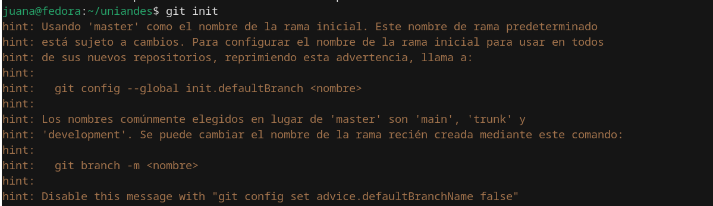

2. Verificar la configuración actual.

```

git config --local --list

```

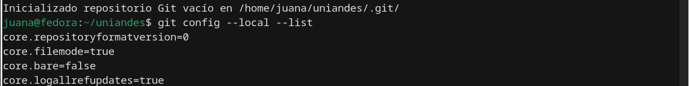

3. Configurar usuario y email solo para este repositorio:

```

git config user.name "JuanaVMendozaS"
git config user.email "jv.mendoza@uniandes.edu.co"
git config --local --list

```

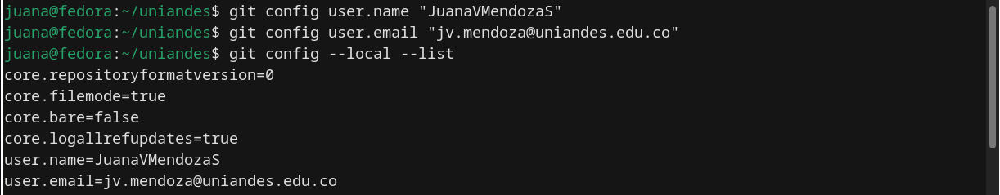

4. Generar una nueva clave SSH para la otra cuenta (no sobreescribir la personal):

```

ssh-keygen -t ed25519 -C "jv.mendoza@uniandes.edu.co" -f ~/.ssh/id_ed25519_uniandes

```

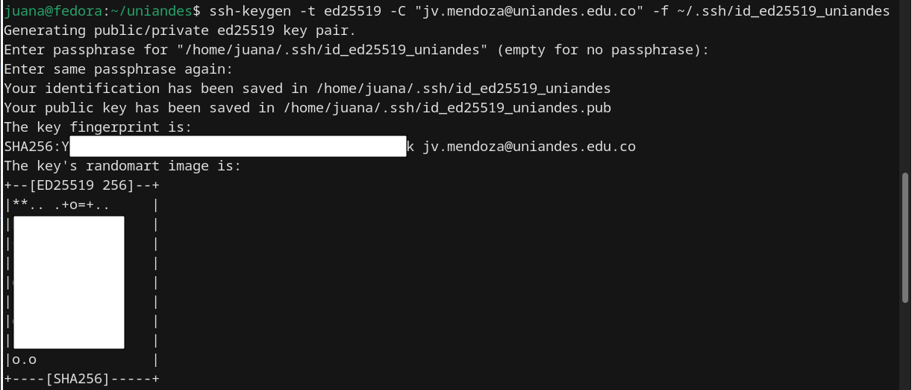

5. Agregar la clave al agente SSH:

```

eval "$(ssh-agent -s)"
ssh-add ~/.ssh/id_ed25519_uniandes

```

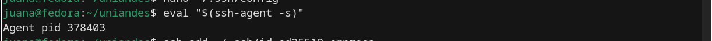

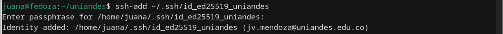

6. Configurar ~/.ssh/config para usar la clave correcta:

```

nano ~/.ssh/config

```

```

Host github.com-uniandes
  HostName github.com
  User git
  IdentityFile ~/.ssh/id_ed25519_uniandes
  IdentitiesOnly yes

```

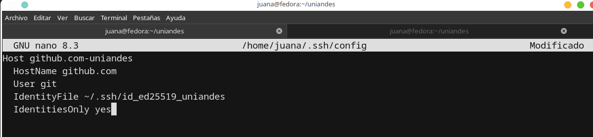

7. Ver el contenido de la llave pública:

```

cat ~/.ssh/id_ed25519_uniandes.pub

```

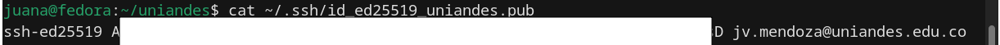

Verás algo como:

```

ssh-ed25519 AAAAC3NzaC1lZDI1NTE5AAAAIJt7... jv.mendoza@uniandes.edu.co

```

Posteriormente, en el Github se agrega la llave pública para conectar el Github. Ve a Settings → SSH and GPG keys → New SSH key.

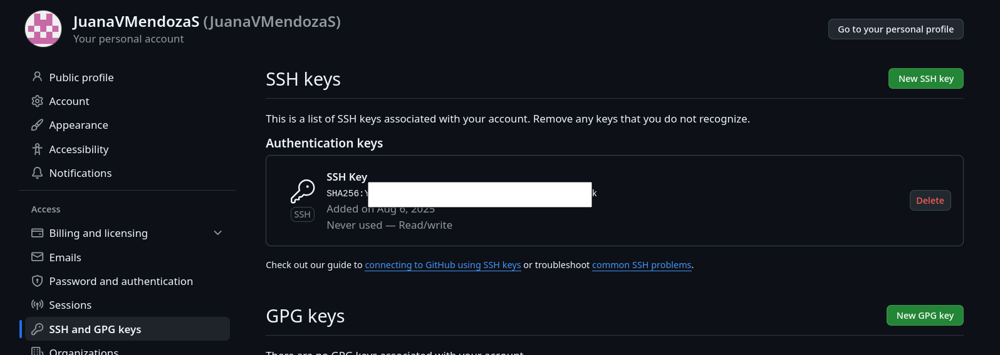

Probar la conexión SSH:

```

 ssh -T git@github.com-uniandes

```

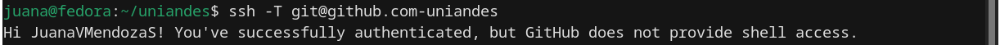


## Tutorial: Crear y clonar repositorio

### Introducción

**Objetivos**

Al finalizar el tutorial el estudiante estará en capacidad de:

* Entender las herramientas para aplicar el enfoque de documentación como código en sus proyectos.
* Generar y verificar automáticamente documentación técnica de un proyecto de código en un repositorio.

**Requisitos y Pasos previos**

* Tener instalado git en su ambiente. Puede hacer uso de un cliente git o con bash.
* En este tutorial haremos uso de Bash por lo que algunos comandos pueden no funcionar igual si hace uso de Powershell en Windows.
* Tener instalado Docker en su ambiente.

**Documentación como Código**

En este tutorial trabajaremos en las siguientes prácticas para implementar documentación cómo código [1]:

* Mantener la documentación en un sistema de control de versiones cómo **Git**.
* Mantener la documentación en un formato plano y legible para humanos usando **Markdown**.
* Generar documentación de manera automática usando herramientas como **Sphinx**, **Plantuml** y **OpenAPI**.
* Revisar los cambios en la documentación como parte del proceso de desarrollo haciendo uso de **PRs** y **MRs**.
* Integrar la documentación al proceso de integración continua haciendo uso de herramientas cómo **Vale**.
* Integrar la documentación al proceso de despliegue continuo haciendo uso de generadores de sitios estáticos cómo **github pages**.


Para este tutorial haremos uso de este [template](https://github.com/MISW-4301-Desarrollo-Apps-en-la-Nube/dann-personal-username), para crear su repositorio personal y realizar pruebas de código y pipelines sin agregar código innecesario a su repositorio del proyecto.

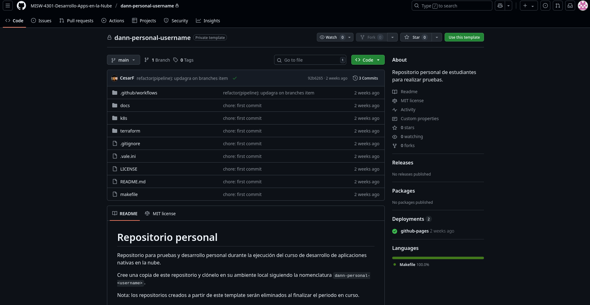

Acceda al repositorio y haga click en el botón Use this template, y después Create a new repository.

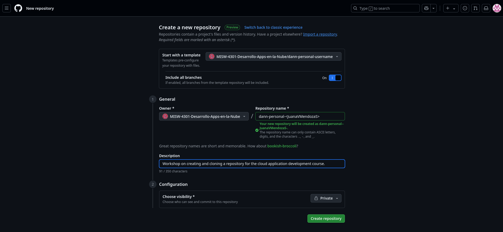

Clone el repositorio recién creado en su ambiente ejecutando:

```

git clone <url repositorio git>
git clone git@github.com:MISW-4301-Desarrollo-Apps-en-la-Nube/dann-personal--JuanaVMendozaS-.git

```

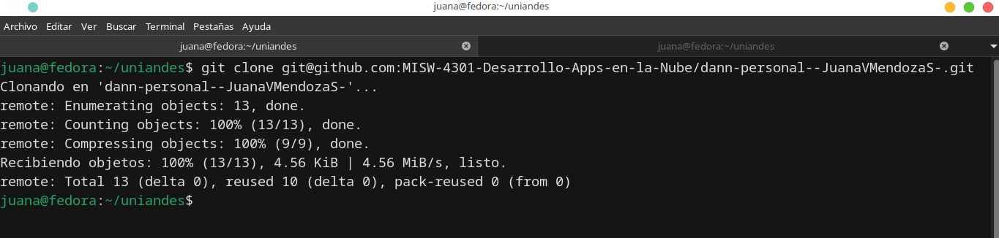

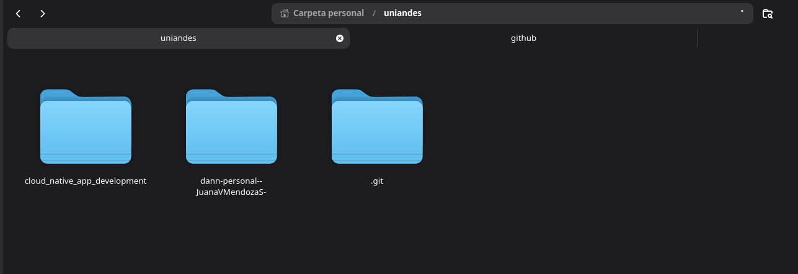


## Tutorial: Crear documentación

Abra el proyecto en el IDE de su preferencia. Si está trabajando con Visual Studio Code, Cursor o Windsurf le recomendamos instalar los siguientes plugins:

- Prettier
- PlantUML
- Markdown all in one

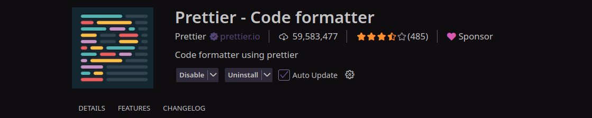


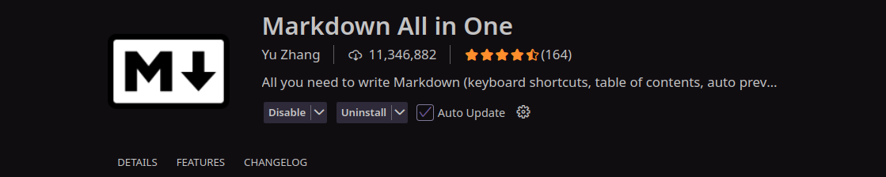

1. Cree una nueva rama con el nombre feature/dac, puede hacerlo en su terminal ejecutando:

```

git checkout -b feature/dac

```

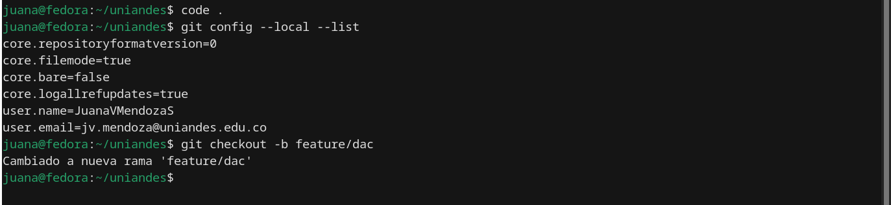

### PlantUML

PlantUML [2] es una herramienta que permite crear diagramas UML haciendo uso de archivos planos siguiendo una estructura y lenguaje definido. Puede encontrar la documentación y ejemplos en la página oficial: https://plantuml.com/

La herramienta le permite diagramar y generar diagramas UML de clase, de secuencia, de componentes, y de despliegue, entre otros.

```

En Visual Studio Code: ctrl + shift + p

PlantUML: Review Current Diagram  

```

### Vista de componentes

En la carpeta /docs/diagrams cree un archivo con el nombre components.puml y agregue el siguiente código que permite crear un diagrama básico de componentes:

docs/diagrams/components.puml

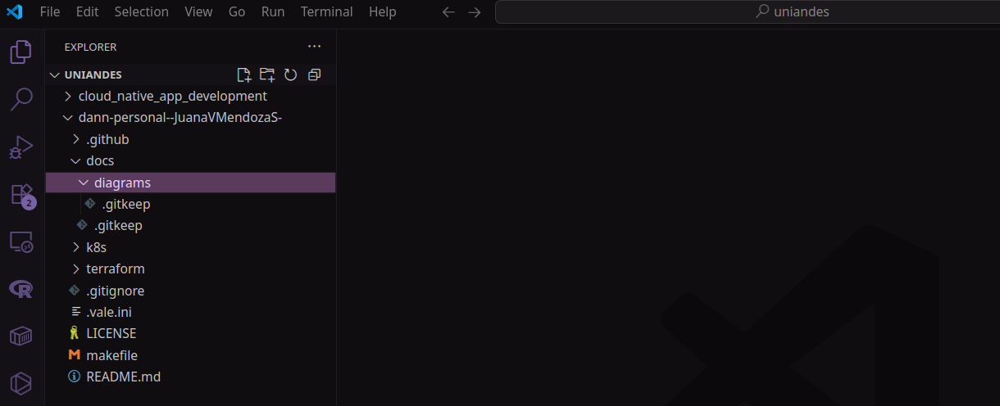

```

@startuml

skinparam componentStyle uml1

component "Application1" as application1
component "Application2" as application2

interface "http" as app1interface
app1interface - application1
application2 --> app1interface

@enduml

```


Este código en PlantUML define un diagrama de componentes UML que muestra la relación entre dos aplicaciones (`Application1` y `Application2`) a través de una interfaz HTTP.

### Explicación detallada:

1. **`skinparam componentStyle uml1`**  

Establece el estilo del diagrama como "UML1", que es un estilo clásico de UML con iconos rectangulares para componentes.

2. **Definición de componentes**:

- `component "Application1" as application1`  

Crea un componente llamado "Application1" y le asigna el alias `application1`.

- `component "Application2" as application2`  

Crea un componente llamado "Application2" con el alias `application2`.

3. **Interfaz HTTP**:

- `interface "http" as app1interface`  

Define una interfaz llamada "http" (que representa un contrato o API HTTP) con el alias `app1interface`.

4. **Conexiones**:

- `app1interface - application1`  

Conecta la interfaz HTTP con `Application1` usando una línea sólida (`-`), indicando que la interfaz **pertenece** a `Application1` (es decir, `Application1` implementa/provee la interfaz HTTP).

- `application2 --> app1interface`  

Muestra una dependencia de `Application2` hacia la interfaz HTTP con una flecha discontinua (`-->`), lo que significa que `Application2` **usa** la interfaz HTTP de `Application1` (por ejemplo, consume su API REST).

### Representación visual:

- **`Application1`** (proveedor):  

Tiene una interfaz HTTP asociada (como un "punto de conexión" o puerto).

- **`Application2`** (cliente):  

Depende de la interfaz HTTP de `Application1` para comunicarse.

### Ejemplo en el mundo real:

- `Application1` podría ser un backend que expone una API REST.

- `Application2` sería un frontend o otro servicio que consume esa API.

### Nota sobre estilos:

- `uml1` muestra las interfaces como "circulos" (icono clásico de UML), mientras que otros estilos como `uml2` las representan como rectángulos con la etiqueta `<<interface>>`. 

En esta configuración puede observar que hay dos componentes los cuales se comunican por medio de la interfaz de uno de ellos. La documentación de este tipo de diagrama lo puede encontrar acá https://plantuml.com/component-diagram.

Esta configuración representa el siguiente diagrama:

Para observar el diagrama tiene dos alternativas:

1. Hacer uso del plugin en visual studio code (ctrl + shift + p), seleccionado el comando Preview:

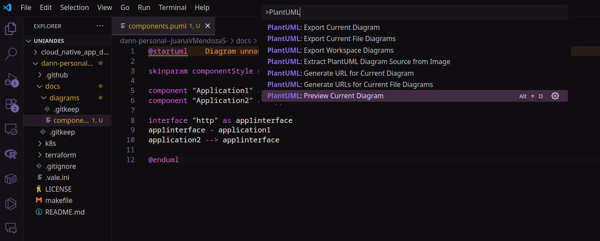

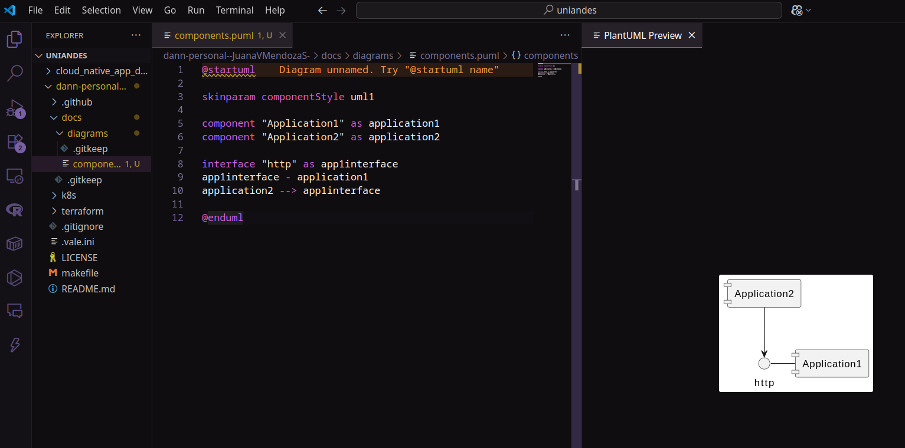

2. Hacer uso del editor en línea de plantUML https://editor.plantuml.com/uml/

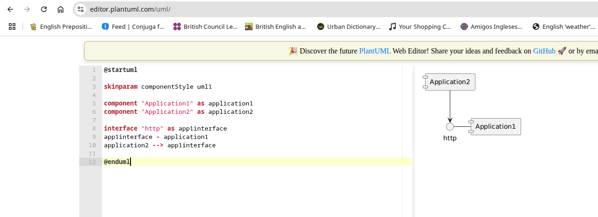

Hands on: Agregue dos aplicaciones más como componentes, y otro componente que corresponda a un proxy. Conecte todos los componentes al proxy.

Revise la documentación del diagrama de componentes, encontrará cómo decorar, agrupar y añadir notas, entre otros features.

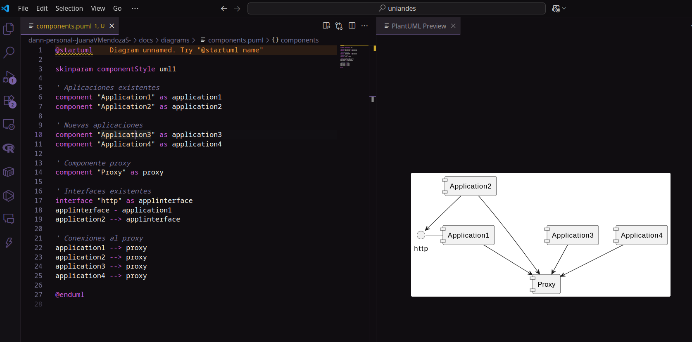

```

@startuml

skinparam componentStyle uml1

' Aplicaciones existentes
component "Application1" as application1
component "Application2" as application2

' Nuevas aplicaciones
component "Application3" as application3
component "Application4" as application4

' Componente proxy
component "Proxy" as proxy

' Interfaces existentes
interface "http" as app1interface
app1interface - application1
application2 --> app1interface

' Conexiones al proxy
application1 --> proxy
application2 --> proxy
application3 --> proxy
application4 --> proxy

@enduml


```

#### Vista de despliegue

En la carpeta /docs/diagrams cree un archivo con el nombre deployment.puml y agregue el siguiente código:

docs/diagrams/deployment.puml

En este diagrama puede observar que se usan frames para agrupar y describir los servicios que se están usando. El diagrama resultante presenta una aplicación (componente) que se ejecuta en un nodo sobre el servicio ec2 en el proveedor aws.. La documentación de este diagrama lo puede encontrar acá https://plantuml.com/deployment-diagram.

Haciendo uso del plugin o el editor en línea podrá ver que el resultado de esta configuración es el siguiente:

```

@startuml

frame "aws" {
    frame "ec2" {
        node "node1" {
           component "application" as app
        }
    }
}

note top of app : Mi aplicación

@enduml

```

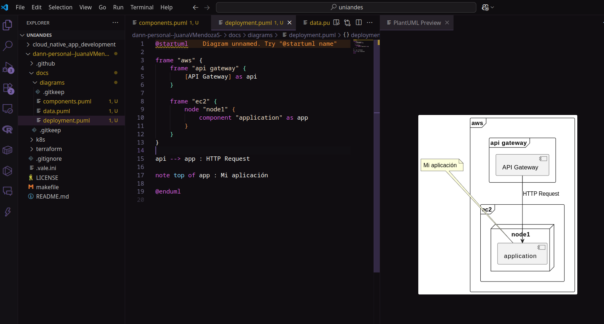

Hands on: Agregue un API Gateway en el diagrama y conéctelo al componente de aplicación.

Revise la documentación del diagrama de componentes, encontrará cómo decorar, agrupar y añadir notas, entre otros features.

#### Vista de información

En la carpeta /docs/diagrams cree un archivo con el nombre data.puml y agregue el siguiente código que permite diagramar entidades:

docs/diagrams/data.puml

```

@startuml

skinparam linetype polyline
skinparam linetype ortho


entity pets {
    * id : uuid
    --
    * created : timestamptz
    name : varchar(255)
    updated : timestamptz
}

entity owners {
    * id : uuid
    --
    * name : varchar(255)
    * document : varchar(255)
    * created : timestamptz
    updated : timestamptz
}

pets }|..|| owners

@enduml

```

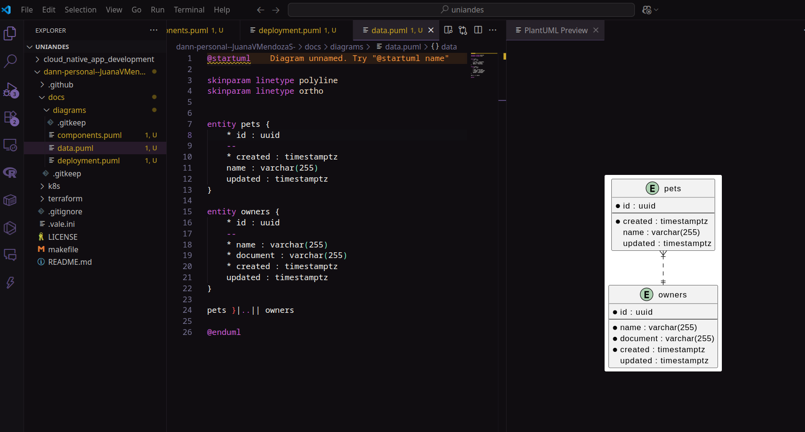

En este diagrama se representan dos entidades por medio de un diagrama entidad relación. La documentación de este tipo de diagramas la encuentra en https://plantuml.com/ie-diagram.

También puede hacer uso de diagramas de clases para presentar sus modelos de información. https://plantuml.com/class-diagram


Hands on: Coloque las tablas dentro de una base de datos y ubíquelos en un modelo de despliegue.

Revise la documentación del diagrama de información, encontrará cómo decorar, agrupar y añadir notas, entre otros features.

```

@startuml

skinparam linetype polyline
skinparam linetype ortho

' Vista de despliegue con base de datos
node "Database Server" {
    database "PostgreSQL" as db {
        entity pets {
            * id : uuid
            --
            * created : timestamptz
            name : varchar(255)
            updated : timestamptz
        }

        entity owners {
            * id : uuid
            --
            * name : varchar(255)
            * document : varchar(255)
            * created : timestamptz
            updated : timestamptz
        }
    }
}

' Relación entre tablas
pets }|..|| owners : owned by

@enduml

```

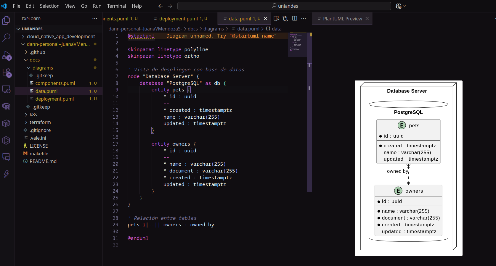


#### README

Cree un archivo tipo markdown con el nombre README.md en la carpeta /docs y agregue el siguiente contenido:

docs/README.md

```

# Documentación técnica del proyecto

Este es un ejemplo de documentación técnica del proyecto

## Vistas de arquitectura

* Vista de componentes
  


* Vista de despliegue


* Vista de información


```

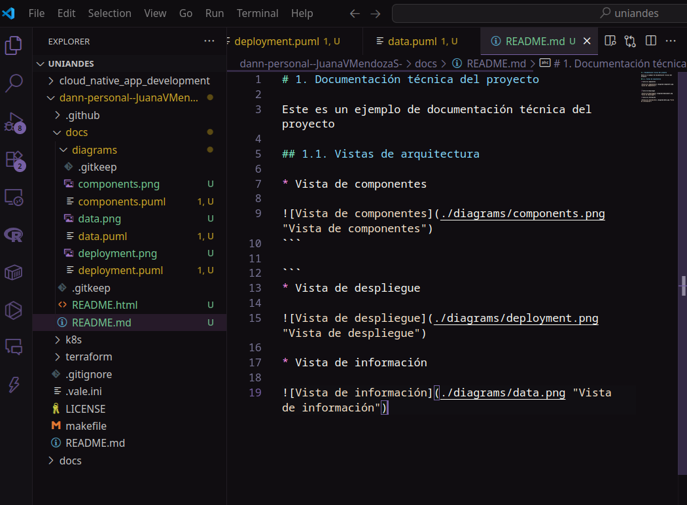

Podrá observar que el documento referencia los diagramas como archivos tipo PNG y NO archivos PUML, dado que markdown no soporta archivos PUML si queremos mostrar nuestros diagramas en la documentación.

Para generar imágenes PNG usaremos PlantUML, pero para ello necesitamos instalar Java y PlantUML en nuestro ambiente. Con el fin de evitar instalar más herramientas en el ambiente puede hacer uso de un contenedor en docker ejecutando el siguiente comando:

```

docker run --rm -e PLANTUML_LIMIT_SIZE=8192 -v $(pwd)/docs/diagrams:/workspace -w /workspace plantuml/plantuml **.puml

```

Ese mismo comando ya está en el archivo makefile del repositorio. Si su ambiente soporta make solo debe ejecutar:

```

make docsbuild

```

Verifique que las imágenes fueron creadas satisfactoriamente en la carpeta docs/diagrams.

Usando el plugin de markdown podrá ver un documento similar a este:

```

En Visual Studio Code: ctrl + shift + p

Markdown: Open Preview

```

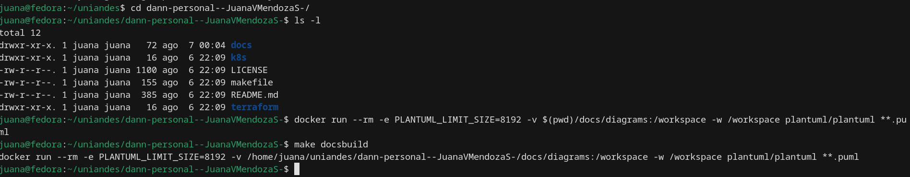

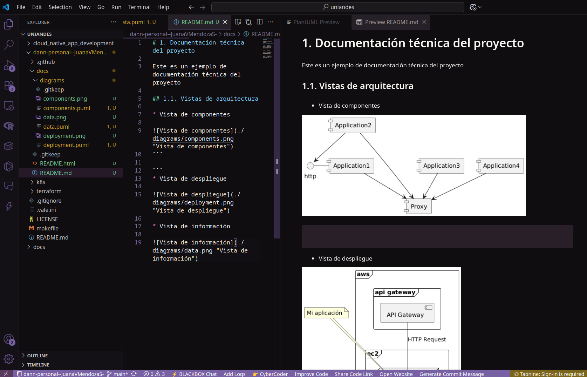

### 4. Pipeline de documentación

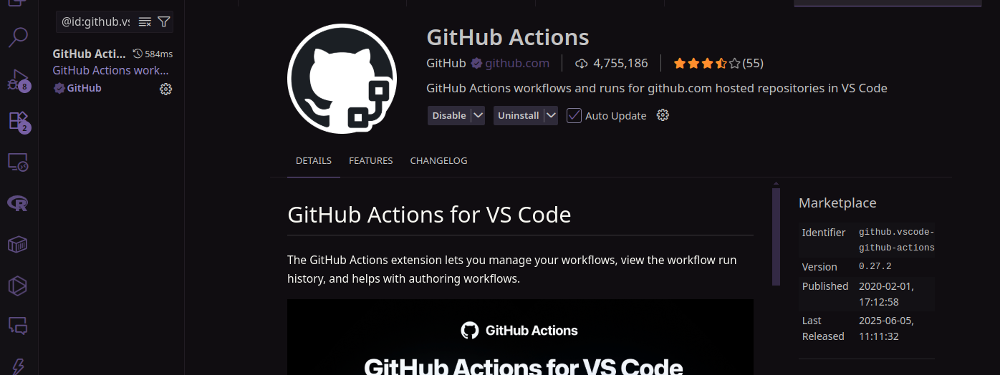

En el repositorio encontrará un pipeline ya configurado para verificar la documentación haciendo uso de Vale [3].

.github/workflows/ci_pipeline.yml

```

name: CI pipeline
on:
  push:
    branches:
      - feature/dac
  pull_request:
    branches:
      - feature/dac
jobs:
  vale:
    name: Docs checker
    runs-on: ubuntu-latest
    steps:
      - uses: actions/checkout@v4
      - uses: errata-ai/vale-action@v2.1.1
        with:
          version: 3.12.0
          files: docs
          fail_on_error: true
          filter_mode: nofilter
          reporter: local

```

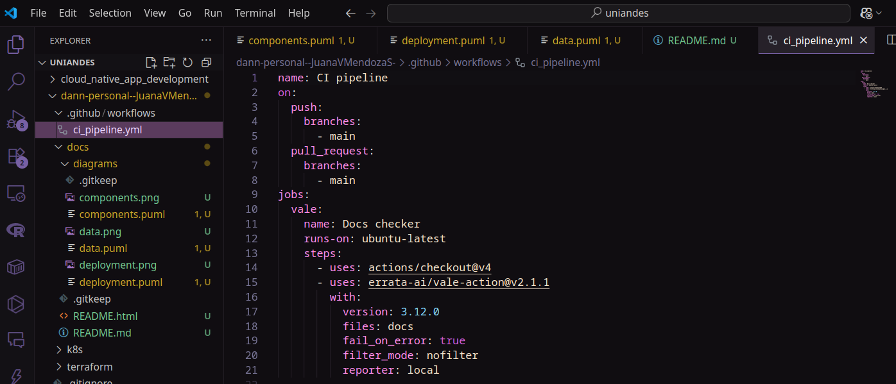

Este pipeline se ejecuta cuando se crea un PR o hace push a la rama main. El job que está configurado ejecuta Vale sobre la carpeta docs (files: docs) y lanza excepción si encuentra que hay algún error en la documentación. La configuración de Vale la puede encontrar en el archivo vale.ini.

Lo invitamos a revisar Vale para entender las posibilidades al usar esta herramienta.

<blockquote>
<strong>⚠️ WARNING: </strong> Aclaración del código .github/workflows/ci_pipeline.yml
</blockquote>

Es un pipeline de integración continua (CI) específicamente orientado a verificar la calidad de la documentación en tu proyecto. 

📌 ¿Para qué es este pipeline?

Este pipeline automatiza la revisión de la calidad del contenido en texto dentro de la carpeta docs/ usando una herramienta llamada Vale.

🎯 Su propósito:

- Asegurar que la documentación cumpla con estándares de estilo, gramática o escritura técnica.

- Detectar errores o inconsistencias automáticamente, como parte del flujo de desarrollo.

🔍 ¿Qué es Vale?

[Vale](https://vale.sh/) es una herramienta de estilo para texto. Funciona como un linter para la documentación: revisa ortografía, gramática, consistencia, estilo técnico, etc.

Puedes personalizar sus reglas en un archivo vale.ini o usar guías predefinidas como:

- Microsoft Writing Style Guide

- Google Developer Style Guide

- RedHat Style Guide

⚙️ ¿Cómo funciona este pipeline?

Este bloque YAML define un workflow en GitHub Actions:

```

on:
  push:
    branches:
      - feature/dac
  pull_request:
    branches:
      - feature/dac


```

🔄 Se ejecuta automáticamente cuando:

- Haces push a la rama feature/dac.

- Creas un Pull Request hacia esa misma rama.

💼 Job vale – Qué hace paso a paso:

```

jobs:
  vale:
    name: Docs checker
    runs-on: ubuntu-latest

```

1. Crea un job llamado Docs checker que se ejecuta en un entorno Ubuntu.

```

steps:
  - uses: actions/checkout@v4

```

2. Clona el repositorio, para que tenga acceso a los archivos del proyecto.

```

- uses: errata-ai/vale-action@v2.1.1
  with:
    version: 3.12.0
    files: docs
    fail_on_error: true
    filter_mode: nofilter
    reporter: local

```

### 5. Publicación de documentación

1. Acceda a su repositorio en Github y diríjase a la pestaña Settings. Posteriormente a la sección Pages. 

En Settings >> Ir a la parte izquierda a Pages >> Build and Deployment >> Source >> Clic en Deploy from a batch.

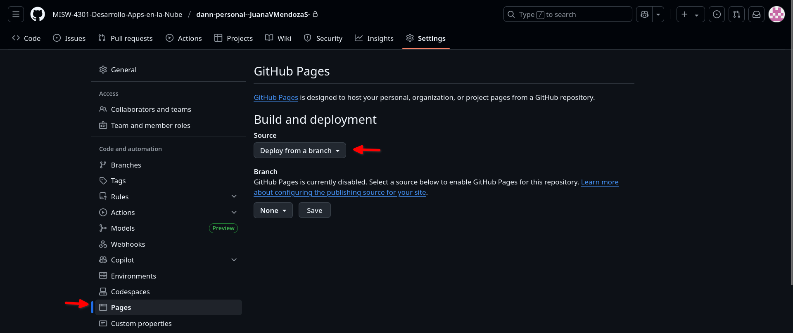

Se recarga la pestaña de Settings. En esta página habilite Github Pages [4] para el repositorio haciendo uso de la siguiente configuración:

- Acceso Privado
- Despliegue pasado en rama (seleccione main)
- Seleccione la carpeta /docs

2. Cambiar la pestaña de Code por Settings.

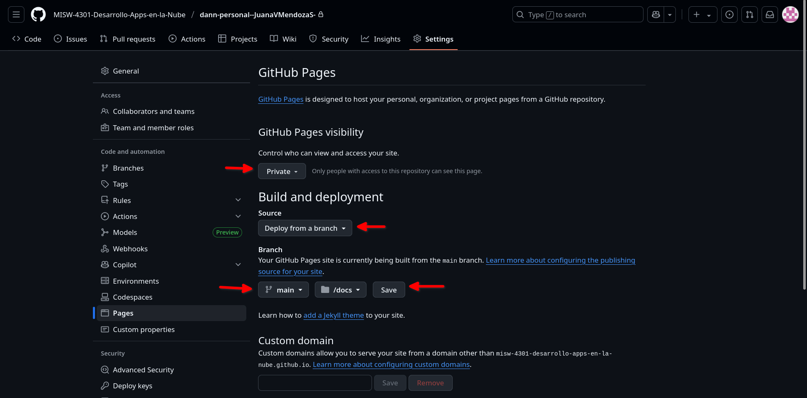

3. Guarde sus cambios en la página.

4. Suba sus cambios locales de git.

Esta sección se enfoca en validar la calidad de la documentación usando Vale a través de un pipeline de GitHub Actions.

Asegúrate de estar en la rama correcta: Debes trabajar en la rama feature/dac, ya que el pipeline solo se activa en esa rama.

```

git checkout feature/dac

```

<blockquote>
<strong>⚠️ WARNING: </strong> Aclaración: La rama no existe localmente y remotamente.

  error: ruta especificada 'feature/dac' no concordó con ningún archivo conocido por git
  
</blockquote>

Para validar qué ramas hay:

```

git status

```

Ver si existe localmente:

```

git branch

```

Ver si existe remotamente:

```

git branch -r

```

Ver los archivos:

```

git ls-files

```

Por lo tanto, se debe de crear esta rama:

```

git checkout -b feature/dac

```


Está en la rama feature/dac, y Git ha detectado los archivos nuevos que se adicionaron a la carpeta docs/, pero todavía no los ha añadido al control de versiones.

Agregar los archivos nuevos:

```

git status
git add docs/

```

Esto agregará todos los archivos dentro de la carpeta docs/ al área de staging.

Confirmar (commit) los cambios:

```

git commit -m "Add docs"

```

Subir la rama al repositorio remoto:

```

git push origin feature/dac

```

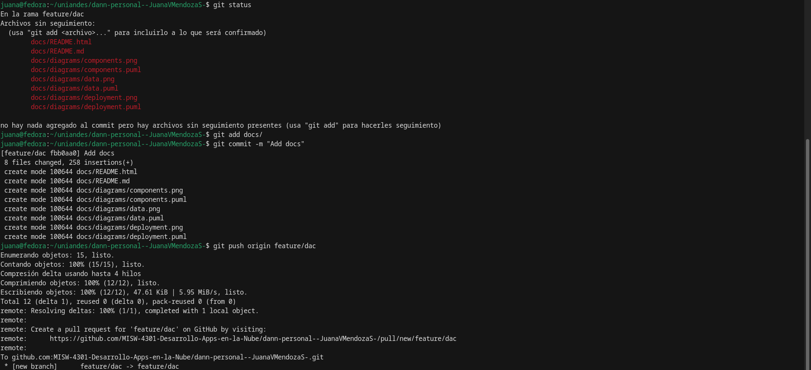

Esto:

- Crea la rama feature/dac en GitHub.

- Sube tu documentación.

- Hará que el pipeline de Vale se ejecute automáticamente si todo está configurado correctamente.

5. Cree un PR de su rama feature/dac a su rama main.

<blockquote>
<strong>⚠️ WARNING: </strong> Aclaración: ¿Qué es un PR?

Un PR, o Pull Request, es una solicitud que haces en plataformas como GitHub, GitLab, o Bitbucket para proponer cambios hechos en una rama (como feature/dac) y pedir que se integren (fusionen) en otra rama (como main o develop).

🧠 ¿Qué significa literalmente “Pull Request”?

Estás diciendo: "Quiero que jales (pull) mis cambios desde esta rama hacia otra rama. Por favor, revísalos y apruébalos."

🔁 Flujo básico de trabajo con Pull Requests

- Creas una rama para trabajar (feature/dac).

- Haces cambios en esa rama (documentación, código, etc.).

- Subes la rama a GitHub.

- Creas un PR hacia otra rama (main).

- Se revisan los cambios (por ti o por otros).

- Si todo está bien, se fusiona (merge).

- ¡Listo! Los cambios ya están en la rama principal.

| Término           | Significado simple                         |
| ----------------- | ------------------------------------------ |
| Pull Request (PR) | Propuesta de cambios para ser fusionados   |
| Crear un PR       | Pedir revisión y aprobación de tus cambios |
| Merge PR          | Aceptar y aplicar los cambios en otra rama |

</blockquote>

En Github posteriormente al hacer el push se vé así:

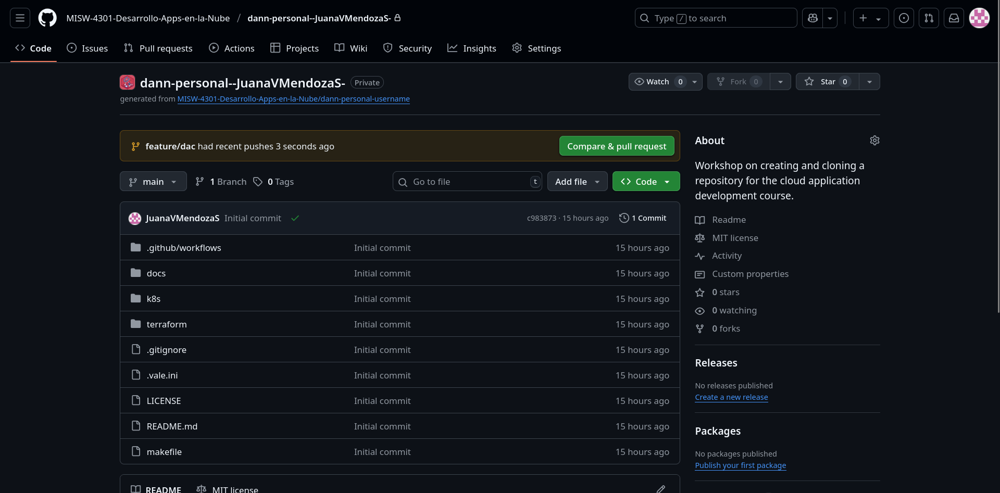

Ir a la pestaña de Pull Request:


Posteriormente, se abrirá la pantalla para crear el Pull Request.

Aquí verás varias cosas importantes:

| Campo       | Contenido                                                           |
| ----------- | ------------------------------------------------------------------- |
| **Base**    | `main` (es la rama de destino: dónde se van a fusionar los cambios) |
| **Compare** | `feature/dac` (es la rama de origen: tus cambios actuales)          |

Agrega un título y descripción

Ejemplo:

- Título: Project documentation.

- Descripción: The README.md file is added with the architectural diagrams generated with PlantUML.

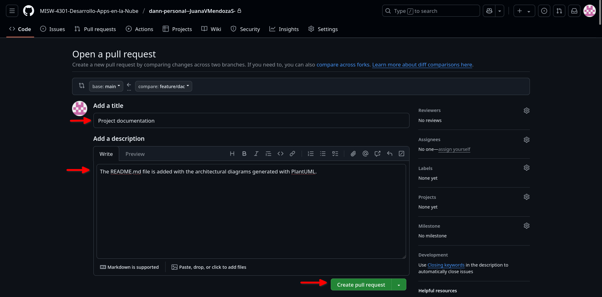

Haz clic en "Create Pull Request". Esto no fusiona los cambios todavía, solo crea la solicitud para que se revise.

<blockquote>
<strong>⚠️ WARNING: </strong> Aclaración: ¿Qué es un PR?¿Qué pasa después de crear el PR?

GitHub ejecutará automáticamente el pipeline de CI

    - Se lanzará el job Docs checker con la herramienta Vale

    - Revisa los archivos .md en la carpeta docs/

    - Si detecta errores de estilo, el job fallará ❌

Verás los resultados en la pestaña “Checks” o directamente en el PR

    - Si todo está bien: aparecerá un check verde (✔) y el PR podrá ser fusionado

    - Si hay errores: GitHub mostrará los detalles para que los corrijas

</blockquote>

Lo primero que podrá observar es que el pipeline de CI con el paso de Vale se ejecuta, verifique que pasa satisfactoriamente:

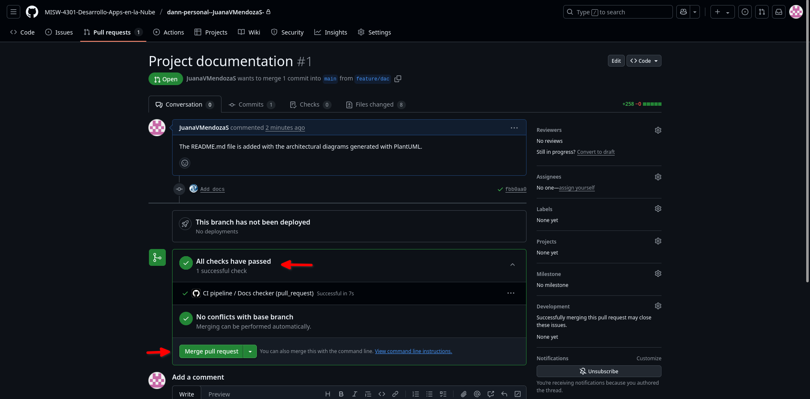

¿Qué significa ese mensaje?

✅ "All checks have passed"

Todos los procesos automáticos (en este caso, el pipeline con Vale) se ejecutaron y terminaron exitosamente. No hay errores en tu documentación.

✅ "No conflicts with base branch"

Tus cambios en la rama feature/dac no entran en conflicto con lo que hay actualmente en main, así que pueden fusionarse sin problema.

Haz clic en "Merge pull request": Esto va a integrar tus cambios en la rama main.

Después de hacer clic, aparecerá un botón que dice: Confirma el merge.

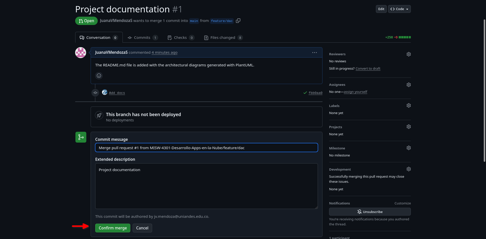

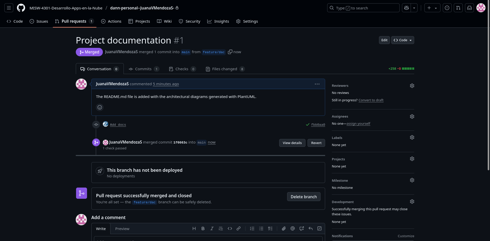

6. Verificar que se ha ejecutado el proceso de github pages

Una vez finalizado el merge a la rama main. Diríjase a la sección de Actions y verifique que el proceso de github pages ha iniciado su ejecución.

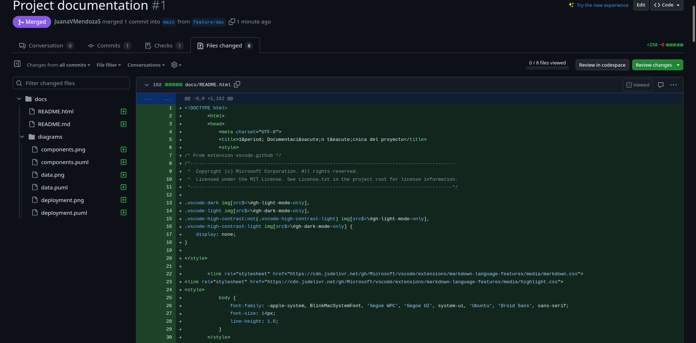

Al ingresar al workflow podrá encontrar la url de la página donde se publicará su documentación (también la encuentra en la sección de github pages):

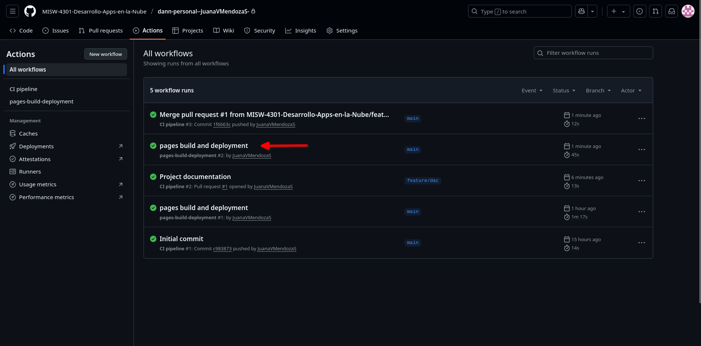

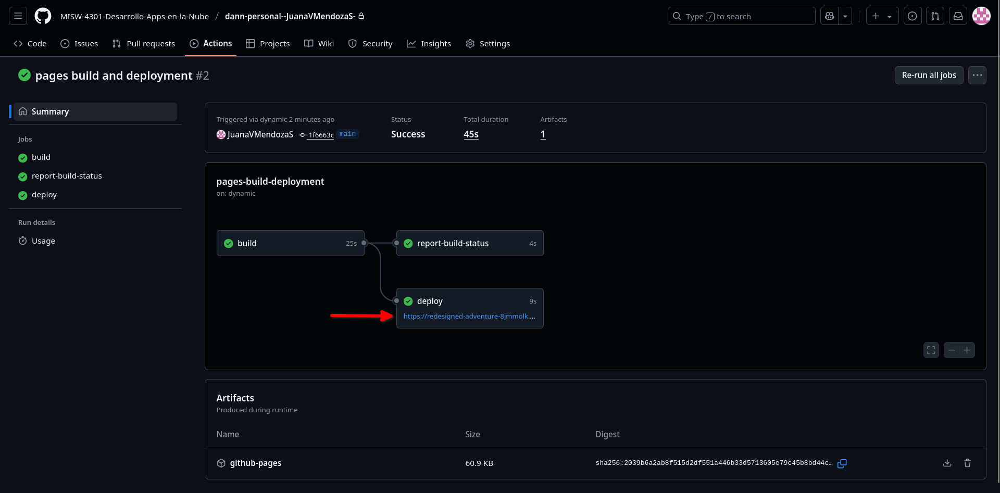

Abra la [URL](https://redesigned-adventure-8jmmolk.pages.github.io/) en su navegador y verá la página de su documentación:

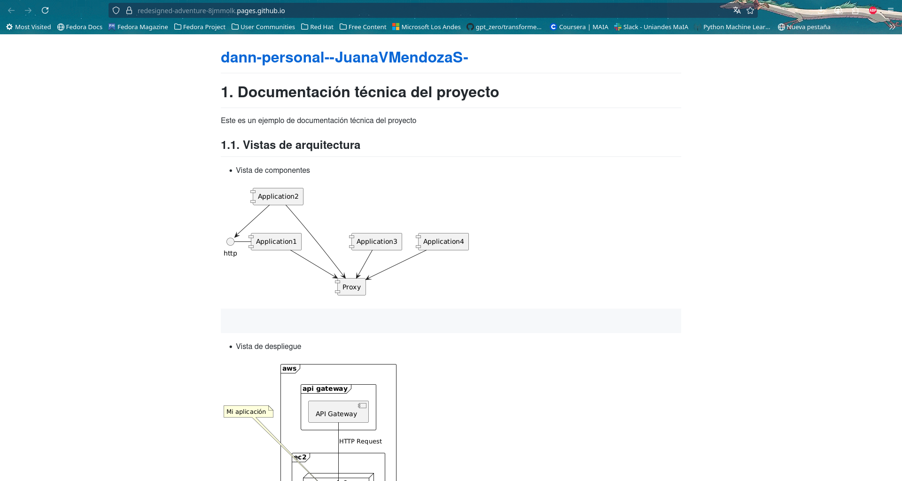

Posteriormente, se borra la rama feature/dac.

Antes de borrar una rama local, debes cambiarte (checkout) a otra rama, como main.

```

git status

git checkout main

```

Se traen los cambios remotos a local:

```

git pull origin main

```

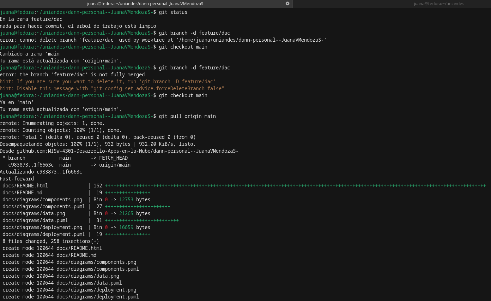

Borrar la rama localmente:

```

git branch -d feature/dac

```


Borrar la rama del repositorio remoto:

```

git push origin --delete feature/dac

```

Este es el final del tutorial, en este punto usted ya sabe cómo gestionar su documentación técnica haciendo uso de los procesos y herramientas de desarrollo que ya conoce y algunas nuevas.

Esperamos que sea de gran utilidad. Nos vemos en el siguiente tutorial.

### 6. Referencias

[1] «Documentation as Code», [Online]. Disponible en:https://www.writethedocs.org/guide/docs-as-code/

[2] «PlantUML», [Online]. Disponible en:https://plantuml.com/

[3] «Documentación de Vale». [Online]. Disponible en:https://vale.sh/

[4] «Github Pages». [Online]. Disponible en: https://pages.github.com/

### 7. Tutorial

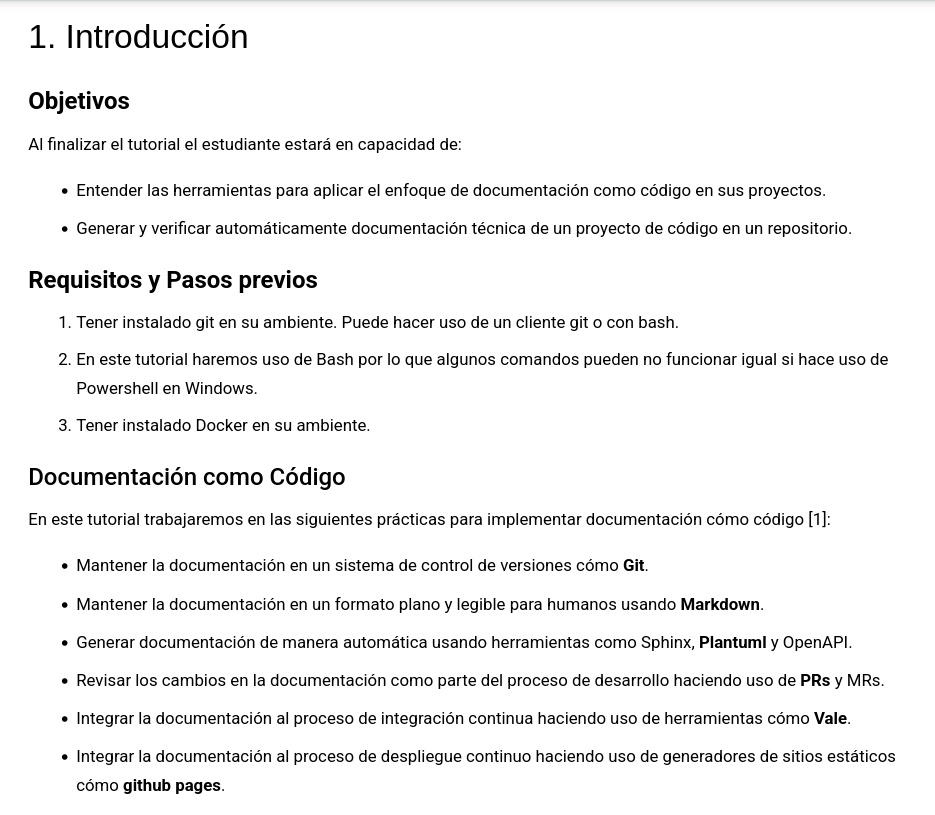

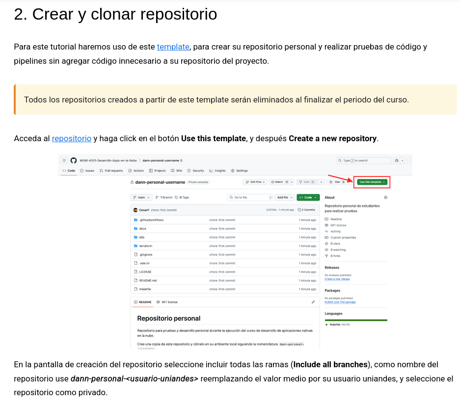

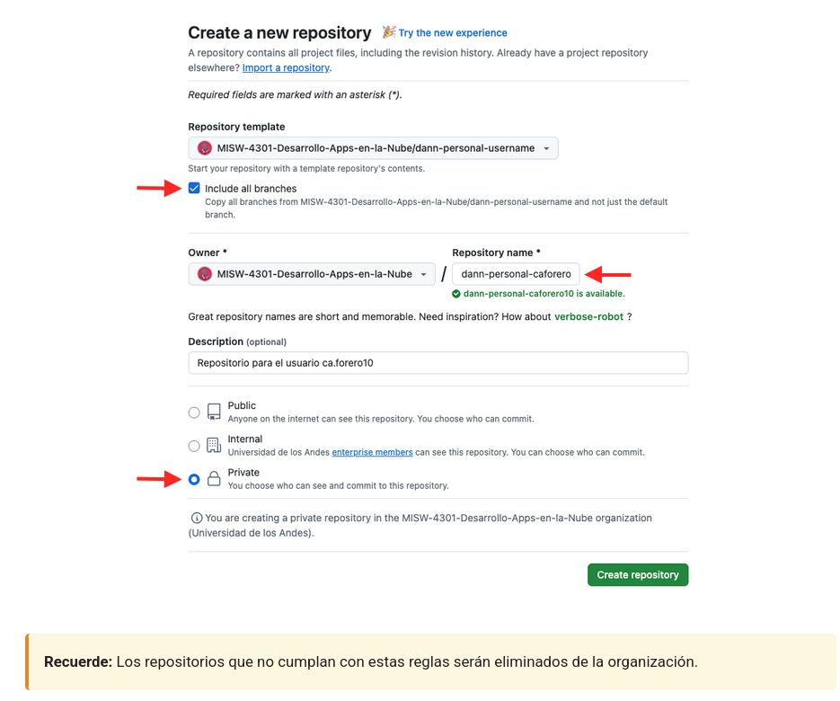

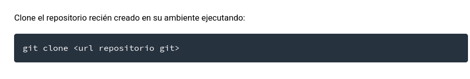

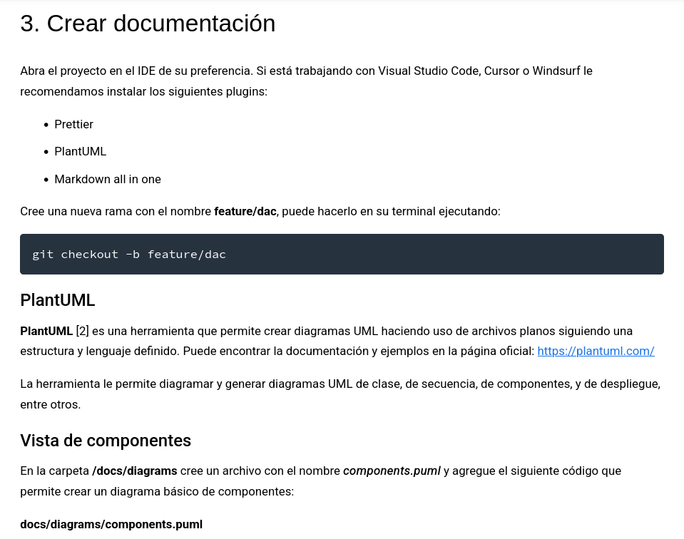

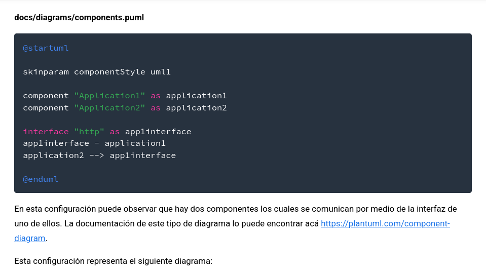

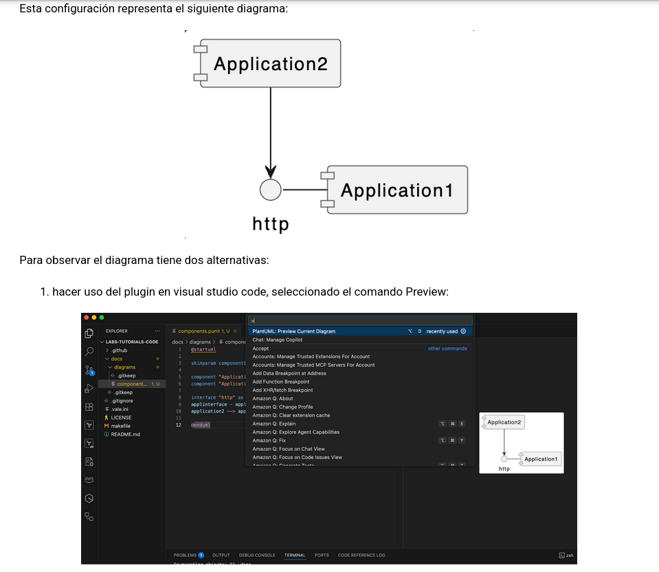


